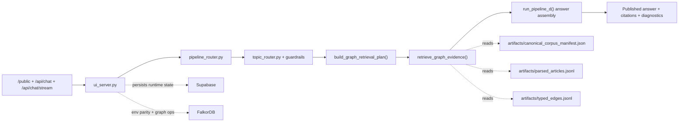
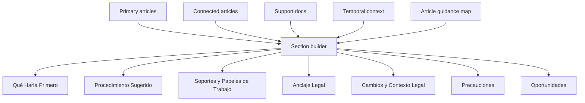

# Archived Orchestration Snapshot

> Archived snapshot kept for comparison only.
> Do not use this file as the current runtime truth.
> For the live runtime read `docs/orchestration/orchestration.md`.
> For the response-shaping source of truth read `docs/guide/chat-response-architecture.md`.

## Purpose

This guide describes an older served Lia Graph runtime snapshot preserved for historical comparison.

It is the operating map for:

- `/public`
- authenticated chat shells
- `/api/chat`
- `/api/chat/stream`
- the `/orchestration` HTML view

The live served path is:

1. `src/lia_graph/ui_server.py`
2. `src/lia_graph/pipeline_router.py`
3. `src/lia_graph/topic_router.py` + topic guardrails
4. `src/lia_graph/pipeline_d/planner.py`
5. `src/lia_graph/pipeline_d/retriever.py`
6. `src/lia_graph/pipeline_d/orchestrator.py`

There is no second historical retrieval engine. Historical behavior is part of `pipeline_d`.

## Product Rules

- The visible answer must be accountant-facing only.
- The visible answer must be practical-first.
- The visible answer must not expose planner/retrieval/meta-thinking.
- Accountants should not need article-citation phrasing to get a useful answer.
- Graph grounding comes before interpretive or practical enrichment.
- `/orchestration` and this markdown guide must describe the current runtime only.

## Runtime Overview

## Step 1: Entry And Route Resolution

`ui_server.py` serves the shell, normalizes the chat payload, handles public/auth access, and starts the runtime.

`pipeline_router.py` resolves the served route. Today that default is `pipeline_d`.

Nothing in this step decides the answer substance yet. It only decides:

- how the request enters
- which runtime handles it
- whether the request is public/authenticated
- whether the response is buffered or streamed

## Step 2: Topic Detection And Guardrails

`topic_router.py` and the guardrails convert accountant language into topic hints without making `topic/subtopic` the load-bearing truth model.

What this step does:

- detects the dominant accountant workflow from natural language
- resists side mentions hijacking the route
- keeps practical prompts practical
- hands topic hints into the planner instead of flat-filtering documents first

Example:

- a devolución / saldo a favor prompt that also mentions facturación electrónica should stay centered on `procedimiento_tributario`

## Step 3: Planner Contract

`build_graph_retrieval_plan()` converts the question into a graph retrieval plan.

The planner outputs:

- `query_mode`
- `entry_points`
- `traversal_budget`
- `evidence_bundle_shape`
- `temporal_context`
- `topic_hints`
- `planner_notes`

### 3.1 Query Mode Selection

The planner classifies in this order:

1. `historical_reform_chain`
   Triggered when historical intent is present and the question also contains an article or reform anchor.
2. `historical_graph_research`
   Triggered when historical intent is present but explicit legal anchors are weaker.
3. `reform_chain`
   Triggered by explicit reform references or reform-language markers such as `ley`, `decreto`, `resolucion`, `vigencia`, `reforma`, `modific...`.
4. `definition_chain`
5. `obligation_chain`
6. `computation_chain`
7. `article_lookup`
8. `general_graph_research`

Important guardrail:

- generic procedural phrasing like `antes de pedir...` should not by itself trigger historical mode or reform mode

### 3.2 Historical Intent Detection

Historical intent lives in `src/lia_graph/pipeline_c/temporal_intent.py`.

It now treats these as strong signals:

- `qué decía`
- `versión anterior`
- `originalmente`
- `histórico`
- `vigencia`
- anchored phrasing like `antes de la Ley ...`, `previo a la Ley ...`, `después de la Ley ...`

It does not treat any casual `antes de ...` phrasing as historical by default.

When the prompt contains a reform year, the helper infers a coarse cutoff as the last day of the prior year. Example:

- `antes de la Ley 2277 de 2022` -> `2021-12-31`

### 3.3 Entry Point Construction

The planner adds entry points in layers:

1. explicit articles
2. explicit reforms
3. topic hints
4. lexical article-search queries when the user asks in workflow language instead of law-citation language

This lets a prompt like `Mi cliente tiene saldo a favor...` still land on hard legal anchors such as `850`, `589`, `815`.

### 3.4 Practical Workflow Expansion

The planner has explicit workflow expansions for:

- refund / devolución / saldo a favor
- correction / firmeza interactions
- benefit-of-audit / accelerated-firmness interactions

For those prompts it adds:

- supplemental topic hints such as `procedimiento_tributario`, `declaracion_renta`, `calendario_obligaciones`
- lexical graph searches tailored to the workflow

### 3.5 Budgets

Each `query_mode` gets a different budget.

Examples:

- `article_lookup`: tight graph walk, low support-doc budget
- `obligation_chain` / `computation_chain`: broader connected-article and support-doc budget
- `historical_reform_chain`: more hops, more reform slots, tighter connected-article limit to reduce noise

This is one of the core control levers that keeps the first answer relevant instead of sprawling.

## Step 4: Entry-Point Resolution

The retriever resolves the planner output against local artifacts.

If the planner emitted explicit anchors:

- article entry -> direct `ArticleNode` anchor when present
- reform entry -> direct `ReformNode` anchor when present

If the planner emitted lexical article searches:

- the runtime scores articles by token overlap
- heading hits are worth `2.0`
- body hits are worth `1.0`
- matching a planner topic hint adds `1.5`

That produces concrete article anchors while preserving the natural-language intent of the original question.

## Step 5: Graph Traversal

The served answer path is graph-first and artifact-backed.

The runtime reads:

- `artifacts/canonical_corpus_manifest.json`
- `artifacts/parsed_articles.jsonl`
- `artifacts/typed_edges.jsonl`

Traversal is a bounded graph walk over resolved anchors.

### 5.1 Traversal Priority

Neighbor expansion is sorted by:

1. temporal rank
2. mode-specific preferred edge kind
3. node-kind rank
4. direction preference
5. stable key order

Mode-specific edge preferences include patterns like:

- `obligation_chain`: `REQUIRES`, `REFERENCES`, `MODIFIES`
- `computation_chain`: `COMPUTATION_DEPENDS_ON`, `REQUIRES`, `REFERENCES`
- `historical_reform_chain`: `SUPERSEDES`, `MODIFIES`, `REFERENCES`, `REQUIRES`

### 5.2 Neighbor Bonus Formula

The traversal score is additive. In words:

- start from the discovery score of the parent node
- add an edge-kind bonus based on mode preference order
- add `+1.2` for article neighbors
- add `+0.8` for reform neighbors
- add `+0.2` for outgoing direction
- add `+3.0` for explicitly anchored reforms
- add `+0.9` for reforms at or before the temporal cutoff
- subtract `0.4` for future reforms outside the cutoff when they are not anchor reforms
- add `+1.1` for `SUPERSEDES` in historical mode

This is the main runtime prioritization that determines what the first answer sees first.

### 5.3 Historical Noise Control

Historical mode is intentionally stricter now.

Connected articles reached through `MODIFIES` or `SUPERSEDES` only survive when at least one of these is true:

- same source document as the parent article
- same topic as the parent article
- same primary topic
- explicitly hinted topic
- heading overlap with the parent article
- explicit reform-anchor match

This prevents graph-valid but topic-wrong neighbors from polluting a historical answer.

## Step 6: Evidence Selection

The evidence bundle has four layers:

1. `primary_articles`
2. `connected_articles`
3. `related_reforms`
4. `support_documents`

### 6.1 Primary And Connected Articles

Article ranking uses:

- explicit seed order first
- hop distance
- temporal bonus
- discovery score

Temporal bonus prefers:

- articles matching the anchored reform
- articles that contain historical-version cues like `texto vigente antes`
- historically relevant statuses like `derogado` when the question is historical

### 6.2 Historical Excerpts

For historical prompts, article snippets prefer the text after:

- `Texto vigente antes de la modificación introducida por ...`

If that segment exists, it is used before falling back to generic snippet extraction.

That is why the historical answer can now surface actual pre-reform substance instead of only a reform note.

### 6.3 Support Document Selection

Support documents are never allowed to lead the answer. They enrich it after legal grounding exists.

The selector works in stages:

1. source documents behind selected graph articles
2. topic-expansion documents from ready canonical docs
3. diversification so the answer can include practical and interpretive material without collapsing into one family

Sorting uses:

- source docs before topic-expansion docs
- family rank
- query-token overlap
- stable path order

### 6.4 Historical Support Guardrail

When `historical_query_intent = true`, topic-expansion support docs are restricted to `normativa`.

This is deliberate. A historical “what did the article say before X reform?” question should not be hijacked by practical guides or unrelated expert notes.

## Step 7: Answer Assembly

`run_pipeline_d()` builds the visible answer from:

- curated article guidance by key article
- article-derived insights from primary/connected excerpts
- support-doc-derived insights from `practica` and `interpretacion`
- temporal context
- reform context

### 7.1 Article-Guidance Layer

There is explicit operational guidance for high-value articles such as:

- `850`
- `589`
- `815`
- `588`
- `714`
- `689-3`
- `771-2`
- `616-1`
- `617`
- `115`

This is how the first answer can be practical even before a support document contributes.

### 7.2 Support-Line Scoring

Support lines are extracted from `practica` and `interpretacion` docs only.

Scoring uses:

- family bonus: `0.6` for `practica`, `0.35` for `interpretacion`
- query-token overlap: `1.8` per overlapping token
- `+1.1` for procedure markers
- `+1.2` for paperwork markers
- `+0.8` for context markers
- `+0.7` for precaution markers

Lines under the threshold are discarded.

### 7.3 Article-Line Scoring

Article-derived lines use a similar filter:

- query-token overlap: `1.6` per overlapping token
- deadline/time markers get extra weight
- primary-article lines get an extra bonus over connected-article lines

This is why deadlines such as `50, 30 o 20 días hábiles` can be pulled into the first answer directly from the norm.

### 7.4 Visible Section Rules

The visible answer is assembled in this order:

1. `Qué Haría Primero`
2. `Procedimiento Sugerido`
3. `Soportes y Papeles de Trabajo`
4. `Anclaje Legal`
5. `Cambios y Contexto Legal`
6. `Precauciones`
7. `Oportunidades`

Anti-leak rule:

- planner modes
- route names
- retrieval diagnostics
- graph self-commentary

stay in diagnostics, not in the published answer text.

## Step 8: Response Contract

The response returned to the UI/API still includes:

- answer text
- citations
- diagnostics
- confidence
- `graph_native` vs `graph_native_partial`

But the user should only see the practical answer content, not the orchestration internals.

## Storage Truth

### Local Artifacts

Local graph artifacts are the live answer source.

### Supabase

Supabase is runtime persistence and ops state:

- conversations
- chat runs
- metrics
- feedback
- usage ledger
- auth nonces
- terms state
- active-generation state

### Falkor

Falkor is currently for:

- local Docker parity
- staging/cloud parity
- graph ops and environment health

It is not yet the live per-request traversal engine for served answers.

## Local Dev And Staging

### `npm run dev`

- builds the public UI
- runs health checks
- uses filesystem runtime persistence
- expects local Docker Falkor

### `npm run dev:staging`

- uses cloud Falkor + cloud Supabase for surrounding runtime state
- keeps the served answer path artifact-backed

The mental model is one served chat engine with different surrounding environments.

## Files That Matter Most

- `src/lia_graph/ui_server.py`
- `src/lia_graph/pipeline_router.py`
- `src/lia_graph/topic_router.py`
- `src/lia_graph/topic_guardrails.py`
- `src/lia_graph/pipeline_c/temporal_intent.py`
- `src/lia_graph/pipeline_d/planner.py`
- `src/lia_graph/pipeline_d/retriever.py`
- `src/lia_graph/pipeline_d/retrieval_support.py`
- `src/lia_graph/pipeline_d/orchestrator.py`
- `src/lia_graph/pipeline_d/answer_support.py`

## Current Weak Spots

- exact `effective_date` / vigencia is still not fully artifact-backed
- duplicate/versioned article handling still needs more fidelity
- support-doc ranking is cleaner but still not perfect topic-by-topic
- managed evidence/history/admin surfaces are still partial

## Reading This As A Human

If you want the shortest accurate mental model, read the runtime like this:

1. classify the accountant’s intent
2. turn it into graph anchors, budgets, and temporal context
3. resolve lexical workflow language into real articles
4. walk the graph with mode-aware and time-aware prioritization
5. attach support docs only after legal grounding
6. publish a practical-first answer with no meta leakage
