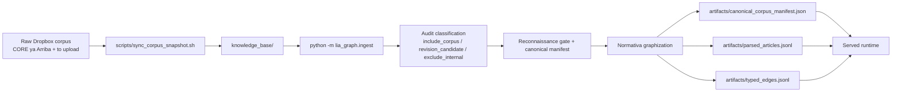
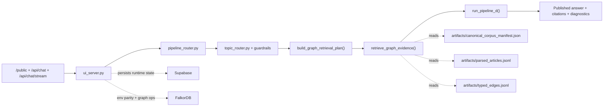
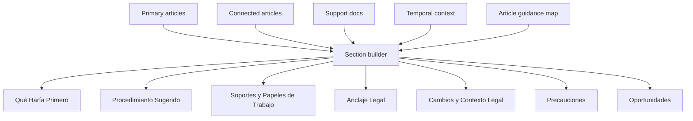

# Orchestration Guide

## Purpose

This guide describes two connected truths of Lia Graph as they operate today:

- the build-time ingestion path from the raw shared corpus into the artifact set
- the served Lia Graph runtime that answers accountant questions from those artifacts

`docs/guide/orchestration1.md` preserves the previous version of this guide as a snapshot before this update.

This file is the operating map for:

- `/public`
- authenticated chat shells
- `/api/chat`
- `/api/chat/stream`
- the `/orchestration` HTML view
- the raw-corpus ingestion flow that materializes the artifact bundle those surfaces read

The live served path is:

1. `src/lia_graph/ui_server.py`
2. `src/lia_graph/pipeline_router.py`
3. `src/lia_graph/topic_router.py` + topic guardrails
4. `src/lia_graph/pipeline_d/planner.py`
5. `src/lia_graph/pipeline_d/retriever.py`
6. `src/lia_graph/pipeline_d/orchestrator.py`

There is no second historical retrieval engine. Historical behavior is part of `pipeline_d`.

The served runtime does not read the raw Dropbox corpus directly. It reads the artifacts produced by the audit-first ingestion path.

## Product Rules

- The visible answer must be accountant-facing only.
- The visible answer must be practical-first.
- The visible answer must not expose planner or retrieval meta-thinking.
- Accountants should not need article-citation phrasing to get a useful answer.
- Graph grounding comes before interpretive or practical enrichment.
- Hot-path tuning must be general by workflow, signal class, or evidence pattern; never by memorizing a single user question.
- Ambiguous state phrases such as `saldo a favor` must not activate a workflow bundle unless the prompt also shows the workflow intent itself.
- `/orchestration` and this guide must describe the current runtime truthfully.
- Planned improvements may be noted here, but they must be clearly labeled as not yet live.

## Lane 0: Raw Corpus, Ingestion, And Artifact Build

This lane is build-time orchestration, not the per-request hot path. It is still load-bearing because the served runtime depends on the artifacts it produces.

Current green ingestion state as of `2026-04-16`:

- raw corpus source root: `/Users/ava-sensas/Library/CloudStorage/Dropbox/AAA_LOGGRO Ongoing/AI/LIA_contadores/Corpus`
- synced working snapshot: `/Users/ava-sensas/Developer/Lia_Graph/knowledge_base`
- latest snapshot counts: `1319` synced files, `1246` `include_corpus`, `0` `revision_candidate`, `73` `exclude_internal`
- canonical blessing state: `ready_for_canonical_blessing`, `1246` ready, `0` review required, `0` pending revisions
- graph validation state: `2617` nodes, `20345` edges, `ok = true`

### 0.1 Raw Corpus To Snapshot

`scripts/sync_corpus_snapshot.sh` copies the two canonical raw roots:

- `CORE ya Arriba`
- `to upload`

The sync intentionally keeps accountant-facing material and revision staging visible, then lets the audit gate decide what is corpus, what is revision material, and what is internal control text.

The current snapshot intentionally omits `79` Dropbox files, but only because they already classify as `exclude_internal`. There are `0` shared-path decision or label mismatches between Dropbox and `knowledge_base`.

### 0.2 Audit And Canonical Blessing

`src/lia_graph/ingest.py` scans the snapshot and classifies every file into exactly one decision:

- `include_corpus`
- `revision_candidate`
- `exclude_internal`

It then materializes:

- `artifacts/corpus_audit_report.json`
- `artifacts/corpus_reconnaissance_report.json`
- `artifacts/revision_candidates.json`
- `artifacts/excluded_files.json`
- `artifacts/canonical_corpus_manifest.json`
- `artifacts/corpus_inventory.json`

This is the layer that decides whether the corpus is durably blessable, not the runtime.

### 0.3 Revision Handling

`revision_candidate` files do not enter the canonical corpus as standalone evidence. They must either:

- be merged into their base document, or
- remain visible as attached pending revisions and keep the blessing gate open

The current corpus is green because the open editorial tranche was merged back into the Dropbox source and the standalone patch/upsert/errata files were archived under `deprecated/`. That brought the latest run to `0` pending revisions and `0` manual-review rows.

### 0.4 Artifact Materialization

After the audit gate clears, the ingestion pass graphizes the `normativa` family first and writes the artifact bundle the runtime consumes:

- `artifacts/canonical_corpus_manifest.json`
- `artifacts/parsed_articles.jsonl`
- `artifacts/typed_edges.jsonl`

That is the exact handoff between corpus-build orchestration and served answer orchestration.

## Runtime Overview

## Lane 1: Entry, Route, And Runtime Shell

`ui_server.py` serves the shell, normalizes the chat payload, handles public and authenticated access, and starts the runtime.

`pipeline_router.py` resolves the served route. Today that default is `pipeline_d`.

This lane decides:

- how the request enters
- which runtime handles it
- whether the request is public or authenticated
- whether the response is buffered or streamed

This lane does not decide answer substance yet.

## Lane 2: Topic Detection And Guardrails

`topic_router.py` and the guardrails convert accountant language into topic hints without making `topic/subtopic` the only truth model.

What this lane does:

- detects the dominant accountant workflow from natural language
- resists side mentions hijacking the route
- keeps practical prompts practical
- hands topic hints into the planner instead of flat-filtering documents first

Example:

- a devolución / saldo a favor prompt that also mentions facturación electrónica should stay centered on `procedimiento_tributario`

Important limitation in the current runtime:

- broad renta vocabulary can still outweigh a more specific tax concept when the downstream lexical resolver is too literal or too generic

## Lane 3: Planner Contract

`build_graph_retrieval_plan()` converts the user question into a graph retrieval plan.

The planner outputs:

- `query_mode`
- `entry_points`
- `traversal_budget`
- `evidence_bundle_shape`
- `temporal_context`
- `topic_hints`
- `planner_notes`

### 3.1 Query Mode Selection

The planner classifies in this order:

1. `historical_reform_chain`
2. `historical_graph_research`
3. `reform_chain`
4. `definition_chain`
5. `obligation_chain`
6. `computation_chain`
7. `article_lookup`
8. `general_graph_research`

The key design intent is:

- reform and historical prompts should be explicit
- workflow prompts should not be misread as historical just because they say `antes de...`
- accountant-style operational questions should still land in a mode with enough support budget

### 3.2 Historical Intent

Historical intent lives in `src/lia_graph/pipeline_c/temporal_intent.py`.

Strong signals include:

- `qué decía`
- `versión anterior`
- `originalmente`
- `histórico`
- `antes de la Ley ...`
- `previo a la Ley ...`
- `después de la Ley ...`

When the prompt contains a reform year, the helper infers a coarse cutoff as the last day of the prior year.

Example:

- `antes de la Ley 2277 de 2022` -> `2021-12-31`

### 3.3 Entry Point Construction

The planner adds entry points in layers:

1. explicit articles
2. explicit reforms
3. topic hints
4. lexical article-search queries when the user asks in workflow language instead of citation language

This is why a prompt like `Mi cliente tiene saldo a favor...` can still land on hard legal anchors such as `850`, `589`, and `815`.

### 3.4 Workflow Expansion

The planner has workflow expansion for:

- devolución / saldo a favor
- corrección / firmeza
- beneficio de auditoría interactions
- tax-treatment / procedencia prompts

For those prompts it can add:

- supplemental topic hints such as `procedimiento_tributario`, `declaracion_renta`, `calendario_obligaciones`
- lexical graph searches tailored to the workflow
- mode selection that prefers the dominant workflow when multiple downstream actions are mentioned

Important guardrail now live:

- workflow expansion is keyed to explicit workflow signals, not just to broad states like `saldo a favor`
- if correction/firmness and devolución/compensación both appear, the planner compares workflow strength instead of blindly favoring the refund branch

### 3.5 Current Planner Pressure Point

The planner still depends on marker heuristics, but the current hot path is materially less brittle than before.

The implemented improvements were:

- broader computation/procedencia markers such as `deducir`, `deducible`, `procedencia`, `descuento tributario`, `costo o gasto`
- workflow-strength comparison between refund and correction lanes
- secondary topic hints from scored topic detection instead of hardcoded one-question exceptions

The remaining risk is not “one question fails”, but that new accountant phrasings can still arrive that are semantically right and lexically unfamiliar.

## Lane 4: Retrieval And Evidence Selection

The served answer path is graph-first and artifact-backed.

The retriever reads:

- `artifacts/canonical_corpus_manifest.json`
- `artifacts/parsed_articles.jsonl`
- `artifacts/typed_edges.jsonl`

The evidence bundle has four layers:

1. `primary_articles`
2. `connected_articles`
3. `related_reforms`
4. `support_documents`

### 4.1 Entry-Point Resolution

If the planner emitted explicit anchors:

- article entry -> direct `ArticleNode` anchor when present
- reform entry -> direct `ReformNode` anchor when present

If the planner emitted lexical article searches:

- the runtime scores articles by boundary-aware lexical overlap
- heading hits weigh more than body hits
- strong query-heading alignment gets an extra boost
- broad generic renta tokens are discounted
- matching a planner topic hint boosts the score, but only lightly if the article has no real content match
- lexical results are trimmed per search so the first search does not monopolize all seed articles

This is the bridge between natural-language accountant prompts and concrete article anchors.

### 4.2 Graph Traversal

Traversal is a bounded graph walk over resolved anchors.

Neighbor expansion is sorted by:

1. temporal rank
2. mode-specific preferred edge kind
3. node-kind rank
4. direction preference
5. stable key order

Mode-specific edge preferences include patterns like:

- `obligation_chain`: `REQUIRES`, `REFERENCES`, `MODIFIES`
- `computation_chain`: `COMPUTATION_DEPENDS_ON`, `REQUIRES`, `REFERENCES`
- `historical_reform_chain`: `SUPERSEDES`, `MODIFIES`, `REFERENCES`, `REQUIRES`

### 4.3 Historical Noise Control

Historical mode is intentionally stricter.

Connected articles reached through `MODIFIES` or `SUPERSEDES` survive only when at least one of these is true:

- same source document as the parent article
- same topic as the parent article
- same primary topic
- explicitly hinted topic
- heading overlap with the parent article
- explicit reform-anchor match

This prevents graph-valid but topic-wrong neighbors from polluting a historical answer.

### 4.4 Support Document Selection

Support documents do not lead the answer. They enrich it after legal grounding exists.

Selection currently works in stages:

1. source documents behind selected graph articles
2. topic-expansion documents from ready canonical docs
3. diversification so the answer can include practical and interpretive material when possible
4. enrichment reservation so operational answers keep room for at least one `practica` or `interpretacion` doc when available

Sorting uses:

- source docs before topic-expansion docs
- family rank
- query-token overlap
- stable path order

### 4.5 Retrieval Changes Now Live

The contained first-answer pass changed this lane in three important ways:

1. lexical matching is no longer substring-driven
   - short tax concepts such as `ICA` and `GMF` now rely on boundary-aware matching
   - the scorer prefers strong heading alignment over diffuse generic overlap

2. lexical seeding is no longer dominated by one article-search string
   - each generated search contributes only a limited number of anchors
   - multi-step workflows retain anchor diversity such as `850`, `854`, `815`, `589` or `589`, `588`, `714`

3. support selection now preserves enrichment space
   - source documents still enter first
   - but operational answers no longer lose all practical or interpretive context by default

## Lane 5: Answer Assembly

`run_pipeline_d()` builds the visible answer from:

- curated article guidance by key article
- article-derived insights from primary and connected excerpts
- support-doc-derived insights from `practica` and `interpretacion`
- temporal context
- reform context

### 5.1 Guidance Layer

There is explicit operational guidance for high-value articles such as:

- `850`
- `589`
- `815`
- `588`
- `714`
- `689-3`
- `771-2`
- `616-1`
- `617`
- `115`

This guidance is intentionally article-level and reusable. It is not supposed to memorize one user phrasing.

It is how the first answer can still be practical even before support documents contribute.

### 5.2 Support-Line Extraction

Support lines are extracted only from `practica` and `interpretacion` docs.

That is deliberate: normative source docs are anchors, but not the main vehicle for practical phrasing.

### 5.3 Visible Section Rules

The visible answer is assembled in this order:

1. `Qué Haría Primero`
2. `Procedimiento Sugerido`
3. `Soportes y Papeles de Trabajo`
4. `Anclaje Legal`
5. `Cambios y Contexto Legal`
6. `Precauciones`
7. `Oportunidades`

The user should never see:

- planner mode names
- route names
- retrieval diagnostics
- graph self-commentary

Those stay in diagnostics, not in the visible answer.

### 5.4 Answer-Assembly Changes Now Live

The current answer path now does three extra things before falling back to generic language:

1. surfaces a direct position line when the legal treatment is already clear
2. keeps more legal anchors visible for multi-step obligation workflows
3. filters connected anchors by query relevance instead of dumping every graph-valid neighbor

The remaining weak spot is not the section structure itself, but any future case where anchor quality and practical support quality both degrade at the same time.

## Lane 6: Response Contract And Persistence

The response returned to the UI and API still includes:

- answer text
- citations
- diagnostics
- confidence
- `graph_native` vs `graph_native_partial`

The user should see the answer and citations, not the orchestration internals.

Supabase remains the runtime persistence and ops state for:

- conversations
- chat runs
- metrics
- feedback
- usage ledger
- auth nonces
- terms state
- active-generation state

FalkorDB currently supports:

- local Docker parity
- staging or cloud parity
- graph ops and environment health

It is not yet the live per-request traversal engine for served answers.

## Contained Pass Status

The contained first-answer pass is now live in `pipeline_d`.

What it solved:

- `¿Puedo deducir...?` / `¿Es procedente...?` prompts now route more reliably to `computation_chain`
- short tax concepts no longer depend on brittle substring scoring
- refund workflows retain the main legal articles instead of losing them to one dominant lexical seed
- correction/firmness prompts no longer get dragged into the refund branch just because they mention `saldo a favor`
- support bundles now admit practical or interpretive material more consistently

What it intentionally did not do:

- ingestion redesign
- public API redesign
- secondary-surface rewrite
- second historical engine

## Deferred Medicine

This is not active work yet.

Only if the contained pass stops being enough should we open a second layer of intervention:

- a very small query-contextualization helper before the planner for ambiguous follow-ups only
- more structured support-doc budgeting by family or purpose
- selective synthesis on top of already-grounded evidence, with a hard fallback when coverage is weak

Trigger:

- a future eval set shows repeated anchor-quality or answer-quality misses that cannot be fixed with general workflow or evidence rules alone

That remains deferred on purpose so the current fix stays commensurate with the actual problem.

## Files That Matter Most

- `scripts/sync_corpus_snapshot.sh`
- `src/lia_graph/ingest.py`
- `config/topic_taxonomy.json`
- `docs/guide/corpus.md`
- `src/lia_graph/ui_server.py`
- `src/lia_graph/pipeline_router.py`
- `src/lia_graph/topic_router.py`
- `src/lia_graph/topic_guardrails.py`
- `src/lia_graph/pipeline_c/temporal_intent.py`
- `src/lia_graph/pipeline_d/planner.py`
- `src/lia_graph/pipeline_d/retriever.py`
- `src/lia_graph/pipeline_d/retrieval_support.py`
- `src/lia_graph/pipeline_d/orchestrator.py`
- `src/lia_graph/pipeline_d/answer_support.py`

## Short Mental Model

If you want the shortest accurate read of the served runtime, use this:

1. classify the accountant’s intent
2. turn it into graph anchors, budgets, and temporal context
3. resolve workflow language into real articles
4. walk the graph with mode-aware and time-aware prioritization
5. attach support docs only after legal grounding
6. publish a practical-first answer with no meta leakage
7. tune the hot path only through general rules about workflows, evidence, and ambiguity, never by memorizing one prompt
