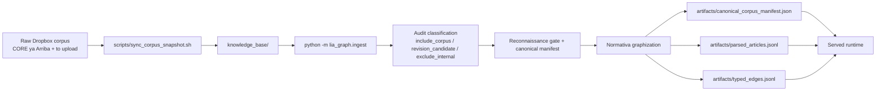
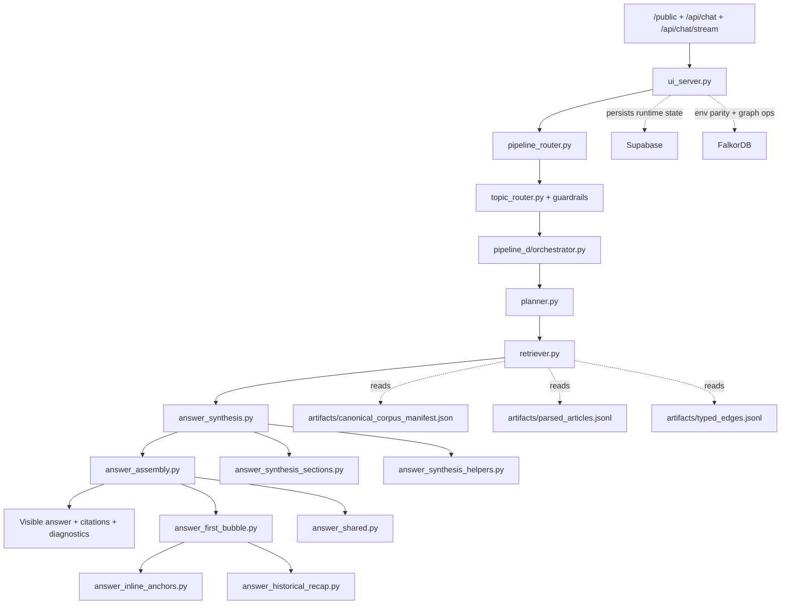
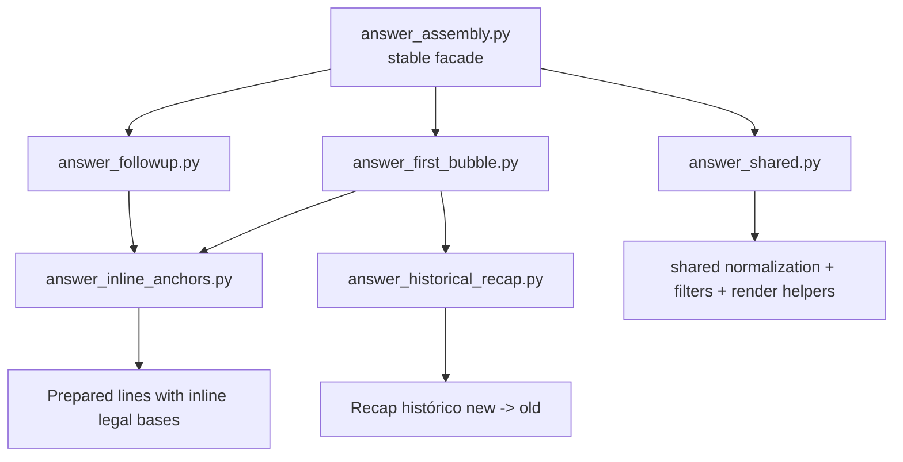

# Orchestration Guide

## Purpose

This guide describes the live orchestration of Lia Graph at two levels:

- the build-time ingestion lane that produces the artifact bundle
- the served runtime lane that turns accountant prompts into visible answers

This is the end-to-end operating map.

For the primary source of truth for chat-answer shaping policy, module ownership, and tuning rules, read:

- `docs/guide/chat-response-architecture.md`

`docs/guide/orchestration1.md` is an archived snapshot only. It is not a live runtime guide.

## What This Guide Owns

This file is the main reference for:

- `/public`
- authenticated chat shells
- `/api/chat`
- `/api/chat/stream`
- `/api/citation-profile`
- `/api/normative-analysis`
- `/source-view`
- the `/orchestration` HTML view
- the artifact-backed retrieval runtime
- the ingestion path that materializes the artifacts the runtime reads

This file answers questions like:

- what modules are on the hot path
- what order they run in
- where graph evidence is selected
- where answer parts are synthesized
- where visible assembly happens
- what belongs to `main chat` only
- what non-chat surfaces such as `Normativa` and `Interpretación` should reuse versus reimplement

It is intentionally not the fine-grained style guide for the visible answer. That belongs in `chat-response-architecture.md`.

## Current Truths

The current served runtime has these properties:

- `pipeline_d` is the served answer path
- there is no second historical retrieval engine
- historical behavior is implemented inside `pipeline_d`
- `Normativa` now has its own surface package under `src/lia_graph/normativa/`
- the `Normativa` modal and deep-analysis page reuse shared graph retrieval but do not reuse `main chat` answer assembly
- `Interpretación` now has its own surface package under `src/lia_graph/interpretacion/`
- the `Interpretación` window reuses shared graph retrieval but does not reuse `main chat` or `Normativa` presentation modules
- after the chat bubble publishes, `Normativa` and `Interpretación` run as sibling post-answer tracks from the same minimal turn kernel; neither should block the bubble, and `Interpretación` must not wait for full `Normativa` completion
- source/document-reader windows are deterministic read surfaces, not graph answer-assembly surfaces
- the served runtime does not read Dropbox directly
- the served runtime reads the artifact bundle built from the canonical corpus
- the `main chat` surface now has explicit internal facades and submodules instead of one large orchestration file
- the `main chat` assembly path is split on purpose between first-turn mapping and second-plus follow-up publication

## Product Rules

- The visible answer must be accountant-facing only.
- The visible answer must be practical-first.
- The visible answer must not expose planner or retrieval meta-thinking.
- Accountants should not need article-citation phrasing to get a useful answer.
- Graph grounding comes before interpretive or practical enrichment.
- Hot-path tuning must be general by workflow, signal class, or evidence pattern; never by memorizing a single user question.
- Ambiguous state phrases such as `saldo a favor` must not activate a workflow bundle unless the prompt also shows the workflow intent itself.
- The first visible answer should map the case broadly; second-plus answers should inherit that map and answer the requested double-click directly.
- The `main chat` surface may share graph evidence utilities with future surfaces, but it must not become the hidden assembly layer for `Normativa` or `Interpretación`.
- `/orchestration` and this guide must describe the current runtime truthfully.

## Runtime Stack At A Glance

There are two different sequences to keep straight:

1. the public request path
2. the internal Pipeline D execution path

The public request path is:

1. `src/lia_graph/ui_server.py`
2. `src/lia_graph/pipeline_router.py`
3. `src/lia_graph/topic_router.py` plus topic guardrails
4. `src/lia_graph/pipeline_d/orchestrator.py`

Inside `pipeline_d/orchestrator.py`, the internal execution path is:

1. `src/lia_graph/pipeline_d/planner.py`
2. `src/lia_graph/pipeline_d/retriever.py`
3. `src/lia_graph/pipeline_d/answer_synthesis.py`
4. `src/lia_graph/pipeline_d/answer_assembly.py`

Behind those stable facades, the `main chat` implementation modules are:

- `src/lia_graph/pipeline_d/answer_synthesis_sections.py`
- `src/lia_graph/pipeline_d/answer_synthesis_helpers.py`
- `src/lia_graph/pipeline_d/answer_first_bubble.py`
- `src/lia_graph/pipeline_d/answer_followup.py`
- `src/lia_graph/pipeline_d/answer_inline_anchors.py`
- `src/lia_graph/pipeline_d/answer_historical_recap.py`
- `src/lia_graph/pipeline_d/answer_shared.py`

Important boundary:

- other runtime modules should prefer importing the stable facades `answer_synthesis.py` and `answer_assembly.py`
- the deeper modules are implementation detail for `main chat`

## Information Architecture Map

The current runtime is easiest to reason about if you map it as information handoffs instead of just file order.

### 0. Information Objects

The main objects passed across the runtime are:

- normalized chat request payload
- topic hints and guardrail output
- graph retrieval plan
- graph evidence bundle
- article/support insights
- structured answer parts
- visible markdown answer
- `PipelineCResponse`

### 1. Producer To Consumer Map

| Producer | Contract | Main fields or shape | Consumer | Surface scope |
| --- | --- | --- | --- | --- |
| `ui_server.py` | normalized request | message, history, knobs, auth/public context | `pipeline_router.py` | shared runtime |
| `topic_router.py` + guardrails | routed topic hints | dominant topic, secondary hints, disambiguation pressure | `planner.py` | shared runtime |
| `planner.py` | retrieval plan | `query_mode`, `entry_points`, budgets, temporal context, follow-up continuity anchoring | `retriever.py`, `orchestrator.py` | shared runtime |
| `retriever.py` | evidence bundle | `primary_articles`, `connected_articles`, `related_reforms`, `support_documents`, citations | `answer_synthesis.py` | shared runtime |
| `answer_support.py` | enrichment insights | article-derived and support-derived practical lines | `answer_synthesis.py` | shared hot path |
| `answer_synthesis.py` | `GraphNativeAnswerParts` | recommendations, procedure, paperwork, anchors, context, precautions, opportunities | `answer_assembly.py`, `orchestrator.py` | `main chat` |
| `answer_assembly.py` | visible markdown pieces | first-turn mapping route and second-plus follow-up route | `orchestrator.py` | `main chat` |
| `orchestrator.py` | `PipelineCResponse` | answer text, citations, confidence, diagnostics | `ui_server.py` | shared runtime |

### 2. Main-Chat Facade Map

The `main chat` surface now has two stable facades:

| Facade | Why it exists | What sits behind it |
| --- | --- | --- |
| `answer_synthesis.py` | caller should not need to know how section candidates are built | `answer_synthesis_sections.py`, `answer_synthesis_helpers.py` |
| `answer_assembly.py` | caller should not need to know how first-turn and follow-up rendering internals are organized | `answer_first_bubble.py`, `answer_followup.py`, `answer_inline_anchors.py`, `answer_historical_recap.py`, `answer_shared.py` |

### 3. Surface Boundary Map

| Layer | Shared across surfaces | `main chat` specific | `Normativa` specific |
| --- | --- | --- | --- |
| request normalization | yes | no | reuse |
| planner | yes | no | reuse when goals match |
| retriever/evidence bundle | yes | no | reuse where compatible |
| synthesis facade | no | yes | `src/lia_graph/normativa/synthesis.py` |
| assembly facade | no | yes | `src/lia_graph/normativa/assembly.py` |
| first-bubble logic | no | yes | do not reuse as normative UI contract |

The design intent is:

- shared graph logic can stay shared
- visible surface behavior should be isolated per surface
- `main chat` should not quietly become the assembly backend for `Normativa`

## Runtime Surface Map

The served product has multiple user-visible surfaces, and they are orchestrated differently on purpose.

### Main Chat Surface

This is the accountant conversation surface behind:

- `/public`
- authenticated chat shells
- `/api/chat`
- `/api/chat/stream`

Its orchestration path is:

1. `src/lia_graph/ui_server.py`
2. `src/lia_graph/pipeline_router.py`
3. `src/lia_graph/topic_router.py`
4. `src/lia_graph/pipeline_d/orchestrator.py`
5. `src/lia_graph/pipeline_d/answer_synthesis.py`
6. `src/lia_graph/pipeline_d/answer_assembly.py`

This surface owns:

- first-bubble structure
- second-plus follow-up publication
- inline legal anchors
- historical recap formatting
- the senior-accountant visible answer policy

### Post-Answer Surface Concurrency

The served UX intentionally has three tracks after a user turn:

1. `main chat` publishes the answer bubble first
2. `Normativa` primes its own track second
3. `Interpretación` primes its own track third

The important runtime rule is not strict serialization; it is minimal shared dependency.

- `main chat` is the critical path and should not wait for either side window
- `Normativa` and `Interpretación` both start from the shared turn kernel:
  - `trace_id`
  - user message
  - published assistant answer
  - normalized topic and country
  - detected or cited normative anchors already visible in the turn
- `Interpretación` may reuse the current turn's cited-anchor snapshot, but it must not wait for `/api/normative-support` to finish a full resolve before beginning its own retrieval
- the ordering is UX ownership, not deep blocking: `Normativa` gets first crack at the post-answer context, then `Interpretación` starts with whatever kernel is already available

### Normativa Window And Deep Analysis Surface

This is the surface behind:

- citation click modal via `GET /api/citation-profile`
- deep-analysis page via `GET /api/normative-analysis`

Its runtime is intentionally split into two layers:

1. deterministic citation/profile assembly
2. graph-backed Normativa enrichment

Deterministic layer:

- `src/lia_graph/ui_citation_controllers.py`
- `src/lia_graph/ui_citation_profile_builders.py`
- `src/lia_graph/ui_reference_resolvers.py`
- `src/lia_graph/ui_source_view_processors.py`
- `src/lia_graph/ui_expert_extractors.py`
- `src/lia_graph/ui_normative_processors.py`
- `src/lia_graph/normative_taxonomy.py`
- `src/lia_graph/citation_resolution.py`
- `src/lia_graph/normative_references.py`

Normativa graph-backed layer:

- `src/lia_graph/normativa/orchestrator.py`
- `src/lia_graph/normativa/synthesis.py`
- `src/lia_graph/normativa/policy.py`
- `src/lia_graph/normativa/synthesis_helpers.py`
- `src/lia_graph/normativa/sections.py`
- `src/lia_graph/normativa/assembly.py`
- `src/lia_graph/normativa/shared.py`

The important contract split is:

- `phase=instant` returns deterministic document-centered payloads fast
- `phase=llm` keeps the old API name for compatibility, but the generated content now comes from the dedicated `Normativa` surface package
- `Normativa` reuses shared planner/retriever evidence, but it does not import `pipeline_d/answer_*` modules for visible shaping
- inside the `Normativa` package, `orchestrator.py`, `synthesis.py`, and `assembly.py` are the stable surface seams; `policy.py`, `synthesis_helpers.py`, `sections.py`, and `shared.py` are focused implementation modules behind them

Current ET-article recovery behavior:

- if `phase=instant` receives an ET citation such as `reference_key=et` plus `locator_start`, but the canonical `renta_corpus_a_et_art_*` row cannot be resolved, the deterministic citation-profile layer builds a fallback modal payload from `artifacts/parsed_articles.jsonl`
- this preserves the deterministic modal contract and avoids surfacing a raw `404` for ET article clicks when the surface still has enough article text to render
- this fallback belongs to the `Normativa` deterministic layer; it is not a `main chat` answer-assembly concern

### Interpretación Window

This is the surface behind:

- `POST /api/expert-panel`
- `POST /api/expert-panel/enhance`
- `POST /api/expert-panel/explore`
- `POST /api/citation-interpretations`
- `POST /api/interpretation-summary`

Current truth:

- it is a separate window concern
- it must remain separate from both `main chat` and `Normativa`
- it now has its own dedicated surface package under `src/lia_graph/interpretacion/`
- it runs after the answer bubble with the same minimal turn kernel used to prime `Normativa`, but it does not wait for `Normativa` retrieval to complete

Current server-side ownership is intentionally split:

- `src/lia_graph/ui_analysis_controllers.py`
- `src/lia_graph/interpretacion/orchestrator.py`
- `src/lia_graph/interpretacion/synthesis.py`
- `src/lia_graph/interpretacion/policy.py`
- `src/lia_graph/interpretacion/synthesis_helpers.py`
- `src/lia_graph/interpretacion/assembly.py`
- `src/lia_graph/interpretacion/shared.py`
- `src/lia_graph/interpretation_relevance.py` as compatibility facade for the shared ranking contract

Important boundary:

- `ui_analysis_controllers.py` is the thin HTTP seam
- the dedicated `interpretacion` package owns ranking, grouping, summary, enhancement, and payload publication
- supporting citation/source helpers may still be injected from shared deterministic modules, but visible shaping belongs to the `Interpretación` surface package itself

### Source View, Article Reader, And Form Guide Windows

These are document-reading surfaces, not graph-assembled answer surfaces.

They are primarily deterministic:

- `/source-view`
- `/source-download`
- article reader
- form-guide page/shell

Their server-side path is mainly:

- `src/lia_graph/ui_source_view_processors.py`
- `src/lia_graph/ui_text_utilities.py`
- `src/lia_graph/form_guides.py`
- `src/lia_graph/ui_form_guide_helpers.py`

Surface-specific package root:

- `knowledge_base/form_guides/`
- this root powers deterministic formulario/formato previews and interactive guide windows
- it is a local read package lane, not a `main chat` assembly input and not a remote dependency on Lia Contadores at runtime
- it should stay organized as `formulario_<numero>/<profile_id>/...` even when the visible label is `Formato <numero>`

These windows may reuse normalized document metadata and source resolution, but they are not supposed to route through `main chat` or `Normativa` answer-assembly logic.

## Lane 0: Raw Corpus, Ingestion, And Artifact Build

This lane is build-time orchestration, not the per-request hot path.
It is still load-bearing because the served runtime depends on the artifacts it produces.

Current green ingestion state as of `2026-04-16`:

- raw corpus source root: `/Users/ava-sensas/Library/CloudStorage/Dropbox/AAA_LOGGRO Ongoing/AI/LIA_contadores/Corpus`
- synced working snapshot: `/Users/ava-sensas/Developer/Lia_Graph/knowledge_base`
- latest snapshot counts: `1319` synced files, `1246` `include_corpus`, `0` `revision_candidate`, `73` `exclude_internal`
- canonical blessing state: `ready_for_canonical_blessing`, `1246` ready, `0` review required, `0` pending revisions
- graph validation state: `2617` nodes, `20345` edges, `ok = true`

### 0.1 Raw Corpus To Snapshot

`scripts/sync_corpus_snapshot.sh` copies the two canonical raw roots:

- `CORE ya Arriba`
- `to upload`

The sync intentionally keeps accountant-facing material and revision staging visible, then lets the audit gate decide what is corpus, what is revision material, and what is internal control text.

The current snapshot intentionally omits `79` Dropbox files, but only because they already classify as `exclude_internal`.
There are `0` shared-path decision or label mismatches between Dropbox and `knowledge_base`.

### 0.2 Audit And Canonical Blessing

`src/lia_graph/ingest.py` scans the snapshot and classifies every file into exactly one decision:

- `include_corpus`
- `revision_candidate`
- `exclude_internal`

It then materializes:

- `artifacts/corpus_audit_report.json`
- `artifacts/corpus_reconnaissance_report.json`
- `artifacts/revision_candidates.json`
- `artifacts/excluded_files.json`
- `artifacts/canonical_corpus_manifest.json`
- `artifacts/corpus_inventory.json`

This is the layer that decides whether the corpus is durably blessable, not the runtime.

### 0.3 Revision Handling

`revision_candidate` files do not enter the canonical corpus as standalone evidence.
They must either:

- be merged into their base document, or
- remain visible as attached pending revisions and keep the blessing gate open

The current corpus is green because the open editorial tranche was merged back into the Dropbox source and the standalone patch/upsert/errata files were archived under `deprecated/`.
That brought the latest run to `0` pending revisions and `0` manual-review rows.

### 0.4 Artifact Materialization

After the audit gate clears, the ingestion pass graphizes the `normativa` family first and writes the artifact bundle the runtime consumes:

- `artifacts/canonical_corpus_manifest.json`
- `artifacts/parsed_articles.jsonl`
- `artifacts/typed_edges.jsonl`

`artifacts/parsed_articles.jsonl` now serves two live purposes:

- graph/article retrieval input
- deterministic ET-article fallback input for the `Normativa` citation-profile modal when the canonical article `doc_id` cannot be resolved from the current read path

That is the exact handoff between corpus-build orchestration and served-answer orchestration.

## Runtime Overview

## Lane 1: Entry, Route, And Runtime Shell

`ui_server.py` serves the shell, normalizes the chat payload, handles public and authenticated access, and starts the runtime.

`pipeline_router.py` resolves the served route.
Today that default is `pipeline_d`.

This lane decides:

- how the request enters
- which runtime handles it
- whether the request is public or authenticated
- whether the response is buffered or streamed

This lane does not decide answer substance.

## Lane 2: Topic Detection And Guardrails

`topic_router.py` and the guardrails convert accountant language into topic hints without making `topic/subtopic` the only truth model.

What this lane does:

- detects the dominant accountant workflow from natural language
- resists side mentions hijacking the route
- keeps practical prompts practical
- hands topic hints into the planner instead of flat-filtering documents first

Example:

- a devolución / saldo a favor prompt that also mentions facturación electrónica should stay centered on `procedimiento_tributario`

Important limitation in the current runtime:

- broad renta vocabulary can still outweigh a more specific tax concept when the downstream lexical resolver is too literal or too generic

## Lane 3: Planner Contract

`build_graph_retrieval_plan()` converts the user question into a graph retrieval plan.

The planner outputs:

- `query_mode`
- `entry_points`
- `traversal_budget`
- `evidence_bundle_shape`
- `temporal_context`
- `topic_hints`
- `planner_notes`

### 3.1 Query Mode Selection

The planner classifies in this order:

1. `historical_reform_chain`
2. `historical_graph_research`
3. `reform_chain`
4. `strategy_chain`
5. `definition_chain`
6. `obligation_chain`
7. `computation_chain`
8. `article_lookup`
9. `general_graph_research`

The key design intent is:

- reform and historical prompts should be explicit
- workflow prompts should not be misread as historical just because they say `antes de...`
- accountant-style operational questions should still land in a mode with enough support budget
- advisory prompts about lawful tax planning vs abuse/simulation should trigger a dedicated strategy lane instead of collapsing into generic renta anchors

### 3.2 Historical Intent

Historical intent lives in `src/lia_graph/pipeline_c/temporal_intent.py`.

Strong signals include:

- `qué decía`
- `versión anterior`
- `originalmente`
- `histórico`
- `antes de la Ley ...`
- `previo a la Ley ...`
- `después de la Ley ...`

When the prompt contains a reform year, the helper infers a coarse cutoff as the last day of the prior year.

Example:

- `antes de la Ley 2277 de 2022` -> `2021-12-31`

### 3.3 Entry Point Construction

The planner adds entry points in layers:

1. explicit articles
2. explicit reforms
3. topic hints
4. lexical article-search queries when the user asks in workflow language instead of citation language

This is why a prompt like `Mi cliente tiene saldo a favor...` can still land on hard legal anchors such as `850`, `589`, and `815`.

### 3.4 Workflow Expansion

The planner has workflow expansion for:

- devolución / saldo a favor
- corrección / firmeza
- beneficio de auditoría interactions
- tax-treatment / procedencia prompts
- lawful planning / abuse / simulation / jurisprudence prompts

For those prompts it can add:

- supplemental topic hints such as `procedimiento_tributario`, `declaracion_renta`, `calendario_obligaciones`
- lexical graph searches tailored to the workflow
- mode selection that prefers the dominant workflow when multiple downstream actions are mentioned

Important guardrail now live:

- workflow expansion is keyed to explicit workflow signals, not just to broad states like `saldo a favor`
- if correction/firmness and devolución/compensación both appear, the planner compares workflow strength instead of blindly favoring the refund branch

### 3.5 Current Planner Pressure Point

The planner still depends on marker heuristics, but the current hot path is materially less brittle than before.

The implemented improvements were:

- broader computation/procedencia markers such as `deducir`, `deducible`, `procedencia`, `descuento tributario`, `costo o gasto`
- workflow-strength comparison between refund and correction lanes
- secondary topic hints from scored topic detection instead of hardcoded one-question exceptions
- explicit `strategy_chain` handling for planning, anti-abuse, simulation, and jurisprudence prompts

The remaining risk is not “one question fails”, but that new accountant phrasings can still arrive that are semantically right and lexically unfamiliar.

## Lane 4: Retrieval And Evidence Selection

The served answer path is graph-first and artifact-backed.

The retriever reads:

- `artifacts/canonical_corpus_manifest.json`
- `artifacts/parsed_articles.jsonl`
- `artifacts/typed_edges.jsonl`

The evidence bundle has four layers:

1. `primary_articles`
2. `connected_articles`
3. `related_reforms`
4. `support_documents`

### 4.1 Entry-Point Resolution

If the planner emitted explicit anchors:

- article entry -> direct `ArticleNode` anchor when present
- reform entry -> direct `ReformNode` anchor when present

If the planner emitted lexical article searches:

- the runtime scores articles by boundary-aware lexical overlap
- heading hits weigh more than body hits
- strong query-heading alignment gets an extra boost
- broad generic renta tokens are discounted
- matching a planner topic hint boosts the score, but only lightly if the article has no real content match
- lexical results are trimmed per search so the first search does not monopolize all seed articles

This is the bridge between natural-language accountant prompts and concrete article anchors.

### 4.2 Graph Traversal

Traversal is a bounded graph walk over resolved anchors.

Neighbor expansion is sorted by:

1. temporal rank
2. mode-specific preferred edge kind
3. node-kind rank
4. direction preference
5. stable key order

Mode-specific edge preferences include patterns like:

- `obligation_chain`: `REQUIRES`, `REFERENCES`, `MODIFIES`
- `computation_chain`: `COMPUTATION_DEPENDS_ON`, `REQUIRES`, `REFERENCES`
- `historical_reform_chain`: `SUPERSEDES`, `MODIFIES`, `REFERENCES`, `REQUIRES`
- `strategy_chain`: primary anchors first, then adjacent norms that define legal limits or abuse-risk boundaries

### 4.3 Historical Noise Control

Historical mode is intentionally stricter.

Connected articles reached through `MODIFIES` or `SUPERSEDES` survive only when at least one of these is true:

- same source document as the parent article
- same topic as the parent article
- same primary topic
- explicitly hinted topic
- heading overlap with the parent article
- explicit reform-anchor match

This prevents graph-valid but topic-wrong neighbors from polluting a historical answer.

### 4.4 Support Document Selection

Support documents do not lead the answer.
They enrich it after legal grounding exists.

Selection currently works in stages:

1. source documents behind selected graph articles
2. topic-expansion documents from ready canonical docs
3. diversification so the answer can include practical and interpretive material when possible
4. enrichment reservation so operational answers keep room for at least one `practica` or `interpretacion` doc when available

Sorting uses:

- source docs before topic-expansion docs
- family rank
- query-token overlap
- stable path order

### 4.5 Retrieval Changes Now Live

The contained first-answer pass changed this lane in important ways:

1. lexical matching is no longer substring-driven
   - short tax concepts such as `ICA` and `GMF` now rely on boundary-aware matching
   - the scorer prefers strong heading alignment over diffuse generic overlap

2. lexical seeding is no longer dominated by one article-search string
   - each generated search contributes only a limited number of anchors
   - multi-step workflows retain anchor diversity such as `850`, `854`, `815`, `589` or `589`, `588`, `714`

3. support selection now preserves enrichment space
   - source documents still enter first
   - but operational answers no longer lose all practical or interpretive context by default

4. strategy/advisory prompts reserve more room for `practica` and `interpretacion`
   - so the visible answer can sound like a knowledgeable senior accountant rather than a bare list of norms

## Lane 5: Synthesis Contract

Synthesis is the step that turns graph evidence into structured answer parts before any visible markdown is assembled.

This is intentionally separate from rendering.

### 5.1 Stable Synthesis Facade

`src/lia_graph/pipeline_d/answer_synthesis.py` is the stable facade for `main chat` synthesis.

It exists so other runtime modules do not need to know the internal submodule layout.

Today it exposes one primary product:

- `GraphNativeAnswerParts`

And one primary entrypoint:

- `build_graph_native_answer_parts(...)`

### 5.2 `GraphNativeAnswerParts`

`GraphNativeAnswerParts` is the internal structured bundle returned by synthesis.

It currently includes:

- `article_insights`
- `support_insights`
- `recommendations`
- `procedure`
- `paperwork`
- `legal_anchor`
- `context_lines`
- `precautions`
- `opportunities`

This is not the public API contract.
It is the internal handoff between synthesis and assembly for `main chat`.

### 5.3 Synthesis Order Of Operations

`build_graph_native_answer_parts(...)` currently does this in order:

1. computes `allow_change_context`
2. extracts support-doc insights via `answer_support.py`
3. extracts article insights from primary and connected articles
4. builds section candidates
5. applies publication filtering
6. deduplicates visible candidate lines across sections
7. returns the structured answer-parts bundle

This order matters:

- evidence extraction must happen before section building
- publication filtering must happen before final assembly
- section-level dedup happens before rendering so repeated lines do not pollute the answer

### 5.4 Section Builders

`src/lia_graph/pipeline_d/answer_synthesis_sections.py` owns the section-specific builders for `main chat`.

It currently owns:

- `build_recommendations(...)`
- `build_procedure_steps(...)`
- `build_paperwork_lines(...)`
- `build_legal_anchor_lines(...)`
- `build_context_lines(...)`
- `build_precautions(...)`
- `build_opportunities(...)`

This module is where the runtime answers:

- what candidate lines belong in each section
- which direct-position lines should appear before generic copy
- when historical context should surface as context rather than recap
- when a connected article should appear in legal anchors

### 5.5 Synthesis Helpers

`src/lia_graph/pipeline_d/answer_synthesis_helpers.py` owns reusable synthesis heuristics.

It currently owns:

- extending candidate lines from support insights
- extending candidate lines from article guidance
- fallback recommendation/procedure lines
- best-primary-article selection
- procedure anchor-tail injection
- connected-anchor relevance heuristics
- tax-treatment heuristics
- small cleanup helpers such as title cleaning

This module should stay focused on reusable heuristics.
It should not become the place where whole visible answer shapes are decided.

### 5.6 What Synthesis Must Not Own

Synthesis should not decide:

- the visible section titles
- first-turn versus later-turn layout
- inline anchor markdown formatting
- historical recap wording
- whether the answer is rendered as numbered vs bullet sections

Those belong to assembly.

## Lane 6: Assembly Contract

Assembly is the step that turns answer parts into the visible markdown shown to the user.

This lane is `main chat` specific.

### 6.1 Stable Assembly Facade

`src/lia_graph/pipeline_d/answer_assembly.py` is the stable facade for `main chat` assembly.

It re-exports the pieces other runtime modules are supposed to consume:

- `compose_first_bubble_answer(...)`
- `compose_main_chat_answer(...)`
- publication filters
- rendering helpers
- shared text utilities needed by synthesis

Rule:

- import from `answer_assembly.py` unless you are actively editing the `main chat` implementation

### 6.2 Shared Assembly Utilities

`src/lia_graph/pipeline_d/answer_shared.py` owns shared assembly-time utilities.

It currently owns:

- `normalize_text(...)`
- `append_unique(...)`
- `filter_published_lines(...)`
- `published_context_lines(...)`
- `take_new_lines(...)`
- `render_bullet_section(...)`
- `render_numbered_section(...)`
- `should_surface_change_context(...)`
- `should_use_first_bubble_format(...)`
- change-intent helpers
- common inline legal-reference detection

This is the common utility layer for `main chat`.
It is intentionally not surface-generic product policy.

### 6.3 First-Turn Composer

`src/lia_graph/pipeline_d/answer_first_bubble.py` owns first-turn composition.

It currently decides:

- whether the prompt should use the standard first-turn operational shape
- whether it should use the richer tax-planning advisory shape
- which first-turn sections appear
- how recommendations, precautions, paperwork, and recap are interleaved into a readable first answer

This module is where the product intent “contador senior que te guía” becomes a concrete first-turn structure.

### 6.4 Follow-Up Composer

`src/lia_graph/pipeline_d/answer_followup.py` owns second-plus answer publication.

It currently decides:

- whether the turn is a focused double-click or a broader follow-up
- how much of the previous case map should be assumed instead of replayed
- how direct-answer lead lines are selected for focused follow-ups
- when later turns should stay sectioned but lighter than the first bubble

This module is where the product rule “second-plus answers inherit the active case and answer the requested point directly” becomes concrete.

### 6.5 Inline Legal Anchors

`src/lia_graph/pipeline_d/answer_inline_anchors.py` owns inline legal anchoring for first-bubble lines.

It currently owns:

- cleanup of legacy anchor tails
- prepared-line identity keys
- anchor scoring and selection
- inline anchor rendering
- `PreparedAnswerLine`

That means this module answers:

- which legal references should attach to a line
- in what order
- how many
- and how they should render in the line itself

### 6.6 Historical Recap

`src/lia_graph/pipeline_d/answer_historical_recap.py` owns recap logic.

It currently owns:

- whether recap should appear at all
- reform-chain extraction from primary article excerpts
- chronological sorting of mentions
- recap wording for one-, two-, or three-step mention chains

That means this module answers:

- when historical context should be a dedicated recap block
- and how the chain should be narrated from newer evidence to older evidence

### 6.7 Visible Shapes Now Live

The visible answer now has two live shapes.

First-turn `fast_action`:

- general operational prompts use:
  - `Ruta sugerida`
  - `Riesgos y condiciones`
  - `Soportes clave`
  - optional `Recap histórico`
- tax-planning / abuse / simulation / jurisprudence prompts use:
  - `Cómo La Trabajaría`
  - `Estrategias Legítimas A Modelar`
  - `Qué Mira DIAN Y La Jurisprudencia`
  - `Papeles De Trabajo`

Second-plus follow-ups use a separate publication path:

- focused double-clicks use:
  - a direct answer lead
  - `En concreto`
  - `Precauciones`
  - `Anclaje Legal`
- broader later turns still use sectioned follow-up output such as:
  - `Qué Haría Primero`
  - `Procedimiento Sugerido`
  - optional `Soportes y Papeles de Trabajo`
  - `Anclaje Legal`
  - `Precauciones`
  - optional `Cambios y Contexto Legal`
  - optional `Oportunidades`

### 6.8 What The User Must Never See

The user should never see:

- planner mode names
- route names
- retrieval diagnostics
- graph self-commentary
- “I searched the graph” style system narration

Those stay in diagnostics, not in the visible answer.

### 6.9 Assembly Module Graph

### 6.10 Assembly Information Flow

Within `main chat`, the current assembly flow is:

1. `answer_synthesis.py` returns `GraphNativeAnswerParts`
2. `answer_assembly.py` decides whether the turn publishes through the first-turn or follow-up route
3. `answer_first_bubble.py` decides which first-turn shape applies
4. `answer_followup.py` decides whether a second-plus turn is a focused double-click or a broader follow-up
5. `answer_inline_anchors.py` prepares line-level inline legal anchors
6. `answer_historical_recap.py` decides whether a recap block should appear
7. `answer_shared.py` provides normalization, filtering, dedup, and common markdown rendering helpers

That means the current `main chat` visible answer is not produced by one module doing all of these at once:

- selecting evidence
- extracting practical lines
- choosing first-turn shape
- choosing inline legal anchors
- deciding recap visibility
- rendering markdown

That separation is intentional and is now part of the architecture, not just an implementation accident.

## Lane 7: Response Contract And Persistence

The response returned to the UI and API still includes:

- answer text
- citations
- diagnostics
- confidence
- `graph_native` vs `graph_native_partial`

The user should see the answer and citations, not the orchestration internals.

Supabase remains the runtime persistence and ops state for:

- conversations
- chat runs
- metrics
- feedback
- usage ledger
- auth nonces
- terms state
- active-generation state

FalkorDB currently supports:

- local Docker parity
- staging or cloud parity
- graph ops and environment health

It is not yet the live per-request traversal engine for served answers.

## Surface Boundaries

The new internal split is intentionally `main chat` specific.

What `main chat` owns:

- `answer_synthesis.py`
- `answer_assembly.py`
- all deeper submodules behind those facades

What `Normativa` should reuse:

- graph artifacts
- planner and retriever where appropriate
- evidence contracts where appropriate
- general runtime shell patterns

What `Normativa` should not do:

- import `main chat` first-bubble modules and treat them as its UI contract
- quietly reuse `answer_first_bubble.py` for normative modal/page rendering
- couple its response shape to `main chat` markdown sections

What `Normativa` does instead:

- define its own facade for normative synthesis
- define its own facade for normative assembly
- reuse shared graph retrieval only where that reuse is real and stable
- keep the stable-facade pattern, not the exact `main chat` visible structure

In other words:

- reuse the architecture pattern
- do not reuse the `main chat` information architecture wholesale
- create a normative information architecture with its own facades, contracts, and implementation modules

The same rule applies to `Interpretación`.

## Current Architecture Change Set

The current refactor materially changed the hot path in these ways:

1. `src/lia_graph/pipeline_d/orchestrator.py` is no longer the hidden home of most answer logic
2. `main chat` synthesis now has a stable facade plus dedicated helper/section modules
3. `main chat` assembly now has a stable facade plus first-bubble, follow-up, inline-anchor, recap, and shared submodules
4. the docs now explicitly distinguish:
   - runtime flow
   - synthesis
   - assembly
   - shared utilities
   - surface-specific ownership

This matters because the repo is now easier to:

- tune
- review
- onboard into
- extend into `Normativa`
- extend into `Interpretación`

without returning to “one giant orchestration file with mixed responsibilities”.

## Tuning Rules

Use this order when debugging or improving the runtime:

1. if the wrong workflow activates, tune `planner.py`
2. if the wrong legal anchors dominate, tune `retriever.py` or `retrieval_support.py`
3. if the evidence is right but the candidate answer parts are weak, tune `answer_synthesis_sections.py` or `answer_synthesis_helpers.py`
4. if the first answer shape is right but the line-level legal anchors are weak, tune `answer_inline_anchors.py`
5. if recap appears when it should not, or reads poorly, tune `answer_historical_recap.py`
6. if the voice/shape itself is wrong, tune `answer_policy.py` or `answer_first_bubble.py`
7. only change `orchestrator.py` when the actual runtime flow or response packaging changes

## Contained Pass Status

The contained first-answer pass is now live in `pipeline_d`.

What it solved:

- `¿Puedo deducir...?` / `¿Es procedente...?` prompts now route more reliably to `computation_chain`
- short tax concepts no longer depend on brittle substring scoring
- refund workflows retain the main legal articles instead of losing them to one dominant lexical seed
- correction/firmness prompts no longer get dragged into the refund branch just because they mention `saldo a favor`
- support bundles now admit practical or interpretive material more consistently
- strategy/advisory prompts now get a richer first-turn structure
- the answer path no longer depends on one oversized orchestration file
- `Normativa` now has its own surface-specific graph orchestration package

What it intentionally did not do:

- ingestion redesign
- public API redesign
- `Interpretación` surface implementation
- second historical engine

## Deferred Medicine

This is not active work yet.

Only if the contained pass stops being enough should we open a second layer of intervention:

- a very small query-contextualization helper before the planner for ambiguous follow-ups only
- more structured support-doc budgeting by family or purpose
- selective synthesis on top of already-grounded evidence, with a hard fallback when coverage is weak
- separate retrieval-policy layers per surface if `Normativa` and `Interpretación` begin to diverge materially from `main chat`

Trigger:

- a future eval set shows repeated anchor-quality or answer-quality misses that cannot be fixed with general workflow or evidence rules alone

That remains deferred on purpose so the current fix stays commensurate with the actual problem.

## Files That Matter Most

- `scripts/sync_corpus_snapshot.sh`
- `src/lia_graph/ingest.py`
- `config/topic_taxonomy.json`
- `docs/guide/corpus.md`
- `src/lia_graph/ui_server.py`
- `src/lia_graph/pipeline_router.py`
- `src/lia_graph/topic_router.py`
- `src/lia_graph/topic_guardrails.py`
- `src/lia_graph/pipeline_c/temporal_intent.py`
- `src/lia_graph/pipeline_d/planner.py`
- `src/lia_graph/pipeline_d/retriever.py`
- `src/lia_graph/pipeline_d/retrieval_support.py`
- `src/lia_graph/pipeline_d/answer_support.py`
- `src/lia_graph/pipeline_d/answer_synthesis.py`
- `src/lia_graph/pipeline_d/answer_synthesis_sections.py`
- `src/lia_graph/pipeline_d/answer_synthesis_helpers.py`
- `src/lia_graph/pipeline_d/answer_assembly.py`
- `src/lia_graph/pipeline_d/answer_first_bubble.py`
- `src/lia_graph/pipeline_d/answer_inline_anchors.py`
- `src/lia_graph/pipeline_d/answer_historical_recap.py`
- `src/lia_graph/pipeline_d/answer_shared.py`
- `src/lia_graph/pipeline_d/orchestrator.py`
- `docs/guide/chat-response-architecture.md`

## Short Mental Model

If you want the shortest accurate read of the served runtime, use this:

1. classify the accountant’s intent
2. turn it into graph anchors, budgets, and temporal context
3. resolve workflow language into real articles
4. walk the graph with mode-aware and time-aware prioritization
5. attach support docs only after legal grounding
6. synthesize structured answer parts
7. assemble the visible answer with a `main chat` specific facade and submodules
8. keep surface-specific assembly separate from shared graph evidence logic
9. tune the hot path only through general rules about workflows, evidence, and ambiguity, never by memorizing one prompt
