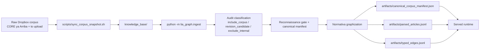
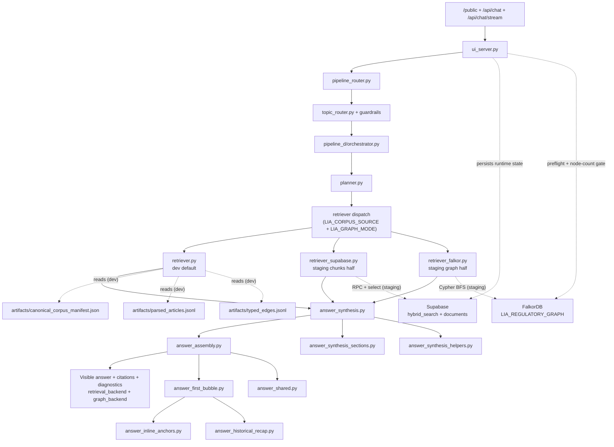
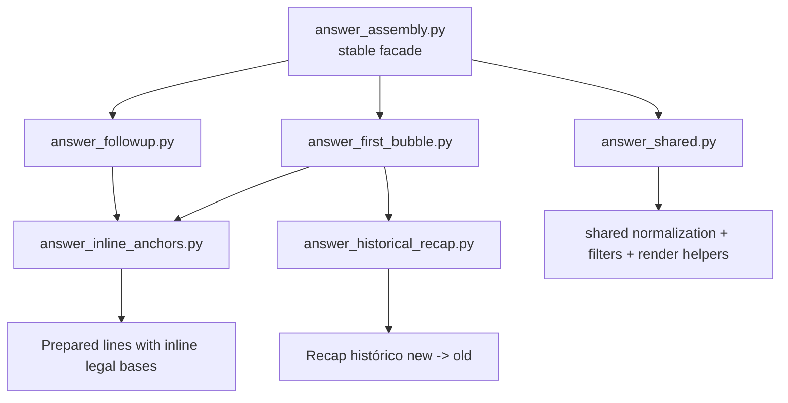

# Orchestration Guide

> **Env matrix version: `v2026-04-18`.**
> Authoritative table lives in [Runtime Env Matrix (Versioned)](#runtime-env-matrix-versioned). Bump the version and extend the change log whenever `scripts/dev-launcher.mjs` flips a flag, a new `LIA_*` env is introduced, or a mode's read path changes.

## Purpose

This guide describes the live orchestration of Lia Graph at two levels:

- the build-time ingestion lane that produces the artifact bundle
- the served runtime lane that turns accountant prompts into visible answers

This is the end-to-end operating map.

For the primary source of truth for chat-answer shaping policy, module ownership, and tuning rules, read:

- `docs/guide/chat-response-architecture.md`

For operational details (env files loaded per mode, migration baseline, seed users, corpus refresh), read:

- `docs/guide/env_guide.md`

`docs/guide/orchestration1.md` is an archived snapshot only. It is not a live runtime guide.

## What This Guide Owns

This file is the main reference for:

- `/public`
- authenticated chat shells
- `/api/chat`
- `/api/chat/stream`
- `/api/citation-profile`
- `/api/normative-analysis`
- `/source-view`
- the `/orchestration` HTML view
- the retrieval runtime — both the artifact-backed path (dev) and the cloud-live Supabase + FalkorDB path (staging / production)
- the ingestion path that materializes the artifacts AND the cloud Supabase rows the runtime reads
- the per-mode env/flag matrix and its version history (see [Runtime Env Matrix (Versioned)](#runtime-env-matrix-versioned))

This file answers questions like:

- what modules are on the hot path
- what order they run in
- where graph evidence is selected
- where answer parts are synthesized
- where visible assembly happens
- what belongs to `main chat` only
- what non-chat surfaces such as `Normativa` and `Interpretación` should reuse versus reimplement

It is intentionally not the fine-grained style guide for the visible answer. That belongs in `chat-response-architecture.md`.

## Current Truths

The current served runtime has these properties:

- `pipeline_d` is the served answer path
- there is no second historical retrieval engine
- historical behavior is implemented inside `pipeline_d`
- `Normativa` now has its own surface package under `src/lia_graph/normativa/`
- the `Normativa` modal and deep-analysis page reuse shared graph retrieval but do not reuse `main chat` answer assembly
- `Interpretación` now has its own surface package under `src/lia_graph/interpretacion/`
- the `Interpretación` window reuses shared graph retrieval but does not reuse `main chat` or `Normativa` presentation modules
- after the chat bubble publishes, `Normativa` and `Interpretación` run as sibling post-answer tracks from the same minimal turn kernel; neither should block the bubble, and `Interpretación` must not wait for full `Normativa` completion
- source/document-reader windows are deterministic read surfaces, not graph answer-assembly surfaces
- the served runtime does not read Dropbox directly
- retrieval reads **two possible sources**, picked per run-mode:
  - `dev` reads the filesystem artifact bundle and local docker FalkorDB (parity only)
  - `dev:staging` reads cloud Supabase (`hybrid_search` RPC) and walks the graph live in cloud FalkorDB
  - `dev:production` inherits staging's wiring through Railway env vars
- the read path is gated by `LIA_CORPUS_SOURCE` + `LIA_GRAPH_MODE`, set by `scripts/dev-launcher.mjs`; see [Runtime Env Matrix (Versioned)](#runtime-env-matrix-versioned) for the full versioned table
- the `main chat` surface now has explicit internal facades and submodules instead of one large orchestration file
- the `main chat` assembly path is split on purpose between first-turn mapping and second-plus follow-up publication

## Product Rules

- The visible answer must be accountant-facing only.
- The visible answer must be practical-first.
- The visible answer must not expose planner or retrieval meta-thinking.
- Accountants should not need article-citation phrasing to get a useful answer.
- Graph grounding comes before interpretive or practical enrichment.
- Hot-path tuning must be general by workflow, signal class, or evidence pattern; never by memorizing a single user question.
- Ambiguous state phrases such as `saldo a favor` must not activate a workflow bundle unless the prompt also shows the workflow intent itself.
- The first visible answer should map the case broadly; second-plus answers should inherit that map and answer the requested double-click directly.
- The `main chat` surface may share graph evidence utilities with future surfaces, but it must not become the hidden assembly layer for `Normativa` or `Interpretación`.
- `/orchestration` and this guide must describe the current runtime truthfully.

## Runtime Stack At A Glance

There are two different sequences to keep straight:

1. the public request path
2. the internal Pipeline D execution path

The public request path is:

1. `src/lia_graph/ui_server.py`
2. `src/lia_graph/pipeline_router.py`
3. `src/lia_graph/topic_router.py` plus topic guardrails
4. `src/lia_graph/pipeline_d/orchestrator.py`

Inside `pipeline_d/orchestrator.py`, the internal execution path is:

1. `src/lia_graph/pipeline_d/planner.py`
2. `src/lia_graph/pipeline_d/retriever.py`
3. `src/lia_graph/pipeline_d/answer_synthesis.py`
4. `src/lia_graph/pipeline_d/answer_assembly.py`

Behind those stable facades, the `main chat` implementation modules are:

- `src/lia_graph/pipeline_d/answer_synthesis_sections.py`
- `src/lia_graph/pipeline_d/answer_synthesis_helpers.py`
- `src/lia_graph/pipeline_d/answer_first_bubble.py`
- `src/lia_graph/pipeline_d/answer_followup.py`
- `src/lia_graph/pipeline_d/answer_inline_anchors.py`
- `src/lia_graph/pipeline_d/answer_historical_recap.py`
- `src/lia_graph/pipeline_d/answer_shared.py`
- `src/lia_graph/pipeline_d/answer_policy.py` — cupos, límites operativos (FIRST_BUBBLE_ROUTE_LIMIT, planning-mode shapes) y `ARTICLE_GUIDANCE`
- `src/lia_graph/pipeline_d/answer_llm_polish.py` — repaso LLM opcional post-assembly (gated por `LIA_LLM_POLISH_ENABLED`), con fallback determinístico al template

Shared pipeline_d modules that sit outside the `main chat` facades but still on the hot path:

- `src/lia_graph/pipeline_d/contracts.py` — dataclasses/typed dicts (`GraphEvidenceBundle`, `GraphRetrievalPlan`, `GraphNativeAnswerParts`)
- `src/lia_graph/pipeline_d/planner_query_modes.py` — clasificación de los 9 `query_mode` + 15 marker tuples (extraído de `planner.py` en ui9)
- `src/lia_graph/pipeline_d/retrieval_support.py` — ranking y selección de support docs (practical + interpretive)

Important boundary:

- other runtime modules should prefer importing the stable facades `answer_synthesis.py` and `answer_assembly.py`
- the deeper modules are implementation detail for `main chat`

## HTTP Controller Topology (granularization v1)

`ui_server.py` is not a monolith anymore. It owns ONE `BaseHTTPRequestHandler` subclass (`LiaUIHandler`) plus the module-level `_<domain>_controller_deps()` helpers (see the `def _*_controller_deps` definitions just above the class). Every `_handle_*` method on the class is a **5–15 line delegate** that builds a fresh `deps={…}` dict and calls `handle_<domain>_<verb>(handler, …, deps=…)` in a sibling `ui_<domain>_controllers.py` module. Domain logic does not live in `ui_server.py` — only dispatch, auth, rate limiting, response helpers (`_send_json`, `_send_bytes`), and dep wiring.

| Domain | Controller module | Deps helper | HTTP surface |
|---|---|---|---|
| chat (main) | `ui_chat_controller.py` | `_chat_controller_deps` | `POST /api/chat`, `POST /api/chat/stream` |
| analysis (pipeline-C compat + expert-panel) | `ui_route_controllers.py` (+ `ui_analysis_controllers.py`) | `_analysis_controller_deps` | various `/api/*` analysis reads |
| citations | `ui_citation_controllers.py` | inline | `GET /api/citations/*` |
| form guides (Normativa forms) | `ui_route_controllers.py` + `ui_form_guide_helpers.py` | inline | `GET /api/form-guides/{catalog,content,asset}` |
| frontend compat (legacy FE shims) | `ui_frontend_compat_controllers.py` | `_frontend_compat_controller_deps` | `GET /api/llm/status`, `GET\|POST /api/feedback*`, milestones, normative-support |
| ops | `ui_route_controllers.py` | inline | `GET /api/ops/*` |
| public session (anonymous visitors) | `ui_public_session_controllers.py` | `_public_session_controller_deps` | `POST /api/public/session`, `GET /public` |
| source view | `ui_route_controllers.py` | inline | `GET /api/source/*` |
| user management (admin + invite) | `ui_user_management_controllers.py` | `_write_controller_deps` | `GET\|POST /api/user-management/*`, invites |
| eval (robot/admin) | `ui_eval_controllers.py` | inline | `GET /api/eval/*` |
| writes (13 endpoints) | `ui_write_controllers.py` | `_write_controller_deps` | all state-mutating POST/PUT/DELETE: platform, form-guides, chat-runs, terms+feedback, contributions, ingestion, corpus sync/ops, embedding ops, reindex, rollback, promote |
| history / conversations | `ui_conversation_controllers.py` | inline | `GET /api/conversation*`, `GET /api/contributions/pending` |
| platform / admin | `ui_admin_controllers.py` | inline | `GET /api/me`, `/api/admin/*`, `/api/jobs/{id}` |
| runtime terms | `ui_runtime_controllers.py` | inline | `GET /api/terms*`, `GET /terms-of-use`, `PUT /api/orchestration/settings` |
| reasoning stream | `ui_reasoning_controllers.py` | inline | `GET /api/reasoning/events`, `GET /api/reasoning/stream` (SSE) |
| ingestion (reads + DELETE) | `ui_ingestion_controllers.py` | inline (GET: `{"ingestion_runtime": INGESTION_RUNTIME}`) | `GET /api/corpora`, `GET /api/ingestion/sessions*`, `DELETE /api/ingestion/sessions/{id}` |
| ingest run (admin Sesiones surface) | `ui_ingest_run_controllers.py` | inline (`{"workspace_root": WORKSPACE_ROOT}`) | `GET /api/ingest/state`, `GET /api/ingest/generations*`, `POST /api/ingest/run` (dispatches `make phase2-graph-artifacts-supabase` via `background_jobs.run_job_async`) |

Rules of thumb when editing or extending this surface (authoritative detail in `docs/next/granularization_v1.md` §Controller Surface Catalog):

- anything stateful, path-rooted, env-gated, or monkeypatched on `ui_server` → inject via `deps`
- pure stateless helpers (`json`, `re`, `parse_qs`, dataclass ctors from other modules) → direct import in the controller
- `_send_json`, `_resolve_auth_context`, rate-limit, and audit helpers stay on the class and are called as `handler.X(...)`
- adding more than ~15 LOC to `ui_server.py` for a new endpoint means you're doing it wrong — extract to the matching controller and wire a delegate

## Information Architecture Map

The current runtime is easiest to reason about if you map it as information handoffs instead of just file order.

### 0. Information Objects

The main objects passed across the runtime are:

- normalized chat request payload
- topic hints and guardrail output
- graph retrieval plan
- graph evidence bundle
- article/support insights
- structured answer parts
- visible markdown answer
- `PipelineCResponse`

### 1. Producer To Consumer Map

| Producer | Contract | Main fields or shape | Consumer | Surface scope |
| --- | --- | --- | --- | --- |
| `ui_server.py` | normalized request | message, history, knobs, auth/public context | `pipeline_router.py` | shared runtime |
| `topic_router.py` + guardrails | routed topic hints | dominant topic, secondary hints, disambiguation pressure | `planner.py` | shared runtime |
| `planner.py` | retrieval plan | `query_mode`, `entry_points`, budgets, temporal context, follow-up continuity anchoring | `retriever.py`, `orchestrator.py` | shared runtime |
| `retriever.py` | evidence bundle | `primary_articles`, `connected_articles`, `related_reforms`, `support_documents`, citations | `answer_synthesis.py` | shared runtime |
| `answer_support.py` | enrichment insights | article-derived and support-derived practical lines | `answer_synthesis.py` | shared hot path |
| `answer_synthesis.py` | `GraphNativeAnswerParts` | recommendations, procedure, paperwork, anchors, context, precautions, opportunities | `answer_assembly.py`, `orchestrator.py` | `main chat` |
| `answer_assembly.py` | visible markdown pieces | first-turn mapping route and second-plus follow-up route | `orchestrator.py` | `main chat` |
| `orchestrator.py` | `PipelineCResponse` | answer text, citations, confidence, diagnostics | `ui_server.py` | shared runtime |

### 2. Main-Chat Facade Map

The `main chat` surface now has two stable facades:

| Facade | Why it exists | What sits behind it |
| --- | --- | --- |
| `answer_synthesis.py` | caller should not need to know how section candidates are built | `answer_synthesis_sections.py`, `answer_synthesis_helpers.py`, `answer_policy.py` (cupos + `ARTICLE_GUIDANCE`) |
| `answer_assembly.py` | caller should not need to know how first-turn and follow-up rendering internals are organized | `answer_first_bubble.py`, `answer_followup.py`, `answer_inline_anchors.py`, `answer_historical_recap.py`, `answer_shared.py`, `answer_policy.py` (planning-mode shapes + route limits), `answer_llm_polish.py` (repaso LLM opcional gated por `LIA_LLM_POLISH_ENABLED`) |

### 3. Surface Boundary Map

| Layer | Shared across surfaces | `main chat` specific | `Normativa` specific |
| --- | --- | --- | --- |
| request normalization | yes | no | reuse |
| planner | yes | no | reuse when goals match |
| retriever/evidence bundle | yes | no | reuse where compatible |
| synthesis facade | no | yes | `src/lia_graph/normativa/synthesis.py` |
| assembly facade | no | yes | `src/lia_graph/normativa/assembly.py` |
| first-bubble logic | no | yes | do not reuse as normative UI contract |

The design intent is:

- shared graph logic can stay shared
- visible surface behavior should be isolated per surface
- `main chat` should not quietly become the assembly backend for `Normativa`

## Runtime Surface Map

The served product has multiple user-visible surfaces, and they are orchestrated differently on purpose.

### Main Chat Surface

This is the accountant conversation surface behind:

- `/public`
- authenticated chat shells
- `/api/chat`
- `/api/chat/stream`

Its orchestration path is:

1. `src/lia_graph/ui_server.py`
2. `src/lia_graph/pipeline_router.py`
3. `src/lia_graph/topic_router.py`
4. `src/lia_graph/pipeline_d/orchestrator.py`
5. `src/lia_graph/pipeline_d/answer_synthesis.py`
6. `src/lia_graph/pipeline_d/answer_assembly.py`

This surface owns:

- first-bubble structure
- second-plus follow-up publication
- inline legal anchors
- historical recap formatting
- the senior-accountant visible answer policy

### Post-Answer Surface Concurrency

The served UX intentionally has three tracks after a user turn:

1. `main chat` publishes the answer bubble first
2. `Normativa` primes its own track second
3. `Interpretación` primes its own track third

The important runtime rule is not strict serialization; it is minimal shared dependency.

- `main chat` is the critical path and should not wait for either side window
- `Normativa` and `Interpretación` both start from the shared turn kernel:
  - `trace_id`
  - user message
  - published assistant answer
  - normalized topic and country
  - detected or cited normative anchors already visible in the turn
- `Interpretación` may reuse the current turn's cited-anchor snapshot, but it must not wait for `/api/normative-support` to finish a full resolve before beginning its own retrieval
- the ordering is UX ownership, not deep blocking: `Normativa` gets first crack at the post-answer context, then `Interpretación` starts with whatever kernel is already available

### Normativa Window And Deep Analysis Surface

This is the surface behind:

- citation click modal via `GET /api/citation-profile`
- deep-analysis page via `GET /api/normative-analysis`

Its runtime is intentionally split into two layers:

1. deterministic citation/profile assembly
2. graph-backed Normativa enrichment

Deterministic layer:

- `src/lia_graph/ui_citation_controllers.py`
- `src/lia_graph/ui_citation_profile_builders.py` — main builder; composes facts, actions, original-text and section payloads
- `src/lia_graph/ui_article_annotations.py` — pure parser that turns ET article markdown into `(body, [{label, body, items}])`, preserving `[text](url)` hrefs as structured `items` so the Doctrina / Concordancias / Notas de Vigencia tabs can render clickable anchors
- `src/lia_graph/ui_form_citation_profile.py` — deterministic citation profile for `document_family == "formulario"` (form-number extraction, Spanish-title-casing, row-looks-like-guide heuristic, guide-package resolution)
- `src/lia_graph/ui_reference_resolvers.py`
- `src/lia_graph/ui_source_view_processors.py`
- `src/lia_graph/ui_expert_extractors.py`
- `src/lia_graph/ui_normative_processors.py`
- `src/lia_graph/normative_taxonomy.py`
- `src/lia_graph/citation_resolution.py`
- `src/lia_graph/normative_references.py`

Normativa graph-backed layer:

- `src/lia_graph/normativa/orchestrator.py`
- `src/lia_graph/normativa/synthesis.py`
- `src/lia_graph/normativa/policy.py`
- `src/lia_graph/normativa/synthesis_helpers.py`
- `src/lia_graph/normativa/sections.py`
- `src/lia_graph/normativa/assembly.py`
- `src/lia_graph/normativa/shared.py`

The important contract split is:

- `phase=instant` returns deterministic document-centered payloads fast
- `phase=llm` keeps the old API name for compatibility, but the generated content now comes from the dedicated `Normativa` surface package
- `Normativa` reuses shared planner/retriever evidence, but it does not import `pipeline_d/answer_*` modules for visible shaping
- inside the `Normativa` package, `orchestrator.py`, `synthesis.py`, and `assembly.py` are the stable surface seams; `policy.py`, `synthesis_helpers.py`, `sections.py`, and `shared.py` are focused implementation modules behind them

Current ET-article recovery behavior:

- if `phase=instant` receives an ET citation such as `reference_key=et` plus `locator_start`, but the canonical `renta_corpus_a_et_art_*` row cannot be resolved, the deterministic citation-profile layer builds a fallback modal payload from `artifacts/parsed_articles.jsonl`
- this preserves the deterministic modal contract and avoids surfacing a raw `404` for ET article clicks when the surface still has enough article text to render
- this fallback belongs to the `Normativa` deterministic layer; it is not a `main chat` answer-assembly concern

### Interpretación Window

This is the surface behind:

- `POST /api/expert-panel`
- `POST /api/expert-panel/enhance`
- `POST /api/expert-panel/explore`
- `POST /api/citation-interpretations`
- `POST /api/interpretation-summary`

Current truth:

- it is a separate window concern
- it must remain separate from both `main chat` and `Normativa`
- it now has its own dedicated surface package under `src/lia_graph/interpretacion/`
- it runs after the answer bubble with the same minimal turn kernel used to prime `Normativa`, but it does not wait for `Normativa` retrieval to complete

Current server-side ownership is intentionally split:

- `src/lia_graph/ui_analysis_controllers.py`
- `src/lia_graph/interpretacion/orchestrator.py`
- `src/lia_graph/interpretacion/synthesis.py`
- `src/lia_graph/interpretacion/policy.py`
- `src/lia_graph/interpretacion/synthesis_helpers.py`
- `src/lia_graph/interpretacion/assembly.py`
- `src/lia_graph/interpretacion/shared.py`
- `src/lia_graph/interpretation_relevance.py` as compatibility facade for the shared ranking contract

Important boundary:

- `ui_analysis_controllers.py` is the thin HTTP seam
- the dedicated `interpretacion` package owns ranking, grouping, summary, enhancement, and payload publication
- supporting citation/source helpers may still be injected from shared deterministic modules, but visible shaping belongs to the `Interpretación` surface package itself

### Source View, Article Reader, And Form Guide Windows

These are document-reading surfaces, not graph-assembled answer surfaces.

They are primarily deterministic:

- `/source-view`
- `/source-download`
- article reader
- form-guide page/shell

Their server-side path is mainly:

- `src/lia_graph/ui_source_view_processors.py`
- `src/lia_graph/ui_text_utilities.py`
- `src/lia_graph/form_guides.py`
- `src/lia_graph/ui_form_guide_helpers.py`

Surface-specific package root:

- `knowledge_base/form_guides/`
- this root powers deterministic formulario/formato previews and interactive guide windows
- it is a local read package lane, not a `main chat` assembly input and not a remote dependency on Lia Contadores at runtime
- it should stay organized as `formulario_<numero>/<profile_id>/...` even when the visible label is `Formato <numero>`

These windows may reuse normalized document metadata and source resolution, but they are not supposed to route through `main chat` or `Normativa` answer-assembly logic.

## Lane 0: Raw Corpus, Ingestion, And Artifact Build

This lane is build-time orchestration, not the per-request hot path.
It is still load-bearing because the served runtime depends on the artifacts it produces.

Current green ingestion state as of `2026-04-16`:

- raw corpus source root: `/Users/ava-sensas/Library/CloudStorage/Dropbox/AAA_LOGGRO Ongoing/AI/LIA_contadores/Corpus`
- synced working snapshot: `/Users/ava-sensas/Developer/Lia_Graph/knowledge_base`
- latest snapshot counts: `1319` synced files, `1246` `include_corpus`, `0` `revision_candidate`, `73` `exclude_internal`
- canonical blessing state: `ready_for_canonical_blessing`, `1246` ready, `0` review required, `0` pending revisions
- graph validation state: `2617` nodes, `20345` edges, `ok = true`

### 0.1 Raw Corpus To Snapshot

`scripts/sync_corpus_snapshot.sh` copies the two canonical raw roots:

- `CORE ya Arriba`
- `to upload`

The sync intentionally keeps accountant-facing material and revision staging visible, then lets the audit gate decide what is corpus, what is revision material, and what is internal control text.

The current snapshot intentionally omits `79` Dropbox files, but only because they already classify as `exclude_internal`.
There are `0` shared-path decision or label mismatches between Dropbox and `knowledge_base`.

### 0.2 Audit And Canonical Blessing

`src/lia_graph/ingest.py` scans the snapshot and classifies every file into exactly one decision:

- `include_corpus`
- `revision_candidate`
- `exclude_internal`

It then materializes:

- `artifacts/corpus_audit_report.json`
- `artifacts/corpus_reconnaissance_report.json`
- `artifacts/revision_candidates.json`
- `artifacts/excluded_files.json`
- `artifacts/canonical_corpus_manifest.json`
- `artifacts/corpus_inventory.json`

This is the layer that decides whether the corpus is durably blessable, not the runtime.

### 0.3 Revision Handling

`revision_candidate` files do not enter the canonical corpus as standalone evidence.
They must either:

- be merged into their base document, or
- remain visible as attached pending revisions and keep the blessing gate open

The current corpus is green because the open editorial tranche was merged back into the Dropbox source and the standalone patch/upsert/errata files were archived under `deprecated/`.
That brought the latest run to `0` pending revisions and `0` manual-review rows.

### 0.4 Artifact Materialization

After the audit gate clears, the ingestion pass graphizes the `normativa` family first and writes the artifact bundle the runtime consumes:

- `artifacts/canonical_corpus_manifest.json`
- `artifacts/parsed_articles.jsonl`
- `artifacts/typed_edges.jsonl`

`artifacts/parsed_articles.jsonl` now serves two live purposes:

- graph/article retrieval input
- deterministic ET-article fallback input for the `Normativa` citation-profile modal when the canonical article `doc_id` cannot be resolved from the current read path

That is the exact handoff between corpus-build orchestration and served-answer orchestration.

## Runtime Overview

## Lane 1: Entry, Route, And Runtime Shell

`ui_server.py` serves the shell, normalizes the chat payload, handles public and authenticated access, and starts the runtime.

`pipeline_router.py` resolves the served route.
Today that default is `pipeline_d`.

This lane decides:

- how the request enters
- which runtime handles it
- whether the request is public or authenticated
- whether the response is buffered or streamed

This lane does not decide answer substance.

## Lane 2: Topic Detection And Guardrails

`topic_router.py` and the guardrails convert accountant language into topic hints without making `topic/subtopic` the only truth model.

What this lane does:

- detects the dominant accountant workflow from natural language
- resists side mentions hijacking the route
- keeps practical prompts practical
- hands topic hints into the planner instead of flat-filtering documents first

Example:

- a devolución / saldo a favor prompt that also mentions facturación electrónica should stay centered on `procedimiento_tributario`

Important limitation in the current runtime:

- broad renta vocabulary can still outweigh a more specific tax concept when the downstream lexical resolver is too literal or too generic

## Lane 3: Planner Contract

`build_graph_retrieval_plan()` converts the user question into a graph retrieval plan.

The planner outputs:

- `query_mode`
- `entry_points`
- `traversal_budget`
- `evidence_bundle_shape`
- `temporal_context`
- `topic_hints`
- `planner_notes`
- `sub_questions` — user-facing sub-questions when the consulta has ≥2 of them; empty otherwise. The split prefers `¿…?` inverted-mark spans so preceding context doesn't leak in; falls back to splitting on `?` when the user omitted inverted marks. Downstream, assembly renders a `Respuestas directas` block so each sub-question stays independently findable.

### 3.1 Query Mode Selection

The planner classifies in this order:

1. `historical_reform_chain`
2. `historical_graph_research`
3. `reform_chain`
4. `strategy_chain`
5. `definition_chain`
6. `obligation_chain`
7. `computation_chain`
8. `article_lookup`
9. `general_graph_research`

The key design intent is:

- reform and historical prompts should be explicit
- workflow prompts should not be misread as historical just because they say `antes de...`
- accountant-style operational questions should still land in a mode with enough support budget
- advisory prompts about lawful tax planning vs abuse/simulation should trigger a dedicated strategy lane instead of collapsing into generic renta anchors

### 3.2 Historical Intent

Historical intent lives in `src/lia_graph/pipeline_c/temporal_intent.py`.

Strong signals include:

- `qué decía`
- `versión anterior`
- `originalmente`
- `histórico`
- `antes de la Ley ...`
- `previo a la Ley ...`
- `después de la Ley ...`

When the prompt contains a reform year, the helper infers a coarse cutoff as the last day of the prior year.

Example:

- `antes de la Ley 2277 de 2022` -> `2021-12-31`

### 3.3 Entry Point Construction

The planner adds entry points in layers:

1. explicit articles
2. explicit reforms
3. topic hints
4. lexical article-search queries when the user asks in workflow language instead of citation language

This is why a prompt like `Mi cliente tiene saldo a favor...` can still land on hard legal anchors such as `850`, `589`, and `815`.

### 3.4 Workflow Expansion

The planner has workflow expansion for:

- devolución / saldo a favor
- corrección / firmeza
- beneficio de auditoría interactions
- tax-treatment / procedencia prompts
- lawful planning / abuse / simulation / jurisprudence prompts

For those prompts it can add:

- supplemental topic hints such as `procedimiento_tributario`, `declaracion_renta`, `calendario_obligaciones`
- lexical graph searches tailored to the workflow
- mode selection that prefers the dominant workflow when multiple downstream actions are mentioned

Important guardrail now live:

- workflow expansion is keyed to explicit workflow signals, not just to broad states like `saldo a favor`
- if correction/firmness and devolución/compensación both appear, the planner compares workflow strength instead of blindly favoring the refund branch

### 3.5 Current Planner Pressure Point

The planner still depends on marker heuristics, but the current hot path is materially less brittle than before.

The implemented improvements were:

- broader computation/procedencia markers such as `deducir`, `deducible`, `procedencia`, `descuento tributario`, `costo o gasto`
- workflow-strength comparison between refund and correction lanes
- secondary topic hints from scored topic detection instead of hardcoded one-question exceptions
- explicit `strategy_chain` handling for planning, anti-abuse, simulation, and jurisprudence prompts

The remaining risk is not “one question fails”, but that new accountant phrasings can still arrive that are semantically right and lexically unfamiliar.

## Lane 4: Retrieval And Evidence Selection

The served answer path is graph-first. The retrieval source is chosen per request by `orchestrator.py` based on `LIA_CORPUS_SOURCE` and `LIA_GRAPH_MODE` (see [Runtime Env Matrix (Versioned)](#runtime-env-matrix-versioned)):

- **dev (`LIA_CORPUS_SOURCE=artifacts` + `LIA_GRAPH_MODE=artifacts`)** — `retriever.py` reads the filesystem artifact bundle:
  - `artifacts/canonical_corpus_manifest.json`
  - `artifacts/parsed_articles.jsonl`
  - `artifacts/typed_edges.jsonl`
- **staging (`LIA_CORPUS_SOURCE=supabase` + `LIA_GRAPH_MODE=falkor_live`)** — two cooperating adapters merged by the orchestrator:
  - `retriever_supabase.py` reads cloud Supabase via the `hybrid_search` RPC and the `documents` table for the chunks half. **Topic is passed as a ranking signal (inside `query_text`), never as a WHERE filter on `filter_topic`** — cross-topic anchors (e.g. Art. 147 ET under IVA, load-bearing for a `declaracion_renta` loss-compensation question) must stay reachable. FTS is invoked with an explicit OR-joined `fts_query` built from the planner's tokens, so multi-term queries don't collapse under the RPC's default AND semantics. Planner-anchor chunks are fetched directly by `chunk_id LIKE '%::<key>'` before the FTS pass, so primary-article promotion never depends on ranker luck.
  - `retriever_falkor.py` walks cloud FalkorDB (`LIA_REGULATORY_GRAPH`) with a bounded, parameterized Cypher BFS for the graph half. The traversal is topic-agnostic by construction: `MATCH (node:ArticleNode {article_number: key})` never carries a topic predicate, so adjacency — not catalog — drives recall. The property is `article_number`, which is the canonical field declared in `graph/schema.py`; do not migrate to `article_key` (that alias only exists Python-side on the snapshot).
- **LLM polish (optional, enabled by `LIA_LLM_POLISH_ENABLED=1`)** — after the template composer emits the answer, `pipeline_d/answer_llm_polish.py` asks the configured LLM (see `config/llm_runtime.json`) to rewrite the prose in senior-accountant voice while preserving every `(art. X ET)` inline anchor. Fails loudly in `response.llm_runtime.skip_reason` (one of `polish_disabled_by_env`, `no_adapter_available`, `adapter_error:<Type>`, `empty_llm_output`, `anchors_stripped`) and silently in output: the template answer is always the safety net. The dev launcher sets `LIA_LLM_POLISH_ENABLED=1` by default across `dev`, `dev:staging`, and `dev:production` — override with `LIA_LLM_POLISH_ENABLED=0` to compare template vs polished output.
- **production** — inherits staging wiring through Railway env vars.

All three adapters honor the same evidence contract. The evidence bundle has four layers:

1. `primary_articles`
2. `connected_articles`
3. `related_reforms`
4. `support_documents`

### 4.1 Entry-Point Resolution

If the planner emitted explicit anchors:

- article entry -> direct `ArticleNode` anchor when present
- reform entry -> direct `ReformNode` anchor when present

If the planner emitted lexical article searches:

- the runtime scores articles by boundary-aware lexical overlap
- heading hits weigh more than body hits
- strong query-heading alignment gets an extra boost
- broad generic renta tokens are discounted
- matching a planner topic hint boosts the score, but only lightly if the article has no real content match
- lexical results are trimmed per search so the first search does not monopolize all seed articles

This is the bridge between natural-language accountant prompts and concrete article anchors.

### 4.2 Graph Traversal

Traversal is a bounded graph walk over resolved anchors.

Neighbor expansion is sorted by:

1. temporal rank
2. mode-specific preferred edge kind
3. node-kind rank
4. direction preference
5. stable key order

Mode-specific edge preferences include patterns like:

- `obligation_chain`: `REQUIRES`, `REFERENCES`, `MODIFIES`
- `computation_chain`: `COMPUTATION_DEPENDS_ON`, `REQUIRES`, `REFERENCES`
- `historical_reform_chain`: `SUPERSEDES`, `MODIFIES`, `REFERENCES`, `REQUIRES`
- `strategy_chain`: primary anchors first, then adjacent norms that define legal limits or abuse-risk boundaries

### 4.3 Historical Noise Control

Historical mode is intentionally stricter.

Connected articles reached through `MODIFIES` or `SUPERSEDES` survive only when at least one of these is true:

- same source document as the parent article
- same topic as the parent article
- same primary topic
- explicitly hinted topic
- heading overlap with the parent article
- explicit reform-anchor match

This prevents graph-valid but topic-wrong neighbors from polluting a historical answer.

### 4.4 Support Document Selection

Support documents do not lead the answer.
They enrich it after legal grounding exists.

Selection currently works in stages:

1. source documents behind selected graph articles
2. topic-expansion documents from ready canonical docs
3. diversification so the answer can include practical and interpretive material when possible
4. enrichment reservation so operational answers keep room for at least one `practica` or `interpretacion` doc when available

Sorting uses:

- source docs before topic-expansion docs
- family rank
- query-token overlap
- stable path order

### 4.5 Retrieval Changes Now Live

The contained first-answer pass changed this lane in important ways:

1. lexical matching is no longer substring-driven
   - short tax concepts such as `ICA` and `GMF` now rely on boundary-aware matching
   - the scorer prefers strong heading alignment over diffuse generic overlap

2. lexical seeding is no longer dominated by one article-search string
   - each generated search contributes only a limited number of anchors
   - multi-step workflows retain anchor diversity such as `850`, `854`, `815`, `589` or `589`, `588`, `714`

3. support selection now preserves enrichment space
   - source documents still enter first
   - but operational answers no longer lose all practical or interpretive context by default

4. strategy/advisory prompts reserve more room for `practica` and `interpretacion`
   - so the visible answer can sound like a knowledgeable senior accountant rather than a bare list of norms

## Lane 5: Synthesis Contract

Synthesis is the step that turns graph evidence into structured answer parts before any visible markdown is assembled.

This is intentionally separate from rendering.

### 5.1 Stable Synthesis Facade

`src/lia_graph/pipeline_d/answer_synthesis.py` is the stable facade for `main chat` synthesis.

It exists so other runtime modules do not need to know the internal submodule layout.

Today it exposes one primary product:

- `GraphNativeAnswerParts`

And one primary entrypoint:

- `build_graph_native_answer_parts(...)`

### 5.2 `GraphNativeAnswerParts`

`GraphNativeAnswerParts` is the internal structured bundle returned by synthesis.

It currently includes:

- `article_insights`
- `support_insights`
- `recommendations`
- `procedure`
- `paperwork`
- `legal_anchor`
- `context_lines`
- `precautions`
- `opportunities`
- `direct_answers` — for multi-question consultas only; each entry is `(sub_question, bullets)` with as many bullets as the content warrants. Empty tuple when the planner reported fewer than 2 sub-questions.

This is not the public API contract.
It is the internal handoff between synthesis and assembly for `main chat`.

### 5.3 Synthesis Order Of Operations

`build_graph_native_answer_parts(...)` currently does this in order:

1. computes `allow_change_context`
2. extracts support-doc insights via `answer_support.py`
3. extracts article insights from primary and connected articles
4. builds section candidates
5. applies publication filtering
6. deduplicates visible candidate lines across sections
7. returns the structured answer-parts bundle

This order matters:

- evidence extraction must happen before section building
- publication filtering must happen before final assembly
- section-level dedup happens before rendering so repeated lines do not pollute the answer

### 5.4 Section Builders

`src/lia_graph/pipeline_d/answer_synthesis_sections.py` owns the section-specific builders for `main chat`.

It currently owns:

- `build_recommendations(...)`
- `build_procedure_steps(...)`
- `build_paperwork_lines(...)`
- `build_legal_anchor_lines(...)`
- `build_context_lines(...)`
- `build_precautions(...)`
- `build_opportunities(...)`
- `build_direct_answers(...)` — maps each planner sub-question to bullets drawn from the already-built sections using proportional keyword overlap (favors short sub-questions whose keywords are fully covered). Sub-questions with zero matches get `DIRECT_ANSWER_COVERAGE_PENDING` so an empty block is never silently emitted.

This module is where the runtime answers:

- what candidate lines belong in each section
- which direct-position lines should appear before generic copy
- when historical context should surface as context rather than recap
- when a connected article should appear in legal anchors

### 5.5 Synthesis Helpers

`src/lia_graph/pipeline_d/answer_synthesis_helpers.py` owns reusable synthesis heuristics.

It currently owns:

- extending candidate lines from support insights
- extending candidate lines from article guidance
- fallback recommendation/procedure lines
- best-primary-article selection
- procedure anchor-tail injection
- connected-anchor relevance heuristics
- tax-treatment heuristics
- small cleanup helpers such as title cleaning

This module should stay focused on reusable heuristics.
It should not become the place where whole visible answer shapes are decided.

### 5.6 What Synthesis Must Not Own

Synthesis should not decide:

- the visible section titles
- first-turn versus later-turn layout
- inline anchor markdown formatting
- historical recap wording
- whether the answer is rendered as numbered vs bullet sections

Those belong to assembly.

## Lane 6: Assembly Contract

Assembly is the step that turns answer parts into the visible markdown shown to the user.

This lane is `main chat` specific.

### 6.1 Stable Assembly Facade

`src/lia_graph/pipeline_d/answer_assembly.py` is the stable facade for `main chat` assembly.

It re-exports the pieces other runtime modules are supposed to consume:

- `compose_first_bubble_answer(...)`
- `compose_main_chat_answer(...)`
- publication filters
- rendering helpers
- shared text utilities needed by synthesis

Rule:

- import from `answer_assembly.py` unless you are actively editing the `main chat` implementation

### 6.2 Shared Assembly Utilities

`src/lia_graph/pipeline_d/answer_shared.py` owns shared assembly-time utilities.

It currently owns:

- `normalize_text(...)`
- `append_unique(...)`
- `filter_published_lines(...)`
- `published_context_lines(...)`
- `take_new_lines(...)`
- `render_bullet_section(...)`
- `render_numbered_section(...)`
- `should_surface_change_context(...)`
- `should_use_first_bubble_format(...)`
- change-intent helpers
- common inline legal-reference detection

This is the common utility layer for `main chat`.
It is intentionally not surface-generic product policy.

### 6.3 First-Turn Composer

`src/lia_graph/pipeline_d/answer_first_bubble.py` owns first-turn composition.

It currently decides:

- whether the prompt should use the standard first-turn operational shape
- whether it should use the richer tax-planning advisory shape
- which first-turn sections appear
- how recommendations, precautions, paperwork, and recap are interleaved into a readable first answer

This module is where the product intent “contador senior que te guía” becomes a concrete first-turn structure.

### 6.4 Follow-Up Composer

`src/lia_graph/pipeline_d/answer_followup.py` owns second-plus answer publication.

It currently decides:

- whether the turn is a focused double-click or a broader follow-up
- how much of the previous case map should be assumed instead of replayed
- how direct-answer lead lines are selected for focused follow-ups
- when later turns should stay sectioned but lighter than the first bubble

This module is where the product rule “second-plus answers inherit the active case and answer the requested point directly” becomes concrete.

### 6.5 Inline Legal Anchors

`src/lia_graph/pipeline_d/answer_inline_anchors.py` owns inline legal anchoring for first-bubble lines.

It currently owns:

- cleanup of legacy anchor tails
- prepared-line identity keys
- anchor scoring and selection
- inline anchor rendering
- `PreparedAnswerLine`

That means this module answers:

- which legal references should attach to a line
- in what order
- how many
- and how they should render in the line itself

### 6.6 Historical Recap

`src/lia_graph/pipeline_d/answer_historical_recap.py` owns recap logic.

It currently owns:

- whether recap should appear at all
- reform-chain extraction from primary article excerpts
- chronological sorting of mentions
- recap wording for one-, two-, or three-step mention chains

That means this module answers:

- when historical context should be a dedicated recap block
- and how the chain should be narrated from newer evidence to older evidence

### 6.7 Visible Shapes Now Live

The visible answer now has two live shapes.

First-turn `fast_action`:

- general operational prompts use:
  - optional `Respuestas directas` — emitted only when the planner reports ≥2 sub-questions; rendered **before** `Ruta sugerida` so each sub-question is independently findable. Each sub-question is a bold bullet with any number of sub-bullets underneath.
  - `Ruta sugerida`
  - `Riesgos y condiciones`
  - `Soportes clave`
  - optional `Recap histórico`
- tax-planning / abuse / simulation / jurisprudence prompts use:
  - `Cómo La Trabajaría`
  - `Estrategias Legítimas A Modelar`
  - `Qué Mira DIAN Y La Jurisprudencia`
  - `Papeles De Trabajo`

The LLM polish step (`answer_llm_polish.py`) is instructed to preserve `Respuestas directas` structurally: sub-questions may not be fused, bullets may not move between sub-questions, and `Cobertura pendiente para esta sub-pregunta` markers stay intact on any sub-question the retriever could not cover.

Second-plus follow-ups use a separate publication path:

- focused double-clicks use:
  - a direct answer lead
  - `En concreto`
  - `Precauciones`
  - `Anclaje Legal`
- broader later turns still use sectioned follow-up output such as:
  - `Qué Haría Primero`
  - `Procedimiento Sugerido`
  - optional `Soportes y Papeles de Trabajo`
  - `Anclaje Legal`
  - `Precauciones`
  - optional `Cambios y Contexto Legal`
  - optional `Oportunidades`

### 6.8 What The User Must Never See

The user should never see:

- planner mode names
- route names
- retrieval diagnostics
- graph self-commentary
- “I searched the graph” style system narration

Those stay in diagnostics, not in the visible answer.

### 6.9 Assembly Module Graph

### 6.10 Assembly Information Flow

Within `main chat`, the current assembly flow is:

1. `answer_synthesis.py` returns `GraphNativeAnswerParts`
2. `answer_assembly.py` decides whether the turn publishes through the first-turn or follow-up route
3. `answer_first_bubble.py` decides which first-turn shape applies
4. `answer_followup.py` decides whether a second-plus turn is a focused double-click or a broader follow-up
5. `answer_inline_anchors.py` prepares line-level inline legal anchors
6. `answer_historical_recap.py` decides whether a recap block should appear
7. `answer_shared.py` provides normalization, filtering, dedup, and common markdown rendering helpers

That means the current `main chat` visible answer is not produced by one module doing all of these at once:

- selecting evidence
- extracting practical lines
- choosing first-turn shape
- choosing inline legal anchors
- deciding recap visibility
- rendering markdown

That separation is intentional and is now part of the architecture, not just an implementation accident.

## Lane 7: Response Contract And Persistence

The response returned to the UI and API still includes:

- answer text
- citations
- diagnostics
- confidence
- `graph_native` vs `graph_native_partial`

The user should see the answer and citations, not the orchestration internals.

For the three run modes (`dev`, `dev:staging`, `dev:production`), env files, squashed migration baseline, and seed-user workflow, see `docs/guide/env_guide.md`.

Supabase remains the runtime persistence and ops state for:

- conversations
- chat runs
- metrics
- feedback
- usage ledger
- auth nonces
- terms state
- active-generation state

FalkorDB now serves two roles, picked per run-mode by `scripts/dev-launcher.mjs` and versioned in [Runtime Env Matrix (Versioned)](#runtime-env-matrix-versioned):

- **`npm run dev`** — local docker FalkorDB is still preflighted for environment parity and graph ops. The served runtime walks the artifact bundle (`artifacts/parsed_articles.jsonl` + `artifacts/typed_edges.jsonl`), so FalkorDB is not on the per-request hot path in dev.
- **`npm run dev:staging`** — cloud FalkorDB (`LIA_REGULATORY_GRAPH`) IS the live per-request traversal engine. `pipeline_d/retriever_falkor.py` issues a bounded, parameterized Cypher BFS for each chat turn and returns the same `GraphEvidenceBundle` shape the artifact retriever produces.
- **`npm run dev:production`** — inherits staging's cloud wiring through Railway env vars.

The module wiring that makes this possible:

- `src/lia_graph/pipeline_d/retriever.py` — original artifact BFS. Still the dev path.
- `src/lia_graph/pipeline_d/retriever_supabase.py` — Supabase chunks + hybrid_search RPC adapter. Produces `primary_articles`/`connected_articles` from chunk rows and `support_documents`/`citations` from the `documents` table.
- `src/lia_graph/pipeline_d/retriever_falkor.py` — cloud-live bounded Cypher BFS. Produces `primary_articles`/`connected_articles`/`related_reforms`. Does not produce support docs — that half stays with the Supabase adapter.
- `src/lia_graph/pipeline_d/orchestrator.py` — reads `LIA_CORPUS_SOURCE`/`LIA_GRAPH_MODE`, dispatches to the right adapters, and merges the halves when both are cloud-live.

Ingestion side (build-time) has the matching new module:

- `src/lia_graph/ingestion/supabase_sink.py` — `SupabaseCorpusSink` that mirrors the corpus snapshot into `documents` / `document_chunks` / `corpus_generations` / `normative_edges` behind the `--supabase-sink` CLI flag. See `docs/guide/env_guide.md` for the refresh workflow.

On an outage, the Falkor adapter propagates the error instead of silently falling back to artifacts — operators must see the outage.

## Runtime Env Matrix (Versioned)

This is the authoritative per-mode env matrix. The version number is monotonic — any change to what the launcher sets for `dev`, `dev:staging`, or `dev:production`, or any new `LIA_*` env that gates behavior, requires a version bump plus an entry in the change log.

### Current version: `v2026-04-21-stv2c`

| Env | `npm run dev` | `npm run dev:staging` | `npm run dev:production` | Owner / consumer |
|---|---|---|---|---|
| `LIA_STORAGE_BACKEND` | `supabase` (local docker) | `supabase` (cloud) | `supabase` (cloud) | `src/lia_graph/supabase_client.py` — hard requires `supabase` |
| `LIA_CORPUS_SOURCE` | `artifacts` | `supabase` | inherits Railway | `src/lia_graph/pipeline_d/orchestrator.py` → `retriever.py` vs `retriever_supabase.py` |
| `LIA_GRAPH_MODE` | `artifacts` | `falkor_live` | inherits Railway | `src/lia_graph/pipeline_d/orchestrator.py` → `retriever.py` vs `retriever_falkor.py` |
| `LIA_FALKOR_MIN_NODES` | unset (smoke check skipped) | `500` default (override via `.env.staging`) | inherits Railway | `src/lia_graph/dependency_smoke.py` — blocks boot if cloud graph is empty |
| `LIA_INGEST_SUPABASE` | unset | unset (sink is opt-in per refresh) | unset | `src/lia_graph/ingest.py` — toggles `SupabaseCorpusSink` |
| `LIA_INGEST_SUPABASE_TARGET` | unused | `production` default | unused | `src/lia_graph/ingest.py` `--supabase-target` |
| `LIA_UI_HOST` / `LIA_UI_PORT` | `127.0.0.1` / `8787` | `127.0.0.1` / `8787` | set by Railway | `scripts/dev-launcher.mjs` |
| `FALKORDB_URL` | `redis://127.0.0.1:6389` (local docker) | cloud FalkorDB URL | cloud FalkorDB URL | `scripts/dev-launcher.mjs` + `src/lia_graph/graph/client.py` |
| `FALKORDB_GRAPH` | `LIA_REGULATORY_GRAPH` | `LIA_REGULATORY_GRAPH` | `LIA_REGULATORY_GRAPH` | `src/lia_graph/graph/client.py` |
| `SUPABASE_URL` | `http://127.0.0.1:54321` (fallback) | cloud `utjndyxgfhkfcrjmtdqz` | cloud | `src/lia_graph/supabase_client.py` |
| `SUPABASE_SERVICE_ROLE_KEY` | demo key (fallback) | required real key | required real key | `src/lia_graph/supabase_client.py` |
| `SUPABASE_ANON_KEY` | demo key (fallback) | optional | optional | `src/lia_graph/supabase_client.py` |
| `GEMINI_API_KEY` | from `.env.local` | from `.env.local` / `.env.staging` | set by Railway | `src/lia_graph/embeddings.py` |

Diagnostics surface which adapters were actually used:

- `PipelineCResponse.diagnostics.retrieval_backend` — `artifacts` or `supabase`
- `PipelineCResponse.diagnostics.graph_backend` — `artifacts` or `falkor_live`

If the values in diagnostics do not match the table above for the mode you are running, the launcher or env files drifted — fix it before shipping.

### Change Log

| Version | Date | Change | Affected files |
|---|---|---|---|
| `v2026-04-18` | 2026-04-18 | Introduced `LIA_CORPUS_SOURCE` + `LIA_GRAPH_MODE` for the Phase B cloud-live retrieval cutover. `dev:staging` defaults flipped to `supabase` / `falkor_live`. `LIA_FALKOR_MIN_NODES` added to block boot when cloud Falkor is empty. Sink flags `LIA_INGEST_SUPABASE` / `LIA_INGEST_SUPABASE_TARGET` added for build-time corpus refresh. | `scripts/dev-launcher.mjs`, `src/lia_graph/pipeline_d/orchestrator.py`, `src/lia_graph/pipeline_d/retriever_supabase.py`, `src/lia_graph/pipeline_d/retriever_falkor.py`, `src/lia_graph/ingestion/supabase_sink.py`, `src/lia_graph/ingest.py`, `src/lia_graph/dependency_smoke.py`, `Makefile` (new `phase2-graph-artifacts-supabase` target), `supabase/migrations/20260418000000_normative_edges_unique.sql` |
| `v2026-04-18-ui1` | 2026-04-18 | HTTP granularization v1. `ui_server.py` 2180→1899 LOC; extracted frontend-compat GET+POST and public session surfaces to `ui_frontend_compat_controllers.py` and `ui_public_session_controllers.py`. Filled 501-stub controllers with real ports: history/conversations, platform/admin, runtime/terms, reasoning SSE, ingestion GET/DELETE, and 13 write handlers. New `_frontend_compat_controller_deps()` + `_public_session_controller_deps()` helpers follow the `_write_controller_deps` / `_analysis_controller_deps` / `_chat_controller_deps` convention. See `docs/next/granularization_v1.md` §Controller Surface Catalog. NOT an env change — env matrix unchanged. | `src/lia_graph/ui_server.py`, `src/lia_graph/ui_frontend_compat_controllers.py` (new), `src/lia_graph/ui_public_session_controllers.py` (new), `src/lia_graph/ui_conversation_controllers.py`, `src/lia_graph/ui_admin_controllers.py`, `src/lia_graph/ui_runtime_controllers.py`, `src/lia_graph/ui_reasoning_controllers.py`, `src/lia_graph/ui_ingestion_controllers.py`, `src/lia_graph/ui_write_controllers.py`, `src/lia_graph/ui_form_guide_helpers.py` |
| `v2026-04-20-ui2` | 2026-04-20 | Citation-profile granularization v2. `ui_citation_profile_builders.py` 2204→1986 LOC. Extracted two focused siblings: `ui_article_annotations.py` (pure parser for ET `**Label:**` blocks — emits structured `items: [{text, href}]` so Doctrina Concordante / Concordancias / Notas de Vigencia tabs surface clickable anchors built from the 33k+ markdown hrefs already present in the corpus instead of flattening them to plain text) and `ui_form_citation_profile.py` (deterministic formulario profile + form-number extraction + Spanish-title-casing). Frontend consumers gained a reusable molecule `frontend/src/shared/ui/molecules/linkableList.ts` that renders `Array<{text, href?}>` as a `<ul>` of mixed anchors/text — wired into `profileRenderer.appendAnnotationPanelBody` and available for any modal or panel. `ui_server.py` lazy re-export registry updated so `_ui()._spanish_title_case` etc. continue to resolve. NOT an env change. | `src/lia_graph/ui_citation_profile_builders.py`, `src/lia_graph/ui_article_annotations.py` (new), `src/lia_graph/ui_form_citation_profile.py` (new), `src/lia_graph/ui_server.py` (re-export registry), `frontend/src/shared/ui/molecules/linkableList.ts` (new), `frontend/src/features/chat/normative/profileRenderer.ts`, `frontend/src/features/chat/normative/types.ts`, `tests/test_ui_article_annotations.py` (new), `frontend/tests/linkableList.test.ts` (new) |
| `v2026-04-20-ui3` | 2026-04-20 | Text-utilities granularization v2. `ui_text_utilities.py` 1525→1200 LOC. Extracted the relevance/summary-scoring cluster into `ui_chunk_relevance.py` (331 LOC, new): stopwords + intent-keyword dictionary, Spanish citation-aware sentence splitter (protects `art.` / `núm.` abbreviations from premature breaks), `_score_chunk_relevance`, `_select_diverse_chunks`, `_pick_summary_sentences`, `_first_substantive_sentence`, `_flatten_markdown_to_text`, `_sanitize_question_context`, `_extract_candidate_paragraphs`. The old symbols are re-imported by `ui_text_utilities.py` so eager imports (`from .ui_text_utilities import _split_sentences`) keep working; `ui_server.py` lazy registry points the names at the new module for `_ui()._score_chunk_relevance` call-sites in `ui_source_view_processors.py`, `ui_citation_profile_builders.py`, `ui_normative_processors.py`, `ui_expert_extractors.py`. NOT an env change. | `src/lia_graph/ui_text_utilities.py`, `src/lia_graph/ui_chunk_relevance.py` (new), `src/lia_graph/ui_server.py` (re-export registry), `tests/test_ui_chunk_relevance.py` (new) |
| `v2026-04-20-ui4` | 2026-04-20 | Text-utilities granularization v3 — **`ui_text_utilities.py` now below 1000 LOC** (1200→981). Extracted the Supabase chunk → markdown reassembler into `ui_chunk_assembly.py` (276 LOC, new): `_strip_chunk_context_prefix` (drops the ingestion `[authority \| topic \| path]` decoration), `_match_heading_label` + `_reconstruct_chunk_markdown` (re-emit `## Heading` markdown from the chunker's bare-heading-prefix pattern and deduplicate chunk-overlap paragraphs), `_sb_query_document_chunks`, `_sb_assemble_document_markdown_cached` (`lru_cache(128)` keyed by `(doc_id, sync_generation)`), `_sb_assemble_document_markdown`. This is the read path the citation-profile modal uses in dev / staging / prod when `documents.absolute_path` is NULL. `ui_citation_controllers.py` imports `_sb_assemble_document_markdown` directly from `ui_server` — that still resolves via the lazy registry now pointed at the new module. NOT an env change. | `src/lia_graph/ui_text_utilities.py`, `src/lia_graph/ui_chunk_assembly.py` (new), `src/lia_graph/ui_server.py` (re-export registry), `tests/test_ui_chunk_assembly.py` (new) |
| `v2026-04-20-ui5` | 2026-04-20 | Write-controllers granularization v2. `ui_write_controllers.py` 1709→814 LOC (−52%). Extracted `handle_ingestion_post` (849 LOC — half the original file) into a dedicated sibling `ui_ingestion_write_controllers.py` (869 LOC, new). The new module owns the full POST surface for `/api/ingestion/*` + `/api/corpora`: corpus registration, session create, manual + autodetect classify, resolve-duplicate / accept-autogenerar kanban workflows, per-file upload (with dedup + classify + source-relative-path tracking), auto-process queue, start/retry/validate/stop/clear-batch/delete-failed, preflight (checksums + ledger + WIP collision map), and purge-and-replace. The `_TYPE_LABELS` / `_TOPIC_LABELS` dicts, helper functions (`_type_label`, `_topic_label`, `_find_doc`), and all `_INGESTION_*_RE` regex constants moved with the handler. `ui_write_controllers.py` keeps a thin `from .ui_ingestion_write_controllers import handle_ingestion_post` re-export so `ui_server.py`'s eager import block is unaffected; re-export identity verified by test. NOT an env change. | `src/lia_graph/ui_write_controllers.py`, `src/lia_graph/ui_ingestion_write_controllers.py` (new), `tests/test_ui_ingestion_write_controllers.py` (new) |
| `v2026-04-20-ui6` | 2026-04-20 | Source-view processors granularization v2. `ui_source_view_processors.py` 1609→1339 LOC (−17%). Extracted the cross-module title-resolution pipeline into `ui_source_title_resolver.py` (361 LOC, new): `_resolve_source_display_title` (candidate-walk), `_pick_source_display_title` (orchestrator with normative-identity + `tema_principal` fallbacks), `_title_from_normative_identity` (parses `entity_id` keys like `decreto:2229:2023` → `Decreto 2229 de 2023`), `_looks_like_technical_title` / `_humanize_technical_title` (junk-title detector + Spanish-title-cased slug cleaner), `_is_generic_source_title`, `_extract_source_title_from_raw_text`, `_infer_source_title_from_url_or_path`, `_source_url_label_for_filename`, `_build_source_download_filename`, plus `_normalize_source_reference_text` (5 LOC, co-located to avoid circular import). The `_SOURCE_FORM_REFERENCE_RE` / `_SOURCE_ARTICLE_ID_LINE_RE` / `_SOURCE_HEADING_LINE_RE` / `_TECHNICAL_PREFIX_TOKEN_RE` regexes moved too; the host's reference-anchor cluster re-imports them. Chosen over bigger single-consumer clusters (HTML rendering, LLM summary) because the titles pipeline is consumed by 4 external modules (`ui_citation_profile_builders`, `ui_normative_processors`, `ui_expert_extractors`, `ui_server`), so the new seam has real architectural value beyond LOC reduction. `ui_server.py` lazy registry rewired; eager imports at `ui_server.py:548-552` still resolve via the host's re-import block. NOT an env change. | `src/lia_graph/ui_source_view_processors.py`, `src/lia_graph/ui_source_title_resolver.py` (new), `src/lia_graph/ui_server.py` (re-export registry), `tests/test_ui_source_title_resolver.py` (new) |
| `v2026-04-20-ui7` | 2026-04-20 | Source-view processors granularization v3. `ui_source_view_processors.py` 1339→1038 LOC (−22%). Extracted the HTML rendering cluster into `ui_source_view_html.py` (362 LOC, new): `_sanitize_source_view_href` (href whitelist — blocks `javascript:` / `data:` / `file:`), `_render_source_view_inline_markdown` (links with `target=_blank rel=noopener noreferrer`, bold/italic/code, HTML escaping), `_render_source_view_markdown_html` (block-level markdown — headings, lists, blockquotes, code fences, horizontal rules), `_build_source_view_html` (full HTML doc with inline CSS, meta chips, action buttons), `_build_source_view_href` (sanitized `/source-view?...` URL). This is the final presentation layer the `/source-view?doc_id=…` endpoint serves. `_MARKDOWN_LINK_RE` / `_RAW_URL_RE` constants stayed in the host (used by `_extract_outbound_links`). `ui_server.py` lazy registry rewired; eager imports at `ui_server.py:548-552` still resolve via the host's re-import block. NOT an env change. | `src/lia_graph/ui_source_view_processors.py`, `src/lia_graph/ui_source_view_html.py` (new), `src/lia_graph/ui_server.py` (re-export registry), `tests/test_ui_source_view_html.py` (new) |
| `v2026-04-20-ui8` | 2026-04-20 | Triple graduation in one round — 3 files cross below 1000 LOC simultaneously. (1) `orchestrationApp.ts` 1107→311 LOC (−72%): extracted `contractCards`, `laneCards`, `moduleCards`, `tuningRows` data arrays (~770 LOC of declarative card data describing the pipeline's contracts, lanes, modules, and tuning rules) into `frontend/src/features/orchestration/orchestrationCards.ts` (819 LOC, new). Host now imports the data + types and focuses on render orchestration (DOM mounting, nav wiring, scroll). (2) `ui_source_view_processors.py` 1038→898 LOC: extracted noise-filtering cluster into `ui_source_view_noise_filter.py` (194 LOC, new) — `_SOURCE_VIEW_CONTENT_MARKERS` / `_SOURCE_VIEW_NON_USABLE_HINTS` / `_SOURCE_VIEW_HTML_NOISE_HINTS` hint sets, `_SOURCE_VIEW_USEFUL_HINT_RE` rescue regex, `_trim_source_view_content_markers`, `_is_source_view_noise_text`, `_extract_source_view_usable_text`. This is the filter that strips DIAN portal chrome from scraped normograma pages. (3) `transcriptController.ts` 1094→952 LOC: extracted pre-controller material (types + formatters) into `frontend/src/features/chat/transcriptFormatters.ts` (200 LOC, new) — `formatBubbleTimestamp` (Bogotá-time formatter), `stripFollowupSuggestionLines`, `flattenMarkdownForClipboard` (markdown → plain text for clipboard), `formatConversationCopyPayload` (assembles the `Pregunta/Respuesta` copy payload via i18n), plus the 11 transcript types. All 3 extractions preserve eager imports via explicit re-imports in the hosts; the ui_server lazy registry picks up the noise-filter. NOT an env change. | `frontend/src/features/orchestration/orchestrationApp.ts`, `frontend/src/features/orchestration/orchestrationCards.ts` (new), `src/lia_graph/ui_source_view_processors.py`, `src/lia_graph/ui_source_view_noise_filter.py` (new), `src/lia_graph/ui_server.py` (re-export registry), `frontend/src/features/chat/transcriptController.ts`, `frontend/src/features/chat/transcriptFormatters.ts` (new), `tests/test_ui_source_view_noise_filter.py` (new) |
| `v2026-04-20-ui9` | 2026-04-20 | Planner granularization — 6th file crosses below 1000 LOC. `pipeline_d/planner.py` 1149→867 LOC (−25%). Extracted the query-mode classification cluster into `pipeline_d/planner_query_modes.py` (347 LOC, new): 15 marker tuples (`_REFORM_MODE_MARKERS`, `_DEFINITION_MODE_MARKERS`, `_OBLIGATION_MODE_MARKERS`, `_COMPUTATION_MODE_MARKERS`, three `_TAX_PLANNING_*`, two `_LOSS_COMPENSATION_*`, two `_REFUND_BALANCE_*`, two `_CORRECTION_FIRMNESS_*`), pure scoring primitives (`_contains_any`, `_count_markers`, `_workflow_signal`), the 5 `_looks_like_*` classifiers (tax-treatment, tax-planning, loss-compensation, refund-balance, correction-firmness), and `_classify_query_mode` (the orchestrator that produces the 9 possible `GraphRetrievalPlan.query_mode` values — `article_lookup` / `definition_chain` / `obligation_chain` / `computation_chain` / `reform_chain` / `strategy_chain` / `historical_reform_chain` / `historical_graph_research` / `general_graph_research`). The host re-imports every name so 3 external consumers (`answer_first_bubble`, `answer_synthesis_helpers`, `answer_support`) keep working through `from .planner import _looks_like_tax_planning_case` etc. — identity-preserving re-exports verified by test. NOT an env change. | `src/lia_graph/pipeline_d/planner.py`, `src/lia_graph/pipeline_d/planner_query_modes.py` (new), `tests/test_planner_query_modes.py` (new, 22 cases covering all 9 mode outcomes + mutual exclusion between loss-compensation / refund-balance / correction-firmness) |
| `v2026-04-20-ui10` | 2026-04-20 | Chat-payload granularization — 7th file crosses below 1000 LOC. `ui_chat_payload.py` 1152→873 LOC (−24%). Extracted the clarification flow into `ui_chat_clarification.py` (317 LOC, new): `apply_api_chat_clarification` (the gate called at the top of `/api/chat`'s controller — intercepts the message, inspects any active guided-clarification state, and dispatches one of four directives: `pass_through`, `limit_reached`, `ask`, `run_pipeline`) and `_build_semantic_clarification_payload` (invoked when the pipeline itself raises `PipelineSemanticError` — converts the error into a clarification response using the same interaction/persistence scaffolding). All collaborators still flow through the `deps` dict. Host re-imports both names; `ui_chat_controller.py` and `ui_server.py` keep their eager imports from `.ui_chat_payload` unchanged. NOT an env change. | `src/lia_graph/ui_chat_payload.py`, `src/lia_graph/ui_chat_clarification.py` (new), `tests/test_ui_chat_clarification.py` (new, 7 cases covering all 4 directive outcomes + no-state/wrong-route fallthrough + re-export identity guard) |
| `v2026-04-20-ui11` | 2026-04-20 | Topic-router granularization — 8th file crosses below 1000 LOC. `topic_router.py` 1261→631 LOC (−50%). Extracted the keyword + regex data into `topic_router_keywords.py` (667 LOC, new): `_TOPIC_KEYWORDS` (537 LOC of `strong`/`weak` keyword tuples per topic), `_TOPIC_NOTICE_OVERRIDES` (topic-specific user-facing notice strings), and `_SUBTOPIC_OVERRIDE_PATTERNS` (compiled regex triples that detect narrow sub-topic intent — GMF / impuesto_consumo / patrimonio_fiscal_renta / costos_deducciones_renta / laboral-colloquial — before broader keyword scoring so dedicated child corpora win). The host re-imports all three names by identity; `register_topic_keywords` still mutates `_TOPIC_KEYWORDS` at runtime and the mutation remains visible to both modules because `from X import Y` on a dict shares the object. NOT an env change. | `src/lia_graph/topic_router.py`, `src/lia_graph/topic_router_keywords.py` (new), `tests/test_topic_router_keywords.py` (new, 7 cases covering bucket structural invariants, override matches, and identity guard) |
| `v2026-04-20-ui12` | 2026-04-20 | Citation-profile granularization v4 — 9th file crosses below 1000 LOC. `ui_citation_profile_builders.py` 1986→811 LOC (−59%) via four sibling extractions: (1) `ui_citation_profile_actions.py` (244 LOC, new) — `_resolve_companion_action` / `_resolve_analysis_action` / `_resolve_source_action` + 4 label constants + decreto-URL loader/lookup + ley-URL synthesizer. (2) `ui_citation_profile_context.py` (321 LOC, new) — `_collect_citation_profile_context` + `_collect_citation_profile_context_by_reference_key` (primary + reference-first context collectors that walk the rows catalog, resolve source-view material, and thread chunk-reassembly fallback when `documents.absolute_path` is NULL). (3) `ui_citation_profile_llm.py` (326 LOC, new) — `_build_citation_profile_prompt` + `_llm_citation_profile_payload` + `_should_skip_citation_profile_llm` + `_append_citation_profile_fact` + `_build_citation_profile_facts`. (4) `ui_citation_profile_sections.py` (466 LOC, new) — `_build_citation_profile_original_text_section` / `_build_citation_profile_expert_section` (206 LOC) / `_build_citation_profile_sections` plus analysis-excerpt helpers. Host re-imports every name; test_normativa_surface.py fixtures updated to patch `_ui` on both host + new siblings. NOT an env change. | 4 new sibling modules + 1 new test file `test_ui_citation_profile_round12.py` covering re-export identity + end-to-end Ley URL synthesizer |
| `v2026-04-21-stv2c` | 2026-04-21 | **Ingest-fix v2 maximalist — B3 retro fixes.** The initial B3 run under `v2026-04-21-stv2b` exposed two bugs the A9 fixture missed: (1) when PASO 4's `detected_topic` differed from the legacy regex `topic_key`, `classify_corpus_documents` only updated `subtopic_key` — leaving the `(topic, subtopic)` pair inconsistent and dropping 217 bindings silently in `build_article_subtopic_bindings`; (2) `_infer_vocabulary_labels` produced subtopic_keys not present in the curated taxonomy (e.g. `costos_deducciones_renta`, `ingresos_fiscales_renta`) which leaked into Supabase. Fixes: (a) `CorpusDocument.with_subtopic(...)` now accepts an optional `topic_key` override; `classify_corpus_documents` propagates `detected_topic` to the doc whenever it fires an override. (b) Legacy `subtopic_key` is validated against the curated taxonomy at the top of the classifier pass — any `(doc.topic_key, doc.subtopic_key)` pair not present in `lookup_by_key` is nulled before the classifier step. (c) `build_article_subtopic_bindings` now emits a terminal `subtopic.graph.bindings_summary` event with counters for `accepted`, `distinct_subtopics`, `skipped_topic_subtopic_mismatch`, `skipped_no_subtopic_key`, `skipped_no_topic_key`, etc. — the trace that would have made the original bug visible in 1 grep. (d) New integration test `test_classifier_topic_override_propagates_to_falkor_binding` explicitly exercises the case where `detected_topic != legacy topic_key` — the case the A9 fixture missed. (e) New unit test `test_every_classified_doc_satisfies_topic_subtopic_invariant` — property-style data-boundary assertion that every returned doc with a non-null `subtopic_key` has `(topic_key, subtopic_key) ∈ taxonomy.lookup_by_key`. (f) New `make phase2-graph-artifacts-smoke` target runs the 5+2 integration cases against the committed `mini_corpus` fixture — operationally the 30-second canary that would catch this bug class before a full-corpus re-ingest. (g) `test_phase2_graph_scaffolds.py::test_audit_and_inventory_materialize_parent_and_child_taxonomy` updated to reflect that the post-classifier inventory drops legacy keys not in the curated taxonomy. NOT an env-matrix change. | `src/lia_graph/ingest_subtopic_pass.py` (topic propagation + legacy-key validation + bindings_summary trace + skip counters), `src/lia_graph/ingest_constants.py` (`with_subtopic` accepts topic_key), `tests/test_ingest_subtopic_pass.py` (+3 cases → 16), `tests/test_phase2_graph_scaffolds.py` (inventory assertion updated), `tests/integration/test_single_pass_ingest.py` (+1 case → 5), `Makefile` (`phase2-graph-artifacts-smoke` target) |
| `v2026-04-21-stv2b` | 2026-04-21 | **Ingest-fix v2 maximalist — single-pass ingest correction.** Ships `docs/next/ingestfixv2.md` Phases A1–A11. The first-attempt v2 shipped unit-green but integration-broken: `make phase2-graph-artifacts-supabase` produced 100% NULL `documents.subtema` + 0 SubTopicNodes / 0 HAS_SUBTOPIC edges because the PASO 4 classifier was never wired into the bulk ingest path and `build_graph_load_plan` received `article_subtopics=None`. Fixes: (1) `src/lia_graph/ingest_subtopic_pass.py` (new) — runs PASO 4 over every admitted `CorpusDocument` between audit and sink; honors `rate_limit_rpm` (default 60) and `skip_llm`; tolerates per-doc classifier failures (flags `requires_subtopic_review=True`); drops LLM keys not in the curated taxonomy (Invariant: no orphan subtemas in graph). (2) `materialize_graph_artifacts` threads `article_subtopics: dict[article_key, SubtopicBinding]` built from `build_article_subtopic_bindings` into `build_graph_load_plan` — Falkor now carries SubTopicNodes + HAS_SUBTOPIC edges after the same single-pass run (no separate sync step). (3) `ingest.py` CLI gains `--skip-llm`, `--rate-limit-rpm N`, `--allow-non-local-env` flags; `main()` invokes `assert_local_posture()` unless bypassed. (4) `src/lia_graph/env_posture.py` (new) — URL-host classifier + `EnvPostureError` guard prevents the silent-risk mode where a misconfigured `.env.local` points `SUPABASE_URL` / `FALKORDB_URL` at cloud during a "local" run. (5) `scripts/backfill_subtopic.py` demoted to maintenance: default filter flips to `WHERE requires_subtopic_review=true OR subtema IS NULL`; `--only-requires-review` narrows further; emits SubTopicNode + HAS_SUBTOPIC MERGE to Falkor for every updated doc (mirrors single-pass ingest). (6) Dotenv autoload — all three CLI scripts (`embedding_ops.py`, `backfill_subtopic.py`, `sync_subtopic_taxonomy_to_supabase.py`) call `load_dotenv_if_present()` inside `main()` so CLI invocations don't need `set -a; source .env.local`. Autoload is deliberately inside `main()` (not module top-level) to prevent test-import leaks into `os.environ`. (7) `scripts/sync_subtopic_edges_to_falkor.py` deleted (superseded by A5). (8) `ingest_constants.CorpusDocument` gains `requires_subtopic_review: bool = False` + `with_subtopic(...)` helper. (9) New trace events: `env.posture.asserted`, `subtopic.ingest.audit_classified`, `subtopic.ingest.audit_done`, `subtopic.graph.binding_built`. (10) Tests added: `test_ingest_cli_entry.py` (5), `test_cli_dotenv_autoload.py` (6), `test_env_posture.py` (6), `test_ingest_subtopic_pass.py` (13 — unit + A5 integration with real `build_graph_load_plan`), `test_backfill_subtopic.py` (+2 → 8), plus two new integration suites under `tests/integration/` gated by `LIA_INTEGRATION=1` + live local Falkor: `test_single_pass_ingest.py` (4 cases — real Falkor + fake-recording Supabase + mini_corpus fixture) + `test_subtema_taxonomy_consistency.py` (2 cases — invariant: every written subtema exists in taxonomy). The integration suite is the test that would have caught the original defect. NOT an env-matrix change — no new launcher flag; all new flags are per-invocation on the ingest CLI. | `src/lia_graph/ingest_subtopic_pass.py` (new), `src/lia_graph/env_posture.py` (new), `src/lia_graph/ingest.py` (classifier pass + `article_subtopics` + CLI flags + posture guard), `src/lia_graph/ingest_constants.py` (`requires_subtopic_review` + `with_subtopic`), `scripts/backfill_subtopic.py` (maintenance demotion + Falkor emit), `scripts/embedding_ops.py` (dotenv in `main`), `scripts/sync_subtopic_taxonomy_to_supabase.py` (dotenv in `main`), `scripts/sync_subtopic_edges_to_falkor.py` (deleted), `Makefile` (`phase2-backfill-subtopic` help text + `--only-requires-review` / `--no-falkor-emit` flags), `tests/test_ingest_cli_entry.py` (new), `tests/test_cli_dotenv_autoload.py` (new), `tests/test_env_posture.py` (new), `tests/test_ingest_subtopic_pass.py` (new), `tests/integration/__init__.py` + `conftest.py` + `test_single_pass_ingest.py` + `test_subtema_taxonomy_consistency.py` (new), `tests/integration/fixtures/mini_corpus/` (3 fixture docs), `pyproject.toml` (register `integration` marker), `docs/next/ingestfixv2.md` (the plan), `docs/guide/orchestration.md` (this row), `CLAUDE.md` |
| `v2026-04-21-stv2` | 2026-04-21 | **Ingest-fix v2 — subtopic-aware ingestion + retrieval.** Ships `docs/next/ingestfixv2.md` Phases 1–10. (1) `src/lia_graph/subtopic_taxonomy_loader.py` (new) — frozen dataclass facade over `config/subtopic_taxonomy.json` with alias-breadth-preserving lookup indices (Invariant I1). (2) Supabase migration `supabase/migrations/20260421000000_sub_topic_taxonomy.sql` — adds `sub_topic_taxonomy` reference table (materialized projection of the JSON file per Decision B1), `documents.requires_subtopic_review` bool column, and replaces `hybrid_search` RPC with a subtopic-aware variant that accepts `filter_subtopic` + `subtopic_boost` parameters; Invariant I5 — NULL subtemas never penalized. New sync script `scripts/sync_subtopic_taxonomy_to_supabase.py` + `--sync-supabase` flag on `promote_subtopic_decisions.py`. (3) Classifier PASO 4 — `ingestion_classifier.classify_ingestion_document` extended with subtopic resolution (Decision A1: same LLM call); new `AutogenerarResult.subtopic_key` / `subtopic_label` / `subtopic_confidence` / `requires_subtopic_review` fields; `_fuse_subtopic_confidence` mirrors topic-level fusion (Decision C1); Invariant I4 drops cross-parent subtopics. max_tokens raised 300→500. (4) Sink wire-up — `ingestion/supabase_sink.py` now propagates `subtopic_key` → `documents.subtema`, inherits per-chunk `subtema` / `tema` from parent doc (Decision E1), writes `requires_subtopic_review`, and emits `subtopic.ingest.sunk` at finalize. Intake sidecar JSONL + `ingest.intake.classified` event carry the new fields. (5) FalkorDB schema — `NodeKind.SUBTOPIC` + `EdgeKind.HAS_SUBTOPIC` added to `graph/schema.py`; `ingestion/loader.py` accepts `article_subtopics: Mapping[str, SubtopicBinding]` and emits deduped SubTopic nodes + HAS_SUBTOPIC edges (Decision F1: doc-level only, no chunk edges). (6) Planner intent + retriever boost — `pipeline_d/planner_query_modes._detect_sub_topic_intent` (Decision H1: regex/alias match, longest-form tie-break); `GraphRetrievalPlan.sub_topic_intent` field on the contract; `retriever_supabase` passes `filter_subtopic` + `subtopic_boost` to the RPC with a client-side post-rerank boost fallback for older DBs; `retriever_falkor` runs a preferential `HAS_SUBTOPIC → SubTopicNode` probe and merges those keys with explicit article anchors (Invariant I2 preserved — outages propagate); `LIA_SUBTOPIC_BOOST_FACTOR` env override (Decision G1+G3, default 1.5); diagnostics carry `retrieval_sub_topic_intent` + `subtopic_anchor_keys` in both retrievers. (7) Admin UI — new atom `frontend/src/shared/ui/atoms/subtopicChip.ts`; `intakeFileRow` molecule renders a subtopic chip (tone reflects confirmed / new / review); `generationRow` gains a `subtema: N%` micro-metric; `GET /api/ingest/generations/{id}` now returns `subtopic_coverage` aggregate ({docs_with_subtopic, docs_requiring_review, docs_total}). (8) Backfill script — `scripts/backfill_subtopic.py` walks `documents` in the active generation, re-runs classifier, persists `subtema` + `requires_subtopic_review` + per-chunk propagation; CLI flags `--dry-run|--commit`, `--limit`, `--only-topic`, `--rate-limit-rpm`, `--generation-id`, `--resume-from`, `--refresh-existing`; Makefile target `phase2-backfill-subtopic`; tolerates per-doc failures. (9) Trace events: `subtopic.ingest.taxonomy_sync.start` / `taxonomy_synced` / `classified` / `sunk`; `subtopic.retrieval.intent_detected` / `boost_applied` / `fallback_to_topic`; `subtopic.backfill.start` / `doc.processed` / `doc.failed` / `done`. Tests added: `test_subtopic_taxonomy_loader.py` (10), `test_subtopic_taxonomy_sync.py` (5), `test_ingest_classifier.py` (+6 PASO 4 cases → 73), `test_supabase_sink_subtopic.py` (6), `test_graph_schema_subtopic.py` (5), `test_suin_bridge_subtopic.py` (4), `test_planner_subtopic_intent.py` (8), `test_retriever_supabase_subtopic_boost.py` (6), `test_retriever_falkor_subtopic.py` (5), `test_backfill_subtopic.py` (6), `frontend/tests/subtopicChip.test.ts` (7). E2E runbook `tests/manual/ingestfixv2_e2e_runbook.md` (new, stakeholder-gated production cut). NEW env var `LIA_SUBTOPIC_BOOST_FACTOR` (default 1.5). Full-corpus backfill run ($5–15 LLM cost) gated on stakeholder sign-off. | `src/lia_graph/subtopic_taxonomy_loader.py` (new), `src/lia_graph/ingestion_classifier.py`, `src/lia_graph/ingestion/supabase_sink.py`, `src/lia_graph/ingestion/loader.py`, `src/lia_graph/graph/schema.py`, `src/lia_graph/pipeline_d/contracts.py`, `src/lia_graph/pipeline_d/planner.py`, `src/lia_graph/pipeline_d/planner_query_modes.py`, `src/lia_graph/pipeline_d/retriever_supabase.py`, `src/lia_graph/pipeline_d/retriever_falkor.py`, `src/lia_graph/ui_ingest_run_controllers.py`, `supabase/migrations/20260421000000_sub_topic_taxonomy.sql` (new), `scripts/sync_subtopic_taxonomy_to_supabase.py` (new), `scripts/backfill_subtopic.py` (new), `scripts/promote_subtopic_decisions.py` (added `--sync-supabase` flag), `Makefile` (2 new targets: `phase2-sync-subtopic-taxonomy`, `phase2-backfill-subtopic`), `frontend/src/shared/ui/atoms/subtopicChip.ts` (new), `frontend/src/shared/ui/molecules/{intakeFileRow,generationRow}.ts`, `frontend/src/shared/ui/organisms/intakeDropZone.ts`, 10 new test files + `tests/manual/ingestfixv2_e2e_runbook.md` + `tests/manual/ingestfixv2_evidence/TEMPLATE/` |
| `v2026-04-21-stv1` | 2026-04-21 | Subtopic generation v1 — code-complete pipeline for building `config/subtopic_taxonomy.json` from the corpus. Ships Phases 1–7 of `docs/next/subtopic_generationv1.md` (renamed to `docs/done/...` on stakeholder sign-off). (1) `ingestion_classifier.classify_ingestion_document` gains `always_emit_label: bool = False` kwarg — when True, N2 fires unconditionally and fills `generated_label`/`rationale` as metadata while N1's primary assignment wins (collection-pass-only mode). (2) New build-time scripts: `scripts/collect_subtopic_candidates.py` (walk corpus, LLM-label every doc, write `artifacts/subtopic_candidates/collection_<UTC>.jsonl` + `_latest.json` pointer; CLI flags for dry-run, limit, resume-from, rate-limit), `scripts/mine_subtopic_candidates.py` (slug-normalize + Gemini-embed + cosine-cluster per parent_topic → `artifacts/subtopic_proposals_<UTC>.json`), `scripts/promote_subtopic_decisions.py` (resolve merges/renames/splits in `artifacts/subtopic_decisions.jsonl` → deterministic `config/subtopic_taxonomy.json`). (3) Shared utility `src/lia_graph/corpus_walk.py` extracted from `regrandfather_corpus.py` (zero behavior change; `test_regrandfather_dry_run.py` 7/7 still green). Pure modules: `src/lia_graph/subtopic_miner.py` (clustering primitives, embedding seam), `src/lia_graph/subtopic_taxonomy_builder.py` (merge-chain resolution), `src/lia_graph/ui_subtopic_controllers.py` (admin-scope HTTP). (4) HTTP surface under `/api/subtopics/*`: `GET /proposals`, `GET /evidence`, `GET /taxonomy`, `POST /decision` — all admin-only (`tenant_admin`/`platform_admin`); wired into `ui_server.py` GET + POST dispatch. (5) Frontend: new admin tab "Sub-temas" under Ingesta menu. Atomic-design strict — 2 new molecules (`subtopicProposalCard`, `subtopicEvidenceList`), 1 new organism (`subtopicCurationBoard`), feature controller `frontend/src/features/subtopics/subtopicController.ts`, template `frontend/src/app/subtopics/subtopicShell.ts`, tokens-only CSS `frontend/src/styles/admin/subtopics.css`. (6) Makefile: 3 new targets (`phase2-collect-subtopic-candidates`, `phase3-mine-subtopic-candidates`, `phase2-promote-subtopic-taxonomy`) with DRY_RUN/LIMIT/ONLY_TOPIC/RATE_LIMIT_RPM/CLUSTER_THRESHOLD/SKIP_EMBED/VERSION env levers. (7) Trace schema (`subtopic.collect.*`, `subtopic.mine.*`, `subtopic.curation.*`, `subtopic.promote.*`) documented end-to-end in `docs/next/subtopic_generationv1.md` §13; `tests/test_subtopic_observability.py` smoke-tests that every documented event fires in the canonical flow. Tests added: `test_ingest_classifier.py` (+6 cases → 67), `test_corpus_walk.py` (6), `test_collect_subtopic_candidates.py` (8), `test_mine_subtopic_candidates.py` (11), `test_ui_subtopic_controllers.py` (16), `test_promote_subtopic_decisions.py` (8), `test_subtopic_observability.py` (5), `frontend/tests/subtopicCuration.test.ts` (15). Unblocks `docs/next/ingestfixv2.md` pre-condition #4 (curated sub-topic seed list). NOT an env-matrix change — the new HTTP surface is admin-scope and new artifacts paths are build-time only; no `LIA_*` flag introduced. Full-corpus LLM run + `config/subtopic_taxonomy.json` commit gated on stakeholder sign-off (see `tests/manual/subtopicv1_e2e_runbook.md`). | `src/lia_graph/ingestion_classifier.py`, `src/lia_graph/corpus_walk.py` (new), `src/lia_graph/subtopic_miner.py` (new), `src/lia_graph/subtopic_taxonomy_builder.py` (new), `src/lia_graph/ui_subtopic_controllers.py` (new), `src/lia_graph/ui_server.py` (GET + POST dispatch), `scripts/collect_subtopic_candidates.py` (new), `scripts/mine_subtopic_candidates.py` (new), `scripts/promote_subtopic_decisions.py` (new), `scripts/regrandfather_corpus.py` (refactor to import shared walker), `Makefile` (3 new targets), `frontend/src/shared/ui/molecules/{subtopicProposalCard,subtopicEvidenceList}.ts` (new), `frontend/src/shared/ui/organisms/subtopicCurationBoard.ts` (new), `frontend/src/features/subtopics/subtopicController.ts` (new), `frontend/src/app/subtopics/subtopicShell.ts` (new), `frontend/src/app/ops/shell.ts` (new "Sub-temas" subtab), `frontend/src/app/chat/main.ts` (lazy-mount wiring), `frontend/src/styles/admin/subtopics.css` (new), `frontend/src/styles/main.css` (import), 8 test files, `tests/manual/subtopicv1_e2e_runbook.md` (new) |
| `v2026-04-20-ui15` | 2026-04-20 | Drag-to-ingest, AUTOGENERAR, 6-stage progress timeline + log tail, embedding auto-chain (per `docs/done/ingestfixv1.md`). Adds: (1) `POST /api/ingest/intake` — JSON+base64 batch intake that classifies via the ported AUTOGENERAR cascade (N1 filename/keyword → N2 LLM synonym+type), coerces markdown into the canonical 8-section template (hybrid heuristic + optional LLM fallback), validates it, and places files at `knowledge_base/<resolved_topic>/<filename>` with a sidecar JSONL at `artifacts/intake/<batch_id>.jsonl` for audit/replay; optionally mirrors to the new Dropbox `to_upload_graph/` bucket. (2) Six-stage progress endpoints — `GET /api/ingest/job/{id}/progress` aggregates `ingest.run.stage.{coerce,audit,chunk,sink,falkor,embeddings}.{start,done,failed}` events from `logs/events.jsonl` filtered by `LIA_INGEST_JOB_ID` (new env var forwarded by `_spawn_ingest_subprocess`); `GET /api/ingest/job/{id}/log/tail?cursor=N&limit=200` serves cursor-paginated tails of the subprocess log. (3) Embedding + Promoción auto-chain — `scripts/ingest_run_full.sh` wrapper that chains `make phase2-graph-artifacts-supabase` → `scripts/embedding_ops.py` → optional production pass, gated by `INGEST_AUTO_EMBED` / `INGEST_AUTO_PROMOTE` env vars propagated from the POST `/api/ingest/run` body (`auto_embed`, `auto_promote`, `batch_id` kwargs). (4) Pure modules behind the endpoint — `src/lia_graph/ingestion_classifier.py` (AUTOGENERAR, 61 tests), `src/lia_graph/ingestion_section_coercer.py` (hybrid coercer, 12 tests), `src/lia_graph/ingestion_chunker.py` (section-type-aware chunker, 14 tests), `src/lia_graph/ingestion_validator.py` (8-section + 7-id-key + 14-v2-metadata validator, 12 tests). (5) Regrandfather pass — `scripts/regrandfather_corpus.py` + `phase2-regrandfather-corpus` Makefile target for the one-time re-chunk across existing docs. (6) Frontend: 2 atoms + 3 molecules + 3 organisms (drop zone, progress timeline, log console) + `ingestController` + shell update; atomic-design guard green. (7) `scripts/sync_corpus_snapshot.sh` now also ingests the `to_upload_graph/` Dropbox bucket. NOT an env-matrix change — `LIA_INGEST_JOB_ID` is runtime-only, not launcher-set. | `src/lia_graph/ui_ingest_run_controllers.py` (extended: `/intake` + `/progress` + `/log/tail` + auto-chain wiring), `src/lia_graph/background_jobs.py` (`pass_job_id` kwarg), `src/lia_graph/ingestion_classifier.py` (new), `src/lia_graph/ingestion_section_coercer.py` (new), `src/lia_graph/ingestion_chunker.py` (replaced stub), `src/lia_graph/ingestion_validator.py` (new), `src/lia_graph/ingestion/suin/bridge.py` (canonical template emission — Phase 5b), `scripts/ingest_run_full.sh` (new), `scripts/regrandfather_corpus.py` (new), `scripts/sync_corpus_snapshot.sh` (adds `to_upload_graph/` bucket), `Makefile` (new `phase2-regrandfather-corpus` target), `frontend/src/shared/ui/atoms/{progressDot,fileChip}.ts` (new), `frontend/src/shared/ui/molecules/{intakeFileRow,stageProgressItem,logTailViewer}.ts` (new), `frontend/src/shared/ui/organisms/{intakeDropZone,runProgressTimeline,runLogConsole}.ts` (new), `frontend/src/shared/ui/organisms/runTriggerCard.ts` (auto-embed/promote checkboxes), `frontend/src/features/ingest/ingestController.ts` (extended), `frontend/src/app/ingest/ingestShell.ts` (new slots), `frontend/src/styles/admin/ingest.css` (extended), 9 new test files (`test_ingest_classifier.py`, `test_ingest_section_coercer.py`, `test_ingest_chunker.py`, `test_ingest_validator.py`, `test_ingest_progress_endpoint.py`, `test_ingest_intake_controller.py`, `test_ingest_run_full_orchestrator.py`, `test_ingest_observability.py`, `test_regrandfather_dry_run.py`; `tests/manual/phase8_e2e_runbook.md`; frontend `ingestPhase4Atoms/Molecules.test.ts`, `ingestPhase5Organisms.test.ts`) |
| `v2026-04-20-ui14` | 2026-04-20 | Sesiones admin surface — Lia_Graph native rewire. The Sesiones sub-tab under Ingesta no longer renders the Lia_contadores kanban (which never had a runtime; `ingestion_runtime.py` was a 7-line `compat_stub` dataclass). New backend module `src/lia_graph/ui_ingest_run_controllers.py` exposes four routes mirroring Lane 0 reality: `GET /api/ingest/state` (assembles from `artifacts/corpus_audit_report.json` + `corpus_inventory.json` + `graph_validation_report.json` + cloud `corpus_generations` row where `is_active=true`), `GET /api/ingest/generations` (paginated `corpus_generations` list), `GET /api/ingest/generations/{id}` (single row), `POST /api/ingest/run` (dispatches `make phase2-graph-artifacts-supabase PHASE2_SUPABASE_TARGET={wip\|production} INGEST_SUIN={scope}` via `background_jobs.run_job_async`, log lands at `artifacts/jobs/ingest_runs/ingest_<UTC>.log`). Defaults to WIP target — promotion WIP → cloud Supabase + cloud Falkor stays owned by the Promoción surface (`/api/ops/corpus/rebuild-from-wip`). Every step emits an `emit_event` trace line (`ingest.state.requested`, `ingest.run.dispatched`, `ingest.run.subprocess.{start,end}`, etc.) into `logs/events.jsonl` so a run is followable end-to-end. Frontend rewire (atomic-design strict): atoms `metricValue` + `statusDot`, molecules `metricCard` + `runStatusBadge` + `generationRow` + `pipelineFlow`, organisms `corpusOverview` + `generationsList` + `runTriggerCard`, feature controller `frontend/src/features/ingest/ingestController.ts`, template `frontend/src/app/ingest/ingestShell.ts`. The legacy `opsIngestionController` (2327 LOC, on `decouplingv1.md` kill list) is now branched off in `opsApp.ts` — when `#lia-ingest-shell` is mounted, the kanban controller is skipped entirely (its `queryRequired` calls would crash on the new DOM). Sesiones DOM in `frontend/src/app/ops/shell.ts` shrinks 142 lines → 3 lines. Tests: 17 backend (`test_ui_ingest_run_controllers.py`) + 34 frontend (`ingestAtoms.test.ts`, `ingestMolecules.test.ts`, `ingestOrganisms.test.ts`). CSS in new `frontend/src/styles/admin/ingest.css` references only Tier-2 semantic tokens (atomic-discipline guard stays green). NOT an env-matrix change but the new HTTP surface is admin-scope and worth a version bump per Policy #5 (changes the surface a generation is published from). | `src/lia_graph/ui_ingest_run_controllers.py` (new), `src/lia_graph/ui_server.py` (GET + POST dispatch wiring), `frontend/src/features/ingest/ingestController.ts` (new), `frontend/src/app/ingest/ingestShell.ts` (new), `frontend/src/features/ops/opsApp.ts` (safety branch), `frontend/src/app/ops/shell.ts` (Sesiones DOM swap), `frontend/src/shared/ui/atoms/{metricValue,statusDot}.ts` (new), `frontend/src/shared/ui/molecules/{metricCard,runStatusBadge,generationRow,pipelineFlow}.ts` (new), `frontend/src/shared/ui/organisms/{corpusOverview,generationsList,runTriggerCard}.ts` (new), `frontend/src/styles/admin/ingest.css` (new), `frontend/src/styles/main.css` (import), `tests/test_ui_ingest_run_controllers.py` (new, 17 cases), `frontend/tests/{ingestAtoms,ingestMolecules,ingestOrganisms}.test.ts` (new, 34 cases) |
| `v2026-04-20-ui13` | 2026-04-20 | Planner + clarification + ingest + topic-router + citation graduation (rounds 10-14). **8 additional files crossed below 1000 LOC in a compressed session**: (a) `ui_citation_profile_builders.py` 1986→811 — see ui12. (b) `pipeline_d/planner.py` 1149→867 — `planner_query_modes.py` (347 LOC). (c) `ui_chat_payload.py` 1152→873 — `ui_chat_clarification.py` (317 LOC). (d) `topic_router.py` 1261→631 — `topic_router_keywords.py` (667 LOC). (e) `ingest.py` 2129→772 — `ingest_constants.py` (288 LOC) + `ingest_classifiers.py` (790 LOC) + `ingest_reports.py` (478 LOC). (f) `frontend/.../expertPanelController.ts` 1537→987 — `expertPanelTypes.ts` (131 LOC) + `expertPanelHelpers.ts` (518 LOC). **Campaign outcome: 11 of 13 original >1000-LOC files have graduated; 2 remain** (`opsIngestionController.ts` at 2377 and `ui_server.py` at 1847, both started trimming but need further multi-round refactors because of tightly-coupled closure state / class-method layouts). Tests added: `test_planner_query_modes.py` (22 cases), `test_ui_chat_clarification.py` (7), `test_topic_router_keywords.py` (7), `test_ui_citation_profile_round12.py` (7). Full Python suite stable at 401 passing. NOT an env change. | 10 new sibling modules, 4 new test files, 11 graduations total |
| `v2026-04-17` | 2026-04-17 | Migrations squashed onto `20260417000000_baseline.sql` + `20260417000001_seed_users.sql`; test accounts aligned to `Test123!`. Retrieval path still artifact-only in every mode. | `supabase/migrations/`, `scripts/seed_local_passwords.py` |
| `v2026-04-16` | 2026-04-16 | `main chat` answer path split behind `answer_synthesis.py` + `answer_assembly.py` facades; `Normativa` and `Interpretación` get their own surface packages. Runtime read path still artifacts in all modes. | `src/lia_graph/pipeline_d/*`, `src/lia_graph/normativa/*`, `src/lia_graph/interpretacion/*` |

### Version Bump Policy

Bump the matrix version whenever ANY of the following happens:

1. `scripts/dev-launcher.mjs` changes what it sets for a mode (new env key, different value, removed key).
2. A new `LIA_*` env gates runtime behavior (retrieval, synthesis, assembly, preflight, ingestion).
3. A mode changes its read path (e.g. dev flips to supabase, or a new mode is added).
4. Preflight requirements change (new dependency smoke check, new minimum-node gate, new required env).
5. The ingestion sink changes which tables it writes or which env controls it.

For every bump:

- update the "Current version" header
- add a row to the Change Log with the exact files touched
- update the mirror table in `docs/guide/env_guide.md` (short operational view) and in `CLAUDE.md` (quickstart view)
- update the `/orchestration` HTML map status card in `frontend/src/app/orchestration/shell.ts`

If the table, `env_guide.md`, `CLAUDE.md`, and the `/orchestration` page ever disagree, the orchestration guide table wins — reconcile the others to match it.

## Surface Boundaries

The new internal split is intentionally `main chat` specific.

What `main chat` owns:

- `answer_synthesis.py`
- `answer_assembly.py`
- all deeper submodules behind those facades

What `Normativa` should reuse:

- graph artifacts
- planner and retriever where appropriate
- evidence contracts where appropriate
- general runtime shell patterns

What `Normativa` should not do:

- import `main chat` first-bubble modules and treat them as its UI contract
- quietly reuse `answer_first_bubble.py` for normative modal/page rendering
- couple its response shape to `main chat` markdown sections

What `Normativa` does instead:

- define its own facade for normative synthesis
- define its own facade for normative assembly
- reuse shared graph retrieval only where that reuse is real and stable
- keep the stable-facade pattern, not the exact `main chat` visible structure

In other words:

- reuse the architecture pattern
- do not reuse the `main chat` information architecture wholesale
- create a normative information architecture with its own facades, contracts, and implementation modules

The same rule applies to `Interpretación`.

## Current Architecture Change Set

The current refactor materially changed the hot path in these ways:

1. `src/lia_graph/pipeline_d/orchestrator.py` is no longer the hidden home of most answer logic
2. `main chat` synthesis now has a stable facade plus dedicated helper/section modules
3. `main chat` assembly now has a stable facade plus first-bubble, follow-up, inline-anchor, recap, and shared submodules
4. multi-question consultas now render a `Respuestas directas` block before `Ruta sugerida` so each `¿…?` gets its own visible bullet with unrestricted sub-bullets. Detection lives in the planner (`sub_questions`); content selection in `answer_synthesis_sections.build_direct_answers`; rendering in `answer_first_bubble._render_direct_answers_section`; preservation rules in `answer_llm_polish`. Concerns stay granularized across layers
5. the docs now explicitly distinguish:
   - runtime flow
   - synthesis
   - assembly
   - shared utilities
   - surface-specific ownership

This matters because the repo is now easier to:

- tune
- review
- onboard into
- extend into `Normativa`
- extend into `Interpretación`

without returning to “one giant orchestration file with mixed responsibilities”.

## Tuning Rules

Use this order when debugging or improving the runtime:

1. if the wrong workflow activates, tune `planner.py`
2. if the wrong legal anchors dominate, tune `retriever.py` or `retrieval_support.py`
3. if the evidence is right but the candidate answer parts are weak, tune `answer_synthesis_sections.py` or `answer_synthesis_helpers.py`
4. if a multi-question consulta hides a sub-answer (reader scans, can't find it), check first that the planner emitted `sub_questions`; if yes, tune `build_direct_answers` scoring in `answer_synthesis_sections.py`; if no, tune sub-question detection in `planner._extract_user_sub_questions`
5. if the first answer shape is right but the line-level legal anchors are weak, tune `answer_inline_anchors.py`
6. if recap appears when it should not, or reads poorly, tune `answer_historical_recap.py`
7. if the voice/shape itself is wrong, tune `answer_policy.py` or `answer_first_bubble.py`
8. only change `orchestrator.py` when the actual runtime flow or response packaging changes

## Contained Pass Status

The contained first-answer pass is now live in `pipeline_d`.

What it solved:

- `¿Puedo deducir...?` / `¿Es procedente...?` prompts now route more reliably to `computation_chain`
- short tax concepts no longer depend on brittle substring scoring
- refund workflows retain the main legal articles instead of losing them to one dominant lexical seed
- correction/firmness prompts no longer get dragged into the refund branch just because they mention `saldo a favor`
- support bundles now admit practical or interpretive material more consistently
- strategy/advisory prompts now get a richer first-turn structure
- the answer path no longer depends on one oversized orchestration file
- `Normativa` now has its own surface-specific graph orchestration package

What it intentionally did not do:

- ingestion redesign
- public API redesign
- `Interpretación` surface implementation
- second historical engine

## Deferred Medicine

This is not active work yet.

Only if the contained pass stops being enough should we open a second layer of intervention:

- a very small query-contextualization helper before the planner for ambiguous follow-ups only
- more structured support-doc budgeting by family or purpose
- selective synthesis on top of already-grounded evidence, with a hard fallback when coverage is weak
- separate retrieval-policy layers per surface if `Normativa` and `Interpretación` begin to diverge materially from `main chat`

Trigger:

- a future eval set shows repeated anchor-quality or answer-quality misses that cannot be fixed with general workflow or evidence rules alone

That remains deferred on purpose so the current fix stays commensurate with the actual problem.

## Files That Matter Most

- `scripts/sync_corpus_snapshot.sh`
- `src/lia_graph/ingest.py`
- `config/topic_taxonomy.json`
- `docs/guide/corpus.md`
- `src/lia_graph/ui_server.py`
- `src/lia_graph/pipeline_router.py`
- `src/lia_graph/topic_router.py`
- `src/lia_graph/topic_router_keywords.py`
- `src/lia_graph/topic_guardrails.py`
- `src/lia_graph/pipeline_c/temporal_intent.py`
- `src/lia_graph/pipeline_d/contracts.py`
- `src/lia_graph/pipeline_d/planner.py`
- `src/lia_graph/pipeline_d/planner_query_modes.py`
- `src/lia_graph/pipeline_d/retriever.py`
- `src/lia_graph/pipeline_d/retriever_supabase.py`
- `src/lia_graph/pipeline_d/retriever_falkor.py`
- `src/lia_graph/pipeline_d/retrieval_support.py`
- `src/lia_graph/ingestion/supabase_sink.py`
- `src/lia_graph/dependency_smoke.py`
- `scripts/dev-launcher.mjs`
- `src/lia_graph/pipeline_d/answer_support.py`
- `src/lia_graph/pipeline_d/answer_synthesis.py`
- `src/lia_graph/pipeline_d/answer_synthesis_sections.py`
- `src/lia_graph/pipeline_d/answer_synthesis_helpers.py`
- `src/lia_graph/pipeline_d/answer_assembly.py`
- `src/lia_graph/pipeline_d/answer_first_bubble.py`
- `src/lia_graph/pipeline_d/answer_inline_anchors.py`
- `src/lia_graph/pipeline_d/answer_historical_recap.py`
- `src/lia_graph/pipeline_d/answer_shared.py`
- `src/lia_graph/pipeline_d/answer_policy.py`
- `src/lia_graph/pipeline_d/answer_llm_polish.py`
- `src/lia_graph/pipeline_d/orchestrator.py`
- `docs/guide/chat-response-architecture.md`

## Short Mental Model

If you want the shortest accurate read of the served runtime, use this:

1. classify the accountant’s intent
2. turn it into graph anchors, budgets, and temporal context
3. resolve workflow language into real articles
4. walk the graph with mode-aware and time-aware prioritization
5. attach support docs only after legal grounding
6. synthesize structured answer parts
7. assemble the visible answer with a `main chat` specific facade and submodules
8. keep surface-specific assembly separate from shared graph evidence logic
9. tune the hot path only through general rules about workflows, evidence, and ambiguity, never by memorizing one prompt
