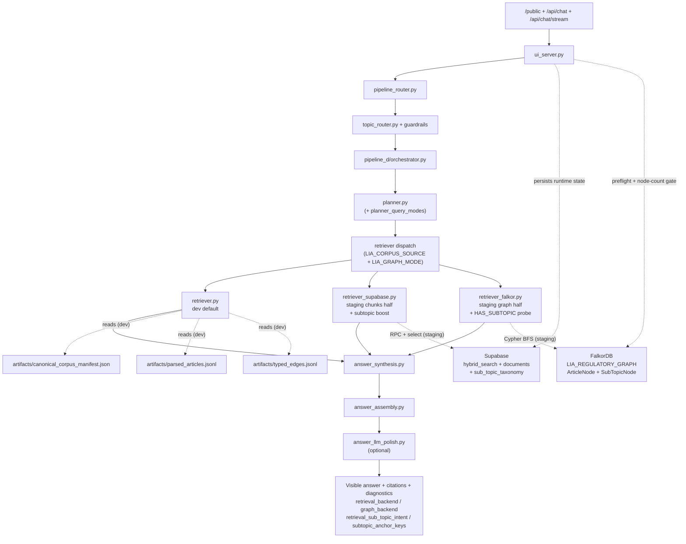
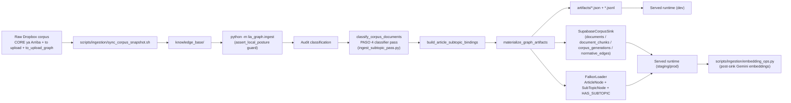
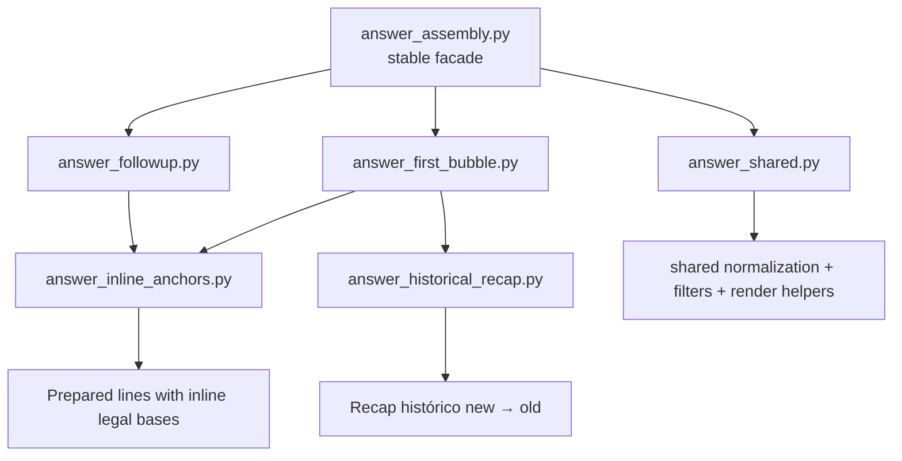

# Orchestration Guide

> **Env matrix version: `v2026-05-11-fix-v11b-discarded-keep-judge-fix`.** Bump from `v2026-05-11-fix-v11b-interpretation-loader` records the gate-6 DISCARD of Phase 11B's runtime path after three refinement attempts (§15 judge fix, §16 Option A soft veto, §17 hybrid threshold) all landed at or below the v10/v11A 12/21 baseline on the 21-Q expert-panel mini-panel. **Mini-panel measurements:** v10 baseline 12/21 → v11B raw 11/21 → v11B+judge-fix 11/21 → v11B+Option A 10/21 → v11B+hybrid 10/21. Every variant shuffled WHICH 10-12 questions win; none cleared the §5.4 70 % ship bar. **Reverted:** `LIA_PLANNER_INTERPRETATION_ANCHOR` default `on` → `off` across all three modes; doc-side off_topic tagger restored to single-match detection (`_match_any`, was `_match_count(...) >= 3`); `tests/test_interpretacion_off_topic_soft_veto.py` deleted. **Kept (real correctness improvements, independent of the discarded path):** §15 `pipeline_c.orchestrator.generate_llm_strict` tuple-contract fix + 12 regression tests (was returning a 4-key dict, every caller did `text, diag = ...` unpacking, silently crashed `expert_rerank.judge` + 3 other LLM call sites for months); `graph/interpretation_loader.py` + `interpretacion/anchor_resolver.py` modules (correct and tested, behind the off flag); cloud Falkor `LIA_REGULATORY_GRAPH` data (105 InterpretationNode + 586 INTERPRETS + 105 COVERS_TOPIC, harmless, ready for future re-attempts). Path to ≥ 70 % needs a semantic relevance signal at the assembly layer (embedding cosine, learned ranker) replacing the off_topic-pattern check — fresh-plan task, out of v11 scope. Full record in `docs/re-engineer/fix/fix_v11_may.md §17`.
>
> **Predecessor: `v2026-05-11-fix-v11b-interpretation-loader`.** Bump from `v2026-05-11-fix-v11a-trust-tier-no-op` covers Phase 11B from `docs/re-engineer/fix/fix_v11_may.md`. **InterpretationNode + INTERPRETS + COVERS_TOPIC loader landed; expert-panel dispatcher now anchors interpretation candidates on Falkor `INTERPRETS` edges (ordered by `trust_tier DESC`) instead of Python-side `interpretacion/article_index.py`.** Code: new `src/lia_graph/graph/interpretation_loader.py` emits batched UNWIND MERGE statements for `InterpretationNode` (key=`doc_id`, byte-identical to `ingestion/supabase_sink._sanitize_doc_id`) and INTERPRETS/COVERS_TOPIC edges; richer article-ref regex catches `parágrafo N del Art. M`, `numeral N del Art. M`, decimal sub-article (`Art. 240.1`→`240-1`), en-dash variants, plus the standard `Art. N`/`art. N-M`. Loader is wired into `materialize_graph_artifacts` AFTER the article/reform load (so INTERPRETS endpoints MATCH) and writes `artifacts/interpretation_load_report.json`. New `src/lia_graph/interpretacion/anchor_resolver.py` issues one `MATCH (a:ArticleNode {article_number:$num})<-[:INTERPRETS]-(i:InterpretationNode) RETURN i.doc_id ORDER BY i.trust_tier DESC LIMIT 8` per resolved article number, capped at 24 total; returns an `AnchorResolution` dataclass with `doc_ids` + diagnostic (`anchor_source ∈ {falkor, falkor_empty, falkor_error, skipped}`). Panel dispatcher (`_retrieve_interpretation_docs`) calls the resolver and passes the result through to `fetch_interpretation_candidates` as the new `planner_anchor_doc_ids` parameter; the retriever uses the Falkor anchor as the ×4-boost set in preference to the Python index, falling back to `article_index.doc_ids_for_article_refs` only when the Falkor anchor returned nothing (loader hasn't run, Falkor unavailable, or no INTERPRETS edges for the queried articles). Two new env flags: `LIA_INGEST_INTERPRETATION_NODES=enforce` (loader on by default across all three modes; set `off` to skip during diagnostic re-ingests) and `LIA_PLANNER_INTERPRETATION_ANCHOR=on` (Falkor anchor resolution on by default; set `off` to bypass and force the Python-index fallback). Diagnostic surface extended on the panel's `retrieval_diagnostics`: new keys `interpretation_anchor_source ∈ {planner_falkor, python_article_index, none}` and `interpretation_anchor_planner` (full AnchorResolution diagnostic when present). **Architectural deviation from fix_v11_may.md §2.B.** The plan describes the chat planner emitting `interpretation_anchor_doc_ids` as a seed on `GraphRetrievalPlan`. In the actual codebase the expert panel is UI-triggered (`/api/expert-panel` in `ui_analysis_controllers.py`) and not invoked from `pipeline_d/orchestrator.py`; the chat planner never fires for panel requests. Shipped wiring keeps the planner deterministic (no Falkor side-effects) and resolves the anchor at the dispatcher boundary — same effective behavior as the plan described, narrower seam, no chat-pipeline regression risk. The new `graph/interpretation_anchors`-style helper is structured so a future chat-inline interpretation surface can call the same function from the planner with no changes. **Tests:** new `tests/test_graph_interpretation_loader.py` (19 cases — article-ref extraction supersetting + paragraph/numeral/decimal/dash variants; manifest scan; node/edge shape; eligible-article + eligible-topic filters; missing-markdown graceful handling; batched UNWIND statement shape; schema validation; idempotency on doc_id; env-flag default + off; unconfigured-client safety); new `tests/test_interpretacion_anchor_resolver.py` (18 cases — flag gating defaults + off-values; ref-shape normalization across `et_art_115` / `art_115_et` / bare `115` / etc.; dedup across refs normalizing to same number; trust-tier cursor ordering; total_cap; per-article LIMIT in query; empty-Falkor degradation; per-article-error continuation; all-errors diagnostic; AnchorResolution immutability); new tests in `tests/test_interpretacion_retriever_supabase.py` (5 cases for the new `planner_anchor_doc_ids` + `planner_anchor_diagnostic` parameters — precedence over Python index; empty falls back to article_index; None+no-refs records `anchor_source=none`; planner diagnostic surfaces on bundle; empty doc_ids stripped). All 76 unit tests green (72 prior + 4 new for the Supabase-aligned loader path). **Cloud loader run COMPLETE on staging Falkor.** New `build_interpretation_load_plan_from_supabase` builder reads the doc list from cloud `documents` (filter `knowledge_class='interpretative_guidance'`) + concatenates `document_chunks.chunk_text` per doc as input to `extract_article_numbers` — guarantees the InterpretationNode `doc_id` set is byte-identical to what the panel retriever returns from `hybrid_search` (avoids local-disk-vs-cloud drift). Operator script `scripts/diagnostics/load_interpretation_nodes.py` has `--source auto` (picks `supabase` for staging/production, `manifest` for local). Cloud run landed **105 InterpretationNodes + 586 INTERPRETS edges + 105 COVERS_TOPIC edges** in 0.66s wall (3 batched UNWIND statements); 20 INTERPRETS dropped because target article wasn't in cloud ArticleNode set; 294 distinct ArticleNodes now have inbound INTERPRETS. End-to-end anchor probe is green for cluster-A targets that drove the 9 v10/v11A misses: **Art. 240 → 8 doc_ids** (T-A TTD + T-E + T-F all surface); **Art. 689-3 → 8 doc_ids** (T-E surfaces); **Art. 115 → 3 doc_ids** (GMF-E01 + ICA-E01 + PARAFISCAL-E01 — exact match for §1.A's 3-way tie). One confirmed corpus gap: Art. 124-2 has zero INTERPRETS (no interpretation doc cites it verbatim — Cluster-B per §1.A; dispatcher correctly falls back to Python `article_index`). Top-cited articles in the cloud INTERPRETS subgraph: Art. 240 (16 docs), Art. 107 (14), Art. 689-3 (13), Art. 69 (9), Art. 147 (8). Mini-panel re-run is operator-authorized per `feedback_sme_panel_explicit_request_only` — awaiting explicit "run the panel" before launching `scripts/eval/run_sme_parallel.py`. Phase 11C (production `LIA_INTERPRETATION_SOURCE` flip + 7-day soak) gated on mini-panel clearing ≥ 70 % per fix_v11_may.md §4.3.
>
> **Predecessor: `v2026-05-11-fix-v11a-trust-tier-no-op`.** Bump from `v2026-05-11-fix-v10a-kc-backfill-fix-v10b-interp-supabase` covers Phase 11A from `docs/re-engineer/fix/fix_v11_may.md`. **Trust-tier prioritization landed; net mini-panel impact 0pt (12/21 = 57.1%, identical to v10 baseline).** Code: `_group_chunks_by_doc` in `src/lia_graph/interpretacion/retriever_supabase.py` accepts `trust_tier_weight` (default `0.30`); score now `base * (1.0 + ref_boost·hits) * (1.0 + tier_weight·tier_bonus)` where `tier_bonus ∈ {high:2.0, medium:1.0, low:0.0}`. New diagnostic keys `trust_tier_weight` + `selected_trust_tier_mix` surface in `retrieval_diagnostics`. New `config/provider_trust_tiers.json` (52-entry curated allowlist: 21 high-tier branded firms, 26 medium-tier Colombian professional firms, 5 low-tier vendor blogs). New scripts: `scripts/diagnostics/backfill_v11_trust_tiers.py` (idempotent UPDATE backfill that ALSO extracts providers from local markdown's `> Fuentes secundarias consultadas:` line and writes `documents.provider_labels` — closes the v10C-deferred provider-extraction step) and `scripts/diagnostics/probe_v11_trust_tier_coverage.py` (distribution + unmatched-authority diagnostic). Cloud Supabase backfill applied to LIA_Graph (`utjndyxgfhkfcrjmtdqz`) — 65 chunks/8 docs → high tier; 747 chunks/97 docs → medium; 0 → low. 12 docs had real providers extracted from markdown (T-A TTD, T-INC INC, T-PT, T-H Ret-572, T-C RST, T-E Auditoría, T-F Planeación, T-I D1474, GMF-E01, SOC-E04, PRO-E01, D-2 GMF PATCH). **Mini-panel result on the same 21-Q v1 instrument: 12/21 (one swap — `renta_conciliacion_2516` flipped miss→win, `retencion_autorretencion_especial` flipped win→miss).** Diagnosis: the lever operates at the chunk-grouping layer but the downstream `synthesize_expert_panel` rerank+filter cuts the 18 retriever-selected docs to 0-1 surface cards on the failing topics, so trust-tier ranking can't lift the right doc above the assembly cutoff. The chat path is provably untouched (`pipeline_d/retriever_supabase.py` does not read `trust_tier`); §1.G regression panel skipped as no-op. Backfill kept (provider_labels are correct cloud data + the trust_tier values feed Phase 11B's planned `INTERPRETS` ordering `ORDER BY i.trust_tier DESC LIMIT 8`). Per gate-6: 0pt < 3pt threshold + one regression on anchor-seeded card → refine-or-discard branch. Recommendation in `fix_v11_may.md`: skip 11A's two refinement levers (allowlist tightening + weight reduction) — they target the wrong layer; jump to Phase 11B (Falkor `InterpretationNode` loader + planner anchor seeding) which targets the assembly-layer dilution that's the actual bottleneck. Original 2026-05-11 fix_v10 entry below stays for reference.

> **Predecessor: `v2026-05-11-fix-v10a-kc-backfill-fix-v10b-interp-supabase`.** Bump from `v2026-05-11-fix-v8-polish-fallback-prompt-anchor` covers two stacked changes from `docs/re-engineer/fix/fix_v10_may.md`: (10A) the chunk-class keystone — `supabase_sink.write_chunks` now inherits `knowledge_class` from the parent doc captured during `write_documents` instead of hardcoding `"normative_base"`; cloud Supabase backfill applied (2,275 chunks retagged across 274 docs — 812 `interpretative_guidance` + 1,463 `practica_erp`, total preserved 19,546). G2 sink-level parity guardrail tracks `chunks_default_class_count` and emits `ingest.sink.chunk_class_default_used` at finalize so future drift surfaces in heartbeats. SME §1.G 36-Q panel re-run after backfill was byte-identical to the pre-10A baseline (34/36 acc+, 26 strong, zero per-question class deltas). (10B) Interpretación de Expertos panel now routes through the same `hybrid_search` RPC the chat uses, behind the new `LIA_INTERPRETATION_SOURCE` env flag (default `filesystem` for `npm run dev`, `supabase` for `dev:staging` and production). New module `src/lia_graph/interpretacion/retriever_supabase.py` (`fetch_interpretation_candidates`) calls `hybrid_search(filter_knowledge_class='interpretative_guidance', boost_topic=topic)`, groups chunks by `doc_id` (highest-rrf-per-doc), batched-fetches `documents.provider_labels` (new column, migration `20260513000000_documents_provider_labels.sql`), and returns the same duck-typed `InterpretationKnowledgeBundle` shape `catalog.py` produces today so downstream synthesis is untouched. `orchestrator._retrieve_interpretation_docs` is now a thin dispatcher on the env flag; the filesystem path stays as the safety floor and never silently fires on a Supabase error per the no-silent-fallback non-negotiable. Diagnostic `interpretation_backend ∈ {supabase, filesystem}` is whitelisted in `ui_chat_payload.filter_diagnostics_for_public_response`. Sink wire-up for `provider_labels` lands in the same commit so future ingests populate the column; existing rows default to `[]`. Phase 10C (`InterpretationNode` + `INTERPRETS` graph edges) and Phase 10D (retire filesystem catalog) remain queued; each is gated on a dual harness + SME 21-Q mini-panel pass (`evals/sme_validation_v1/questions_expert_panel_v1.jsonl`, 21 questions across 9 topics, every `expected_interpretation_files` path verified to exist on disk per `feedback_no_hallucinated_examples`). Original 2026-05-11 fix_v8 entry below stays for archaeological reference.

> **Predecessor: `v2026-05-11-fix-v8-polish-fallback-prompt-anchor`.** Authoritative table lives in [Runtime Env Matrix (Versioned)](#runtime-env-matrix-versioned). Bump the version and extend the change log whenever `scripts/dev-launcher.mjs` flips a flag, a new `LIA_*` env is introduced, a `query_mode` ships, or a mode's read path changes. (Latest bump: `v2026-05-11-fix-v8-polish-fallback-prompt-anchor` — seven surgical fixes from `docs/re-engineer/fix/fix_v8_may.md`. (1) **Substantive polish-rejected fallback (§3a).** New module `pipeline_d/answer_polish_rejected_fallback.py` assembles a deterministic markdown answer from `GraphNativeAnswerParts` when the polish guardrails reject. Before: a rejected polish stranded the user with the ~120-char question-echo template (post-fix_v7 verification had this on Q02/Q03/Q07/Q08). After: rejection returns a Ruta-sugerida / Riesgos / Soportes / Anclaje-legal layout from the same evidence the polish saw, so the user gets substance without the prose smoothing. Wired into `orchestrator.run_pipeline_d` immediately after the `polish.applied` step when `llm_runtime_diag["mode"] == "rejected"`. Cross-topic gate (`filter_template_bullets`) re-applied to the fallback output so the §6.6c invariant holds for both polish-success and polish-rejected paths. Operator override: `LIA_POLISH_REJECTED_FALLBACK_MODE=off` reverts to the legacy thin-template behavior for incident rollback only. (2) **Polish trace observability (§3b).** `synthesis.polish.applied` trace step now carries `mode` ∈ `{llm, skipped, rejected, failed, unknown}` and `skip_reason` ∈ `{invented_norm_lineage, invented_periods, anchors_stripped, empty_llm_output, adapter_error:<Type>, no_adapter_available, polish_disabled_by_env, empty_template, resolver_error:<Type>}`. `response.diagnostics.polish_mode` + `polish_skip_reason` lifted to top-level and whitelisted in `ui_chat_payload.filter_diagnostics_for_public_response` so probe digests + SME report read the polish outcome without walking the trace. `scripts/eval/sme_validation_report.py:_build_retrieval_signal_check` extended to report polish-rejection count + reason distribution per run. `.claude/skills/answer-engine-probe/scripts/digest.py` surfaces `polish_mode` in the Backends block. Two new trace steps: `polish.rejected.fallback_composed` + `polish.rejected.gate_applied` fire when the fallback runs. (3) **Topic-norm-allowlist expansion (§3c) — deferred.** A six-topic expansion (`beneficio_auditoria`, `costos_deducciones_renta`, `declaracion_renta`, `procedimiento_tributario`, `facturacion_electronica`) was drafted but the candidate `allowed_prefixes` did not cover the full set of ET articles synthesis legitimately surfaces today (e.g. `declaracion_renta` answers cite Arts. 869 / 115 / 147 / 850 not in the seed list). The expansion over-fired against `tests/test_phase3_graph_planner_retrieval.py` and was reverted; the scaffold stays at v7's two-topic state (`perdidas_fiscales_art147`, `regimen_simple`). A `@pytest.mark.requires_supabase` cloud-chunks-verification test was added to `tests/test_topic_norm_allowlist.py` (gated by `LIA_SUPABASE_TEST=1`) for the operator-run probe-cycle that unblocks a future re-expansion. Status in `docs/re-engineer/fix/fix_v8_may.md §3c: 🛠 drafted, ↩ over-fire-blocked`. (4) **Comparative-regime instrumentation (§3d).** New trace steps `comparative_regime.pair_matched` (with `pair_key` / `cutoff_year` / `dimension_count`) and `comparative_regime.no_pair_match` (with `primary_topic` / `message_preview`) fire from `compose_main_chat_answer`. New schema test `tests/test_comparative_regime_pairs_schema.py` (4 cases) locks the pair-config shape; new `tests/test_comparative_regime_no_pair_fallthrough.py` (1 case) asserts the no-pair short-circuit emits a non-empty answer. Q10 ("¿Qué diferencia hay entre RST y régimen ordinario?") was hanging at 180s on both pre- and post-fix_v7 probes; the §3e prompt rewrite separately resolved the hang (Q10 now serves in ~39 s with `polish_mode=llm`). (5) **Polish prompt rewrite (§3e).** `answer_llm_polish._build_polish_prompt` rewritten to lead with an explicit DIRECTIVA PRIMARIA paragraph that names the four invention modes the validators reject (norm lineage / article numbers / periods / cifras). Then renders explicit allowlists — `ARTÍCULOS PERMITIDOS PARA CITAR` (from primary + connected article keys) and `REFORMAS Y NORMAS PERMITIDAS` (from `evidence.related_reforms`, never inlined before this fix) — so the LLM has a bright line for what's allowed. Primary-article excerpt budget bumped 600→900 chars; connected articles now ship 300-char excerpts (were title-only); related_reforms ship 240-char excerpts. Result on 10-question probe: rejection rate dropped 7/10 → 3/10; substantive answers (≥800c) went 6/10 → 10/10; Q10 unblocked (was 180s timeout, now 38.7s serving). (6) **Temperature=0 for gemini-flash (§3f).** `config/llm_runtime.json` lowered the chat-polish provider's temperature from 0.1 to 0.0. Deepseek providers (used by the canonicalizer via `LIA_VIGENCIA_PROVIDER`) keep 0.1. Result on the 36-question SME panel: rejections 21 → 18 with `invented_norm_lineage` dropping 4 → 2 and `invented_periods` 14 → 13. Identical visible quality (34/36 acc+, 26 strong); the system is slightly less reliant on the §3a fallback. (7) **ICA-in-renta Art. 115 anchor (§3g).** Q01 trace ("¿Puedo deducir el ICA pagado en renta?") showed `plan_anchor_count=0` and retrieval drifting to gastos-exterior chunks (Arts. 121/122/123). The phase3 test `test_phase3_pipeline_d_recovers_art_115_for_ica_deduction_prompt` passed because it pre-routed `topic=declaracion_renta`; with the LLM router picking `costos_deducciones_renta`, no Art. 115 anchor fired. Fix in `planner.py`: new tax-treatment case in `_build_article_search_queries` adds ICA-specific search queries; new explicit `kind="article"` anchor for Art. 115 ET when `_looks_like_tax_treatment_case` is True AND the message contains "ica" / "industria y comercio". Q01 verification: `seed_article_keys` went `['121','122','123']` → `['115','121','122','123']`, `anchor_row_count` 0→6, answer 297c→1402c, answer now correctly leads with Art. 115 ET framing ("revísalo primero bajo el art. 115 ET, no como deducción genérica, no doble-contabilizar como descuento y costo"). New runtime env: `LIA_POLISH_REJECTED_FALLBACK_MODE=enforce` (default on across all three modes; `off` reverts to thin template). The `LIA_TOPIC_GATE_MODE`, `LIA_QUERY_EMBEDDINGS_ENABLED`, `LIA_LLM_POLISH_ENABLED` flags unchanged. Closed §1.G SME panel runs: `evals/sme_validation_v1/runs/20260511T151413Z_post_fix_v8e/` (PASS — 34/36 acc+, 26 strong, 21 polish-rejected/all caught by fallback) and `20260511T153120Z_post_fix_v8f_temp0/` (PASS — 34/36 acc+, 26 strong, 18 polish-rejected). The skill `.claude/skills/answer-engine-probe/SKILL.md` was extended with a mandatory server-restart preamble after we discovered the long-running dev:staging process was serving stale code through the first probe attempt; future probe invocations will catch this automatically.

Prior bump: `v2026-05-11-fix-v7-retrieval-and-content-gate` — three fixes from `docs/re-engineer/fix/fix_v7_may.md`. (1) **Topic filter is now structurally soft.** New migration `20260512000000_topic_filter_soft.sql` recreates `public.hybrid_search` with a separate `boost_topic` parameter so the topic boost no longer requires `filter_topic` to be set. `retriever_supabase.py` passes `filter_topic=None` + `boost_topic=<router_topic>` on every chat call, restoring the Lane 4.1 invariant ("Topic is ranking signal, not WHERE filter") at the SQL level rather than at the `OR effective_topic_boost > 1.0` short-circuit it relied on in the 0427 migration. Cross-topic anchors (e.g. Art. 147 ET catalogued under IVA on a `declaracion_renta` loss-compensation question) are now structurally reachable regardless of cloud-side migration drift. Recovery branch strips both `boost_topic` and `filter_topic_boost` on first PostgREST rejection so older deployments still serve. Existing tests `test_supabase_retriever_uses_hybrid_search_and_returns_primary_articles` + `test_supabase_retriever_surfaces_cross_topic_anchor` were already red on main pending this fix and now pass. (2) **Query-side embeddings are real.** `retriever_supabase._query_embedding(query_text)` replaces the legacy `_zero_embedding()` payload constant — calls the existing `lia_graph.embeddings.get_query_embedding` helper (gemini-embedding-001, 768-dim, LRU + durable cache) so the vector half of RRF is no longer silently zeroed. New env `LIA_QUERY_EMBEDDINGS_ENABLED` (default `1` across all three modes) is the rollback switch; the zero vector is now reserved for genuine failure modes (no API key, exception inside Gemini call, dimension mismatch, env-disabled). Trace event `retriever.hybrid_search.in` gained `embedding_mode` + `embedding_model` keys so SME evals can verify whether real semantic ranking was live. (3) **Cross-topic content gate.** New module `pipeline_d/answer_topic_gate.py` + new config `config/topic_norm_allowlist.json` filter template bullets whose `(art. N ET)` citations fall outside the primary topic's curated `allowed_prefixes`. The gate runs inside `compose_main_chat_answer` AFTER the inner composer returns and BEFORE the polish LLM ever sees the template, so the polish-side guardrails (`no_invented_norm_lineage` / `no_invented_periods`) and this template-side gate cover the two complementary halves of off-topic-norm bleed. Safety: no-op for any primary_topic not in the allowlist; `LIA_TOPIC_GATE_MODE=off` disables without removing the config file. Initial scaffold ships only verified topic keys (`perdidas_fiscales_art147`, `regimen_simple`) — operator expansion is gated by `tests/test_topic_norm_allowlist.py`, which fails if a hallucinated topic key creeps in. Trace event: `synthesis.topic_gate.applied` carries `gate_mode`, `dropped_count`, and the first 5 dropped excerpts. The SME validation report (`scripts/eval/sme_validation_report.py`) gained a `_build_retrieval_signal_check` section that scans every response trace for the three v7 invariants (filter_topic=None, embedding_mode=ok, gate_mode in expected set) and surfaces violations in the run's `report.md`. Prior bump: `v2026-04-26-additive-no-retire` — **asymmetric corpus-mutation safety** per operator directive: adding to the corpus is the friendly path (GUI drag-drop intake → additive delta `Previsualizar` / `Aplicar`), but **deleting docs from cloud Supabase + Falkor is CLI-explicit only**. `materialize_delta` gained `allow_retirements: bool = False`; when False the disk-vs-baseline `removed` bucket is computed for diagnostic visibility but stripped from the delta before sink + Falkor see it — out-of-sync local `knowledge_base/`, partial Dropbox sync, machine swaps and similar local-disk drift can no longer silently retire production docs through the GUI. Retirement requires `lia-graph-artifacts --additive --allow-retirements` (new CLI flag). UI banner relabels the bucket from "Retirados" (red, action) to "Faltan en disco (no se retiran)" (yellow, diagnostic). `DeltaRunReport` carries `retirements_allowed` + `diagnostic_removed_count`. Removed the redundant "Análisis profundo" GUI button in the same cycle (its preview-only deep re-classify served no actionable purpose distinct from `Ingesta completa` and created a footgun where the operator's deep-preview results couldn't be applied through the same card). Prior bump: `v2026-04-25-comparative-regime` — runtime-shape changes shipped same day from `next_v4`: (1) **conversational-memory staircase Levels 1+2** (`next_v4 §3` Option A + `§4`) closes the three serial frontier breaks identified in the stateless-classifier vs stateful-retriever deep trace — FE forwards `payload.topic` from prior assistant turn, `ConversationState` gained `prior_topic` / `prior_subtopic` / `topic_trajectory` / `prior_secondary_topics`, `resolve_chat_topic` accepts an optional `conversation_state` and uses `prior_topic` as a soft tiebreaker; no env flag introduced; (2) **`comparative_regime_chain` query_mode** (`next_v4 §5`) — new planner mode that detects pre/post-reform comparison cues, anchors both articles via `comparative_regime_anchor`, and routes assembly to `compose_comparative_regime_answer` for a side-by-side markdown table; cue detection runs before standard classifier; orchestrator suppresses decomposer fan-out when the parent message itself is comparative; (3) **coherence-gate hardening + follow-up handling** in pipeline_d. No env-flag changes; the version bump reflects new runtime modules + a new query mode. Prior bump: `v2026-04-25-temafirst-readdressed` — same-session flips: `LIA_TEMA_FIRST_RETRIEVAL` `shadow → on`, `LIA_EVIDENCE_COHERENCE_GATE` `shadow → enforce`, `LIA_POLICY_CITATION_ALLOWLIST` `off → enforce`, `LIA_INGEST_CLASSIFIER_TAXONOMY_AWARE` default → `enforce` — all per operator's "no off flags" directive after taxonomy v2 + K2 path-veto + SME 30Q at 30/30 + qualitative-pass on §8.4 gate 9. See change-log rows + `docs/aa_next/next_v4.md` (active items) + `docs/aa_next/next_done.md` (digest of closed cycles next_v1+v2+v3) + `docs/aa_next/gate_9_threshold_decision.md`. Prior bump: `v2026-04-24-v6` — ingestion-tuning v6 plan landed. Adds **runtime** flags `LIA_EVIDENCE_COHERENCE_GATE` (default `shadow`, phase 3) and `LIA_POLICY_CITATION_ALLOWLIST` (default `off`, phase 4). Adds **ingest-pipeline** env vars `LIA_INGEST_CLASSIFIER_WORKERS` (default 8, phase 2a), `LIA_INGEST_CLASSIFIER_RPM` (default bumped 60→300, phase 2a), `LIA_SUPABASE_SINK_WORKERS` (default 4, phase 2b), `FALKORDB_QUERY_TIMEOUT_SECONDS` (default 30, phase 2c), `FALKORDB_BATCH_NODES` (default 500, phase 2c), `FALKORDB_BATCH_EDGES` (default 1000, phase 2c). Nine lifted diagnostic keys now live at top level of `response.diagnostics` (phase 1 — `primary_article_count`, `connected_article_count`, `related_reform_count`, `seed_article_keys`, `planner_query_mode`, `tema_first_mode`, `tema_first_topic_key`, `tema_first_anchor_count`, `retrieval_sub_topic_intent`, `subtopic_anchor_keys`). See `docs/done/next/ingestion_tunningv2.md` + `docs/done/next/ingestionfix_v6.md` (RAG-quality backlog absorbed by next_v1+v2+v3 cycles, archived 2026-04-25).)

## Purpose

This guide describes the live orchestration of Lia Graph at two levels:

- the build-time ingestion lane that produces the artifact bundle, the Supabase corpus rows, and the FalkorDB graph
- the served runtime lane that turns accountant prompts into visible answers

It is the end-to-end operating map. Read `docs/guide/chat-response-architecture.md` for visible-answer shaping policy, and `docs/guide/env_guide.md` for per-mode env files, migration baseline, seed users, and corpus-refresh workflow.

## Scope

This file is the main reference for:

- `/public`
- authenticated chat shells
- `/api/chat`, `/api/chat/stream`
- `/api/citation-profile`, `/api/normative-analysis`, `/api/expert-panel*`
- `/source-view`, `/source-download`
- `/api/ingest/*` (admin)
- `/api/subtopics/*` (admin)
- the `/orchestration` HTML view
- the retrieval runtime — both the artifact-backed path (dev) and the cloud-live Supabase + FalkorDB path (staging / production)
- the ingestion path that materializes artifacts, cloud Supabase rows, and cloud Falkor graph state in a single pass
- the per-mode env/flag matrix and its version history

This file answers:

- what modules are on the hot path and in what order
- where evidence is selected
- where answer parts are synthesized vs assembled
- what belongs to `main chat` vs non-chat surfaces (`Normativa`, `Interpretación`)
- where subtopic intent is detected and how it boosts retrieval
- how a `make phase2-graph-artifacts-supabase` run lands SubTopicNode + HAS_SUBTOPIC in Falkor without a separate backfill step

It is intentionally not the fine-grained style guide for the visible answer — that belongs in `chat-response-architecture.md`.

## Runtime Truths

- `pipeline_d` is the served answer path; there is no second historical retrieval engine
- `Normativa` has its own surface package under `src/lia_graph/normativa/`; its modal and deep-analysis page reuse shared graph retrieval but do not reuse `main chat` answer assembly
- `Interpretación` has its own surface package under `src/lia_graph/interpretacion/`; reuses shared graph retrieval, does not reuse `main chat` or `Normativa` presentation
- after the chat bubble publishes, `Normativa` and `Interpretación` run as sibling post-answer tracks from the same minimal turn kernel; neither blocks the bubble
- source/document-reader windows are deterministic read surfaces, not graph answer-assembly surfaces
- the served runtime does not read Dropbox directly
- retrieval is **mode-aware**, gated by `LIA_CORPUS_SOURCE` + `LIA_GRAPH_MODE` (see the versioned env matrix below):
  - `dev` — filesystem artifacts + local docker FalkorDB (parity only)
  - `dev:staging` — cloud Supabase (`hybrid_search` RPC) + cloud FalkorDB (live per-request Cypher BFS)
  - `dev:production` — inherits staging wiring through Railway env vars
- retrieval is **subtopic-aware** (since `v2026-04-21-stv2`): the planner detects curated-subtopic intent from the user message; the Supabase retriever boosts matching chunks via a `filter_subtopic` + `subtopic_boost` RPC; the Falkor retriever prefers `HAS_SUBTOPIC → SubTopicNode` anchors
- the `main chat` surface has explicit internal facades (`answer_synthesis.py`, `answer_assembly.py`) instead of one large orchestration file
- bulk ingest (since `v2026-04-21-stv2b`) is **single-pass**: the PASO 4 LLM classifier runs inline over every admitted doc between audit and sink, so Supabase `documents.subtema` + Falkor `SubTopicNode` / `HAS_SUBTOPIC` land in the same run — no separate backfill

## Product Rules

- The visible answer must be accountant-facing only.
- The visible answer must be practical-first.
- The visible answer must not expose planner or retrieval meta-thinking.
- Accountants should not need article-citation phrasing to get a useful answer.
- Graph grounding comes before interpretive or practical enrichment.
- Hot-path tuning must be general by workflow, signal class, or evidence pattern; never by memorizing a single user question.
- Ambiguous state phrases such as `saldo a favor` must not activate a workflow bundle unless the prompt also shows the workflow intent itself.
- The first visible answer should map the case broadly; second-plus answers should inherit that map and answer the requested double-click directly.
- `main chat` may share graph evidence utilities with future surfaces but must not become the hidden assembly layer for `Normativa` or `Interpretación`.
- `/orchestration` and this guide must describe the current runtime truthfully.

## Runtime At A Glance

Two sequences to keep straight: the public request path and the internal Pipeline D execution path.

Public request path:

1. `src/lia_graph/ui_server.py`
2. `src/lia_graph/pipeline_router.py`
3. `src/lia_graph/topic_router.py` + `topic_router_keywords.py` + topic guardrails
4. `src/lia_graph/pipeline_d/orchestrator.py`

Internal Pipeline D execution path:

1. `pipeline_d/planner.py` (+ `planner_query_modes.py` for the 10 `query_mode` values and subtopic-intent detection; `next_v4 §5` added `comparative_regime_chain` 2026-04-25)
2. adapter dispatch (`retriever.py` | `retriever_supabase.py` | `retriever_falkor.py`) keyed off `LIA_CORPUS_SOURCE` + `LIA_GRAPH_MODE`
3. `pipeline_d/answer_synthesis.py` (stable facade) + `answer_support.py` enrichment
4. `pipeline_d/answer_assembly.py` (stable facade)
5. optional `pipeline_d/answer_llm_polish.py` (gated by `LIA_LLM_POLISH_ENABLED`, fails loudly in diagnostics, safely in output)

Behind the two stable facades, the `main chat` implementation modules are:

- `answer_synthesis_sections.py`, `answer_synthesis_helpers.py`
- `answer_first_bubble.py`, `answer_followup.py`
- `answer_inline_anchors.py`, `answer_historical_recap.py`
- `answer_comparative_regime.py` — `next_v4 §5` (2026-04-25). Loader for `config/comparative_regime_pairs.json`, cue detector (`detect_comparative_regime_cue`), pair matcher, and table-renderer (`compose_comparative_regime_answer`). Used when `planner_query_mode == "comparative_regime_chain"`.
- `answer_shared.py`
- `answer_policy.py` — cupos, límites operativos (`FIRST_BUBBLE_ROUTE_LIMIT`, planning-mode shapes), `ARTICLE_GUIDANCE`

Shared pipeline_d modules outside the `main chat` facades but still on the hot path:

- `pipeline_d/contracts.py` — `GraphEvidenceBundle`, `GraphRetrievalPlan` (carries `sub_questions` and `sub_topic_intent`), `GraphNativeAnswerParts`
- `pipeline_d/planner_query_modes.py` — the 10 query modes + 15 marker tuples + `_detect_sub_topic_intent`
- `pipeline_d/retrieval_support.py` — ranking and selection of support docs

Rule: other runtime modules should prefer importing the stable facades (`answer_synthesis.py`, `answer_assembly.py`); deeper modules are implementation detail for `main chat`.

## HTTP Controller Topology

`ui_server.py` is not a monolith. It owns one `BaseHTTPRequestHandler` subclass (`LiaUIHandler`) plus module-level `_<domain>_controller_deps()` helpers. Every `_handle_*` method on the class is a **5–15 line delegate** that builds a fresh `deps={…}` dict and calls `handle_<domain>_<verb>(handler, …, deps=…)` in a sibling `ui_<domain>_controllers.py` module. Domain logic does not live in `ui_server.py` — only dispatch, auth, rate limiting, response helpers (`_send_json`, `_send_bytes`), and dep wiring.

Sibling `ui_*_controllers.py` module count as of `v2026-04-21-stv2d`: **16** domain controllers + `ui_route_controllers.py` (shared passthrough dispatch). The table below is the domain-to-controller mapping — grep for `handle_<domain>_` to find the concrete entrypoint.

| Domain | Controller module | Deps helper | HTTP surface |
|---|---|---|---|
| chat (main) | `ui_chat_controller.py` (+ `ui_chat_payload.py` / `ui_chat_clarification.py`) | `_chat_controller_deps` | `POST /api/chat`, `POST /api/chat/stream` |
| analysis (pipeline-C compat + expert-panel) | `ui_route_controllers.py` (+ `ui_analysis_controllers.py`) | `_analysis_controller_deps` | various `/api/*` analysis reads |
| citations | `ui_citation_controllers.py` (+ `ui_citation_profile_*.py` family) | inline | `GET /api/citations/*` |
| form guides | `ui_route_controllers.py` + `ui_form_guide_helpers.py` | inline | `GET /api/form-guides/{catalog,content,asset}` |
| frontend compat | `ui_frontend_compat_controllers.py` | `_frontend_compat_controller_deps` | `GET /api/llm/status`, feedback, milestones, normative-support |
| ops | `ui_route_controllers.py` | inline | `GET /api/ops/*` |
| public session | `ui_public_session_controllers.py` | `_public_session_controller_deps` | `POST /api/public/session`, `GET /public` |
| source view | `ui_route_controllers.py` | inline | `GET /api/source/*` |
| user management | `ui_user_management_controllers.py` | `_write_controller_deps` | `GET\|POST /api/user-management/*`, invites |
| eval | `ui_eval_controllers.py` | inline | `GET /api/eval/*` |
| writes (13 endpoints) | `ui_write_controllers.py` + `ui_ingestion_write_controllers.py` | `_write_controller_deps` | all state-mutating POST/PUT/DELETE |
| conversations | `ui_conversation_controllers.py` | inline | `GET /api/conversation*`, contributions pending |
| platform / admin | `ui_admin_controllers.py` | inline | `GET /api/me`, `/api/admin/*`, `/api/jobs/{id}` |
| runtime terms | `ui_runtime_controllers.py` | inline | `GET /api/terms*`, orchestration settings |
| reasoning stream | `ui_reasoning_controllers.py` | inline | `GET /api/reasoning/events`, `/api/reasoning/stream` (SSE) |
| ingestion (reads + DELETE) | `ui_ingestion_controllers.py` | inline | `GET /api/corpora`, `/api/ingestion/sessions*` |
| ingest run (admin Sesiones) | `ui_ingest_run_controllers.py` | inline | `GET /api/ingest/{state,generations,generations/{id},job/{id}/progress,job/{id}/log/tail}`, `POST /api/ingest/{run,intake}` |
| subtopics (admin) | `ui_subtopic_controllers.py` | inline | `GET /api/subtopics/{proposals,evidence,taxonomy}`, `POST /api/subtopics/decision` |

Rules of thumb when editing or extending this surface (authoritative detail in `docs/done/next/granularization_v1.md`):

- anything stateful, path-rooted, env-gated, or monkeypatched on `ui_server` → inject via `deps`
- pure stateless helpers (`json`, `re`, `parse_qs`, dataclass ctors from other modules) → direct import in the controller
- `_send_json`, `_resolve_auth_context`, rate-limit, and audit helpers stay on the class and are called as `handler.X(...)`
- adding more than ~15 LOC to `ui_server.py` for a new endpoint means you're doing it wrong — extract to the matching controller and wire a delegate

## Information Architecture Map

### 1. Producer → Consumer Map

| Producer | Contract | Main fields | Consumer | Surface scope |
| --- | --- | --- | --- | --- |
| `ui_server.py` | normalized request | message, history, knobs, auth/public context | `pipeline_router.py` | shared |
| `topic_router.py` + guardrails | routed topic hints | dominant topic, secondary hints, disambiguation pressure | `planner.py` | shared |
| `planner.py` | retrieval plan | `query_mode`, `entry_points`, budgets, temporal context, `sub_questions`, `sub_topic_intent` | `retriever*.py`, `orchestrator.py` | shared |
| `retriever*.py` | evidence bundle | `primary_articles`, `connected_articles`, `related_reforms`, `support_documents`, `citations`, `subtopic_anchor_keys` | `answer_synthesis.py` | shared |
| `answer_support.py` | enrichment insights | article-derived and support-derived practical lines | `answer_synthesis.py` | shared hot path |
| `answer_synthesis.py` | `GraphNativeAnswerParts` | recommendations, procedure, paperwork, anchors, context, precautions, opportunities, `direct_answers` | `answer_assembly.py`, `orchestrator.py` | `main chat` |
| `answer_assembly.py` | visible markdown pieces | first-turn mapping + second-plus follow-up routes | `orchestrator.py` | `main chat` |
| `answer_llm_polish.py` | polished answer text | senior-accountant voice, inline anchors preserved | `orchestrator.py` | `main chat` (opt-in) |
| `orchestrator.py` | `PipelineCResponse` | answer text, citations, confidence, diagnostics (`retrieval_backend`, `graph_backend`, `retrieval_sub_topic_intent`, …) | `ui_server.py` | shared |

### 2. Main-Chat Facade Map

| Facade | Why it exists | What sits behind it |
| --- | --- | --- |
| `answer_synthesis.py` | callers should not know how section candidates are built | `answer_synthesis_sections.py`, `answer_synthesis_helpers.py`, `answer_policy.py` (cupos + `ARTICLE_GUIDANCE`) |
| `answer_assembly.py` | callers should not know how first-turn and follow-up rendering internals are organized | `answer_first_bubble.py`, `answer_followup.py`, `answer_inline_anchors.py`, `answer_historical_recap.py`, `answer_shared.py`, `answer_policy.py` (planning-mode shapes + route limits), `answer_llm_polish.py` |

### 3. Surface Boundary Map

| Layer | Shared | `main chat` | `Normativa` | `Interpretación` |
| --- | --- | --- | --- | --- |
| request normalization | yes | reuse | reuse | reuse |
| planner | yes | reuse | reuse when goals match | reuse when goals match |
| retriever / evidence bundle | yes | reuse | reuse where compatible | reuse where compatible |
| synthesis facade | no | `pipeline_d/answer_synthesis.py` | `normativa/synthesis.py` | `interpretacion/synthesis.py` |
| assembly facade | no | `pipeline_d/answer_assembly.py` | `normativa/assembly.py` | `interpretacion/assembly.py` |
| first-bubble / visible shape | no | yes | do not reuse as normative UI contract | do not reuse |

Design intent: shared graph logic stays shared; visible surface behavior is isolated per surface. `main chat` must not quietly become the assembly backend for `Normativa` or `Interpretación`.

## Runtime Surfaces

### Main Chat

Behind `/public`, authenticated chat shells, `/api/chat`, `/api/chat/stream`.

Orchestration:
1. `ui_server.py` → `pipeline_router.py` → `topic_router.py` → `pipeline_d/orchestrator.py`
2. `planner.py` → retriever dispatch → `answer_synthesis.py` → `answer_assembly.py` → optional `answer_llm_polish.py`

Surface ownership: first-bubble structure, second-plus follow-up publication, inline legal anchors, historical recap formatting, senior-accountant visible answer policy.

### Post-Answer Surface Concurrency

After each user turn there are three tracks:

1. `main chat` publishes the answer bubble first (critical path; must not block on side windows)
2. `Normativa` primes its own track from the minimal turn kernel (`trace_id`, user message, published answer, normalized topic/country, cited-anchor snapshot)
3. `Interpretación` primes its own track from the same kernel; may reuse the cited-anchor snapshot but must not wait for `/api/normative-support` to finish a full resolve

Ordering is UX ownership, not strict blocking. `Normativa` gets first crack at the post-answer context; `Interpretación` starts with whatever kernel is available.

### Normativa Window And Deep Analysis

Behind `GET /api/citation-profile` (citation click modal) and `GET /api/normative-analysis` (deep-analysis page).

Split in two layers:

**Deterministic citation/profile assembly:**
- `ui_citation_controllers.py`
- `ui_citation_profile_builders.py` + siblings (`actions`, `context`, `llm`, `sections`) — main builder
- `ui_article_annotations.py` — ET article markdown parser (preserves `[text](url)` as structured `items`)
- `ui_form_citation_profile.py` — deterministic profile for `document_family == "formulario"`
- `ui_reference_resolvers.py`, `ui_source_view_processors.py`, `ui_source_view_html.py`, `ui_source_view_noise_filter.py`, `ui_source_title_resolver.py`
- `ui_expert_extractors.py`, `ui_normative_processors.py`, `normative_taxonomy.py`, `citation_resolution.py`, `normative_references.py`, `ui_chunk_assembly.py`, `ui_chunk_relevance.py`, `ui_text_utilities.py`

**Graph-backed Normativa layer:**
- `normativa/orchestrator.py`, `synthesis.py`, `policy.py`, `synthesis_helpers.py`, `sections.py`, `assembly.py`, `shared.py`

Contract split:
- `phase=instant` returns deterministic document-centered payloads fast
- `phase=llm` keeps the old API name for compatibility; generated content comes from the `Normativa` package
- `Normativa` reuses shared planner/retriever evidence but does not import `pipeline_d/answer_*` modules for visible shaping

ET-article fallback: if `phase=instant` receives `reference_key=et` + `locator_start` but the canonical `renta_corpus_a_et_art_*` row is unresolvable, the deterministic layer builds a fallback modal from `artifacts/parsed_articles.jsonl`. This belongs to the Normativa deterministic layer, not to `main chat`.

### Interpretación Window

Behind `POST /api/expert-panel`, `/api/expert-panel/enhance`, `/api/expert-panel/explore`, `/api/citation-interpretations`, `/api/interpretation-summary`.

Server-side:
- `ui_analysis_controllers.py` — thin HTTP seam
- `interpretacion/orchestrator.py`, `synthesis.py`, `policy.py`, `synthesis_helpers.py`, `assembly.py`, `shared.py`
- `interpretation_relevance.py` — compatibility facade for the shared ranking contract

Rule: `interpretacion` owns ranking, grouping, summary, enhancement, and payload publication. Shared citation/source helpers may be injected from deterministic modules but visible shaping belongs to the package.

### Source View, Article Reader, Form Guides

Deterministic document-reading surfaces behind `/source-view`, `/source-download`, the article reader, the form-guide page/shell.

Server-side: `ui_source_view_processors.py`, `ui_source_view_html.py`, `ui_text_utilities.py`, `form_guides.py`, `ui_form_guide_helpers.py`.

Package root: `knowledge_base/form_guides/` — local read package, organized as `formulario_<numero>/<profile_id>/...` even when the visible label is `Formato <numero>`. Not a `main chat` assembly input; not a runtime Dropbox dependency.

## Lane 0: Build-Time Ingestion

This lane is not on the per-request hot path, but the served runtime depends on the artifact bundle, the Supabase corpus rows, AND the Falkor graph it produces.

Current state (`2026-04-21`):
- raw corpus source root: `/Users/ava-sensas/Library/CloudStorage/Dropbox/AAA_LOGGRO Ongoing/AI/LIA_contadores/Corpus`
- synced working snapshot: `knowledge_base/`
- graph validation: see `artifacts/graph_validation_report.json` for the most recent `{nodes, edges, ok}`
- curated subtopic taxonomy: `config/subtopic_taxonomy.json` (86 subtopics × 37 parent topics, shipped by `v2026-04-21-stv1`)

### 0.1 Raw Corpus → Snapshot

`scripts/ingestion/sync_corpus_snapshot.sh` copies three canonical raw roots from Dropbox:
- `CORE ya Arriba`
- `to upload`
- `to_upload_graph/` — admin drag-to-ingest bucket (added in `v2026-04-20-ui15`)

The sync keeps accountant-facing material and revision staging visible; the audit gate downstream decides what is corpus, what is revision material, and what is internal control text. Files classified as `exclude_internal` are intentionally omitted from the snapshot.

### 0.2 Audit And Canonical Blessing

`src/lia_graph/ingest.py` scans the snapshot and classifies every file into exactly one decision: `include_corpus`, `revision_candidate`, or `exclude_internal`.

Materialized audit artifacts:
- `artifacts/corpus_audit_report.json`
- `artifacts/corpus_reconnaissance_report.json`
- `artifacts/revision_candidates.json`
- `artifacts/excluded_files.json`
- `artifacts/canonical_corpus_manifest.json`
- `artifacts/corpus_inventory.json`

This layer decides whether the corpus is durably blessable, not the runtime.

### 0.3 Revision Handling

`revision_candidate` files do not enter the canonical corpus as standalone evidence. They must either be merged into their base document or remain visible as attached pending revisions (which keeps the blessing gate open). The current corpus is green because the open editorial tranche was merged back into Dropbox and standalone patch/upsert/errata files were archived under `deprecated/`.

### 0.4 Classifier Pass (Single-Pass Subtopic Resolution)

Since `v2026-04-21-stv2b`, the PASO 4 LLM classifier runs **inline, in the same ingest invocation**, between audit and sink. This is the module that makes the bulk ingest single-pass.

- `src/lia_graph/ingest_subtopic_pass.py` — orchestrator. Runs `classify_ingestion_document` (PASO 4 branch) over every admitted `CorpusDocument`. Honors `rate_limit_rpm` (default 60) and `skip_llm` (fast dev-loop / CI smoke). Tolerates per-doc classifier failures by flagging `requires_subtopic_review=True`. **Drops any LLM subtopic key not present in `subtopic_taxonomy_loader.lookup_by_key`** (Invariant: no orphan subtemas in graph).
- `src/lia_graph/ingestion_classifier.py` — owner of N1 (filename/keyword cascade), N2 (LLM synonym+type), and PASO 4 (subtopic resolution inside the same LLM call per Decision A1). Emits `AutogenerarResult.{subtopic_key, subtopic_label, subtopic_confidence, requires_subtopic_review}`.
- `src/lia_graph/subtopic_taxonomy_loader.py` — frozen dataclass facade over `config/subtopic_taxonomy.json` with alias-breadth-preserving lookup indices. Alias lists are deliberately wide (semantic-expansion fuel for retrieval); do not auto-tighten them.
- `src/lia_graph/ingest_constants.py` — `CorpusDocument` carries `requires_subtopic_review: bool = False` and `with_subtopic(...)` (optionally overrides `topic_key` when PASO 4 fires a topic-level override; invariant: `(topic_key, subtopic_key) ∈ taxonomy.lookup_by_key`).

Per-doc trace events: `subtopic.ingest.audit_classified`, `subtopic.ingest.audit_done`. Terminal: `subtopic.graph.bindings_summary` with counters for `accepted`, `distinct_subtopics`, `skipped_topic_subtopic_mismatch`, `skipped_no_subtopic_key`, `skipped_no_topic_key`.

CLI flags added to `python -m lia_graph.ingest`:
- `--skip-llm` — bypasses PASO 4 for dev-loop smoke
- `--rate-limit-rpm N` — throttle LLM calls
- `--allow-non-local-env` — explicitly bypass the local-posture guard (see 0.10)

### 0.5 Artifact Materialization

After audit + classifier pass, `materialize_graph_artifacts` threads the classifier output into the three downstream sinks:

- `artifacts/canonical_corpus_manifest.json`
- `artifacts/parsed_articles.jsonl` (graph/article retrieval input AND the ET-article fallback source for the Normativa citation-profile modal)
- `artifacts/typed_edges.jsonl`

`article_subtopics: dict[article_key, SubtopicBinding]` is built by `build_article_subtopic_bindings` and passed to `build_graph_load_plan` — this is the wire that carries subtopic attribution from the classifier into Falkor in the same run.

### 0.6 Supabase Sink

`src/lia_graph/ingestion/supabase_sink.py` (`SupabaseCorpusSink`) mirrors the corpus snapshot into cloud Supabase:

- `documents` — one row per canonical doc, now carrying `subtema` (from classifier) and `requires_subtopic_review`
- `document_chunks` — per-chunk rows inherit `tema` / `subtema` from the parent doc (Decision E1)
- `corpus_generations` — sync-generation row (active / WIP / production target tracked by `is_active`)
- `normative_edges` — typed graph edges
- `sub_topic_taxonomy` — reference table materialized from `config/subtopic_taxonomy.json` (Decision B1)

CLI: `make phase2-graph-artifacts-supabase PHASE2_SUPABASE_TARGET={wip|production}`. Idempotent, additive, never touches embeddings.

Admin intake sidecar: `POST /api/ingest/intake` writes a JSONL per batch at `artifacts/intake/<batch_id>.jsonl` for audit/replay.

### 0.7 FalkorDB Loader (SubTopic-Aware)

`src/lia_graph/ingestion/loader.py` accepts `article_subtopics: Mapping[str, SubtopicBinding]` and emits deduped SubTopic nodes + `HAS_SUBTOPIC` edges **in the same single-pass run** (Decision F1: doc-level only, no chunk edges).

Schema contributors:
- `src/lia_graph/graph/schema.py` — `NodeKind.SUBTOPIC`, `EdgeKind.HAS_SUBTOPIC`
- the node key is `SubTopicNode(subtopic_key)`; edges are `(ArticleNode)-[:HAS_SUBTOPIC]->(SubTopicNode)`

This is load-bearing for the `retriever_falkor.py` preferential probe (see Lane 4).

### 0.8 Embedding + Promotion Auto-Chain

`scripts/ingestion/ingest_run_full.sh` wraps the graph-artifacts run and chains it to Gemini embeddings and optional production promotion. Gated by env vars propagated from the admin `POST /api/ingest/run` body:
- `INGEST_AUTO_EMBED` — invokes `scripts/ingestion/embedding_ops.py` after sink
- `INGEST_AUTO_PROMOTE` — follows embedding with a production-target pass

Embedding ops read Supabase chunk rows and write Gemini embeddings in-place; the chunk is **never re-read from the corpus file** — embedding is a downstream Supabase-side operation.

### 0.9 Admin Intake Surface

Since `v2026-04-20-ui15` + `v2026-04-21-stv2`, the admin Sesiones surface supports drag-to-ingest with 6-stage progress.

`POST /api/ingest/intake` — JSON+base64 batch intake:
1. classifies each file via `ingestion_classifier.classify_ingestion_document` (N1 filename/keyword → N2 LLM synonym+type → PASO 4 subtopic)
2. coerces markdown into the canonical 8-section template via `ingestion_section_coercer.py` (hybrid heuristic + optional LLM fallback)
3. validates via `ingestion_validator.py` (8-section + 7-id-key + 14-v2-metadata)
4. places the file at `knowledge_base/<resolved_topic>/<filename>` and optionally mirrors to the Dropbox `to_upload_graph/` bucket

`POST /api/ingest/run` — dispatches `make phase2-graph-artifacts-supabase` via `background_jobs.run_job_async`, propagating `INGEST_AUTO_EMBED` / `INGEST_AUTO_PROMOTE` / `batch_id` + `LIA_INGEST_JOB_ID` as env.

`GET /api/ingest/job/{id}/progress` — aggregates `ingest.run.stage.{coerce,audit,chunk,sink,falkor,embeddings}.{start,done,failed}` events from `logs/events.jsonl` filtered by `LIA_INGEST_JOB_ID`.

`GET /api/ingest/job/{id}/log/tail?cursor=N&limit=200` — cursor-paginated tail of the subprocess log.

`GET /api/ingest/generations/{id}` — returns a `subtopic_coverage` aggregate (`{docs_with_subtopic, docs_requiring_review, docs_total}`) consumed by the admin `generationRow` micro-metric.

### 0.10 Env Posture Guard

`src/lia_graph/env_posture.py` (new in `v2026-04-21-stv2b`) is a URL-host classifier that guards against the silent-risk mode where a misconfigured `.env.local` points `SUPABASE_URL` / `FALKORDB_URL` at cloud during a "local" run.

`assert_local_posture()` is invoked at the top of `python -m lia_graph.ingest` unless `--allow-non-local-env` is passed. Violations raise `EnvPostureError` and emit `env.posture.asserted` with the offending host.

### 0.11 Maintenance & Taxonomy Scripts

- `scripts/ingestion/sync_subtopic_taxonomy_to_supabase.py` — projects `config/subtopic_taxonomy.json` into the `sub_topic_taxonomy` reference table. Invoked by `promote_subtopic_decisions.py --sync-supabase` or the `phase2-sync-subtopic-taxonomy` Makefile target.
- `scripts/ingestion/backfill_subtopic.py` — maintenance-only since `stv2b`. Default filter: `WHERE requires_subtopic_review=true OR subtema IS NULL`. Narrow further with `--only-requires-review`. Emits `SubTopicNode` + `HAS_SUBTOPIC` MERGE to Falkor for every updated doc (mirrors single-pass ingest). CLI: `--dry-run|--commit`, `--limit`, `--only-topic`, `--rate-limit-rpm`, `--generation-id`, `--resume-from`, `--refresh-existing`, `--no-falkor-emit`.
- `scripts/ingestion/regrandfather_corpus.py` — one-time re-chunk across existing docs. `phase2-regrandfather-corpus` Makefile target.
- `scripts/ingestion/collect_subtopic_candidates.py` / `scripts/ingestion/mine_subtopic_candidates.py` / `scripts/ingestion/promote_subtopic_decisions.py` — the build-time pipeline for evolving `config/subtopic_taxonomy.json` itself (see `docs/done/subtopic_generationv1.md`).

### 0.12 Canary Target

`make phase2-graph-artifacts-smoke` runs the `tests/integration/test_single_pass_ingest.py` + `test_subtema_taxonomy_consistency.py` suites against the committed `mini_corpus` fixture (3 docs). Operationally the 30-second canary that catches single-pass regressions (silent 100%-NULL `documents.subtema`, orphan subtemas) before a full-corpus re-ingest.

## Lane 1: Entry, Route, And Runtime Shell

`ui_server.py` serves the shell, normalizes the chat payload, handles public and authenticated access, and starts the runtime. `pipeline_router.py` resolves the served route (default: `pipeline_d`).

This lane decides how the request enters, which runtime handles it, whether it is public or authenticated, and whether the response is buffered or streamed. It does not decide answer substance.

## Lane 2: Topic Detection And Guardrails

`topic_router.py` + `topic_router_keywords.py` + guardrails convert accountant language into topic hints without making `topic/subtopic` the only truth model.

What this lane does:
- detects the dominant accountant workflow from natural language
- resists side mentions hijacking the route
- keeps practical prompts practical
- hands topic hints into the planner instead of flat-filtering documents first

Example: a devolución / saldo a favor prompt that also mentions facturación electrónica should stay centered on `procedimiento_tributario`.

Limitation still live: broad renta vocabulary can outweigh a more specific tax concept when the downstream lexical resolver is too literal or too generic.

Subtopic override patterns live in `_SUBTOPIC_OVERRIDE_PATTERNS` (compiled regex triples detecting narrow sub-topic intent — GMF / impuesto_consumo / patrimonio_fiscal_renta / costos_deducciones_renta / laboral-colloquial) and run **before** broader keyword scoring so dedicated child corpora win.

## Lane 3: Planner

`build_graph_retrieval_plan()` converts the user question into a `GraphRetrievalPlan`:

- `query_mode` — one of 10 modes (see 3.1)
- `entry_points` — explicit articles, reforms, topic-hinted anchors, lexical search strings
- `traversal_budget`
- `evidence_bundle_shape`
- `temporal_context`
- `topic_hints`
- `planner_notes`
- `sub_questions` — populated when the consulta has ≥2 `¿…?` marks; empty otherwise. Split prefers inverted-mark spans so preceding context doesn't leak in; falls back to splitting on `?` when the user omitted inverted marks. Downstream, assembly renders a `Respuestas directas` block so each sub-question stays independently findable.
- `sub_topic_intent` — populated by `planner_query_modes._detect_sub_topic_intent` (new in `stv2`) when the user message matches a curated subtopic via regex/alias (longest-form tie-break per Decision H1). Consumed by both retrievers for boosting.

### 3.1 Query Mode Selection

Classified in this order (first match wins):

1. `comparative_regime_chain` — pre-classifier branch in `planner.py`. Fires when the message carries a temporal-cutoff cue ("antes de 2017", "qué cambió con la reforma", "régimen de transición") AND `config/comparative_regime_pairs.json` has a matching `(domain, cutoff_year)` pair AND the conversation_state carries article anchors. See `next_v4 §5`.
2. `historical_reform_chain`
3. `historical_graph_research`
4. `reform_chain`
5. `strategy_chain`
6. `definition_chain`
7. `obligation_chain`
8. `computation_chain`
9. `article_lookup`
10. `general_graph_research`

Design intent:
- reform/historical prompts should be explicit
- workflow prompts should not be misread as historical just because they say `antes de...`
- accountant-style operational questions should still land in a mode with enough support budget
- advisory prompts about lawful tax planning vs abuse/simulation trigger a dedicated `strategy_chain` lane instead of collapsing into generic renta anchors
- pre/post-reform comparison prompts ("cuanto cambia si parte es pre-2017?") trigger `comparative_regime_chain` so the answer renders as a side-by-side table instead of dissolving into prose; the orchestrator suppresses decomposer fan-out when the parent message itself is comparative

### 3.2 Historical Intent

Lives in `src/lia_graph/pipeline_c/temporal_intent.py`. Strong signals: `qué decía`, `versión anterior`, `originalmente`, `histórico`, `antes de la Ley …`, `previo a la Ley …`, `después de la Ley …`. When the prompt contains a reform year, the helper infers a coarse cutoff as the last day of the prior year (e.g. `antes de la Ley 2277 de 2022` → `2021-12-31`).

### 3.3 Entry Point Construction

Layered:
1. explicit articles
2. explicit reforms
3. topic hints
4. lexical article-search queries when the user asks in workflow language instead of citation language

This bridge is why a prompt like `Mi cliente tiene saldo a favor…` can still land on hard legal anchors such as `850`, `589`, `815`.

### 3.4 Workflow Expansion

For devolución / saldo a favor, corrección / firmeza, beneficio de auditoría, tax-treatment / procedencia, and lawful-planning / abuse / simulation / jurisprudence prompts, the planner can add:

- supplemental topic hints (e.g. `procedimiento_tributario`, `declaracion_renta`, `calendario_obligaciones`)
- lexical graph searches tailored to the workflow
- mode selection that prefers the dominant workflow when multiple downstream actions are mentioned

Workflow expansion is keyed to explicit workflow signals, not just to broad states like `saldo a favor`. If correction/firmness and devolución/compensación both appear, the planner compares workflow strength instead of blindly favoring the refund branch.

### 3.5 Subtopic Intent Detection

`_detect_sub_topic_intent` walks the curated taxonomy's alias index and returns the longest matching subtopic key (if any) plus the matched alias span. Attached to the plan as `sub_topic_intent`. Ambiguity between equal-length matches is broken by a deterministic key order. No match → `None`, and the downstream retrievers fall back to topic-level ranking only.

Trace: `subtopic.retrieval.intent_detected` fires here when a match lands.

### 3.6 Current Planner Pressure Point

The planner depends on marker heuristics but is materially less brittle than the pre-contained-pass era. Remaining risk is not "one question fails" but that new accountant phrasings can arrive semantically right and lexically unfamiliar. The breadth of the subtopic taxonomy's alias lists is part of the mitigation — do not auto-tighten them.

## Lane 4: Retrieval And Evidence Selection

Graph-first. `orchestrator.py` picks the retrieval source per request from `LIA_CORPUS_SOURCE` + `LIA_GRAPH_MODE`.

- **dev** (`LIA_CORPUS_SOURCE=artifacts`, `LIA_GRAPH_MODE=artifacts`): `retriever.py` reads the filesystem artifact bundle.
- **staging** (`LIA_CORPUS_SOURCE=supabase`, `LIA_GRAPH_MODE=falkor_live`): two cooperating adapters merged by the orchestrator:
  - `retriever_supabase.py` — cloud Supabase chunks half via the `hybrid_search` RPC + `documents` table
  - `retriever_falkor.py` — cloud FalkorDB graph half via a bounded, parameterized Cypher BFS
- **production**: inherits staging wiring through Railway env vars.

All three adapters honor the same `GraphEvidenceBundle` contract. The bundle has four layers:
1. `primary_articles`
2. `connected_articles`
3. `related_reforms`
4. `support_documents`

Diagnostics surfaced on every response: `retrieval_backend`, `graph_backend`, `retrieval_sub_topic_intent`, `subtopic_anchor_keys`.

### 4.1 Subtopic-Aware Retrieval

Since `v2026-04-21-stv2`, both cloud adapters respect `plan.sub_topic_intent`:

**Supabase adapter:**
- passes `filter_subtopic` + `subtopic_boost` to the subtopic-aware `hybrid_search` RPC (migration `20260421000000_sub_topic_taxonomy.sql`)
- client-side post-rerank fallback for older DBs that don't know the new params
- boost factor from `LIA_SUBTOPIC_BOOST_FACTOR` (default `1.5`)
- **Invariant I5**: NULL subtemas never penalized — a doc that lacks a subtema still competes on lexical + vector score
- **Invariant — Topic is ranking signal, not WHERE filter**: as of fix_v7 §3a (`v2026-05-11-fix-v7-retrieval-and-content-gate` + migration `20260512000000_topic_filter_soft.sql`), `filter_topic` is **structurally** decoupled from the topic boost. The chat retriever passes `filter_topic=None` on every call so the WHERE clause cannot exclude any chunk; topic ranking rides on the separate `boost_topic` parameter, which the RPC's score CASE multiplies when `chunk.topic == boost_topic` AND `filter_topic_boost > 1.0`. Cross-topic anchors (e.g. Art. 147 ET under IVA, load-bearing for a `declaracion_renta` loss-compensation question) are now reachable regardless of cloud-side migration drift. Topic is also passed inside `query_text` as an OR-joined `fts_query` so multi-term queries don't collapse under the RPC's default AND semantics.
- **Query-side embeddings are live, not zero (Invariant I8, fix_v7 §3b)**: `retriever_supabase._query_embedding(query_text)` calls `lia_graph.embeddings.get_query_embedding` (gemini-embedding-001, 768-dim) and the resulting vector populates `hybrid_search`'s `query_embedding` parameter. The zero-vector path is a safety net (env-disabled, no API key, exception inside Gemini call, dimension mismatch) — every chat with `embedding_mode != "ok"` shows up in the SME report's "Retrieval signal check" section. Rollback: `LIA_QUERY_EMBEDDINGS_ENABLED=0` reverts to the zero vector without a code revert.
- Planner-anchor chunks are fetched directly by `chunk_id LIKE '%::<key>'` **before** the FTS pass, so primary-article promotion never depends on ranker luck.
- Recovery semantics: when the cloud RPC predates the 0512 migration and rejects `boost_topic`, the retriever's `try/except` strips both `boost_topic` and `filter_topic_boost` and retries — ranking degrades to FTS+vector only, but retrieval keeps serving.

**Falkor adapter:**
- runs a preferential `HAS_SUBTOPIC → SubTopicNode` probe and merges those article keys with explicit article anchors before the traversal
- the traversal itself is topic-agnostic by construction: `MATCH (node:ArticleNode {article_number: key})` never carries a topic predicate, so adjacency — not catalog — drives recall
- property name is `article_number` (the canonical field in `graph/schema.py`); do not migrate to `article_key` (that alias exists Python-side on the snapshot only)
- **Invariant I2**: outages propagate — the Falkor adapter must never silently fall back to artifacts on a cloud outage

Trace events: `subtopic.retrieval.intent_detected`, `subtopic.retrieval.boost_applied`, `subtopic.retrieval.fallback_to_topic`.

### 4.2 Entry-Point Resolution

If the planner emitted explicit anchors:
- article entry → direct `ArticleNode` anchor when present
- reform entry → direct `ReformNode` anchor when present

If the planner emitted lexical article searches:
- the runtime scores articles by boundary-aware lexical overlap
- heading hits weigh more than body hits
- strong query-heading alignment gets an extra boost
- broad generic renta tokens are discounted
- matching a planner topic hint boosts lightly unless the article has real content match
- lexical results are trimmed per search so the first search does not monopolize all seed articles

### 4.3 Graph Traversal

Bounded graph walk over resolved anchors. Neighbor expansion sorted by:
1. temporal rank
2. mode-specific preferred edge kind
3. node-kind rank
4. direction preference
5. stable key order

Mode-specific edge preferences:
- `obligation_chain`: `REQUIRES`, `REFERENCES`, `MODIFIES`
- `computation_chain`: `COMPUTATION_DEPENDS_ON`, `REQUIRES`, `REFERENCES`
- `historical_reform_chain`: `SUPERSEDES`, `MODIFIES`, `REFERENCES`, `REQUIRES`
- `strategy_chain`: primary anchors first, then adjacent norms defining legal limits or abuse-risk boundaries

### 4.4 Historical Noise Control

Historical mode is stricter. Connected articles reached through `MODIFIES` / `SUPERSEDES` survive only when at least one is true:
- same source document as parent article
- same topic as parent
- same primary topic
- explicitly hinted topic
- heading overlap with parent
- explicit reform-anchor match

Prevents graph-valid but topic-wrong neighbors from polluting a historical answer.

### 4.5 Support Document Selection

Support docs do not lead the answer; they enrich it after legal grounding exists. Staged:
1. source documents behind selected graph articles
2. topic-expansion documents from ready canonical docs
3. diversification so the answer can include practical and interpretive material
4. enrichment reservation so operational answers keep room for at least one `practica` or `interpretacion` doc

Sort: source docs before topic-expansion docs, then family rank, query-token overlap, stable path order.

### 4.6 LLM Polish (Post-Assembly)

`pipeline_d/answer_llm_polish.py` (gated by `LIA_LLM_POLISH_ENABLED=1`, default on) asks the configured LLM (see `config/llm_runtime.json`) to rewrite the prose in senior-accountant voice while preserving every `(art. X ET)` inline anchor.

Fails loudly in `response.llm_runtime.skip_reason` — one of `polish_disabled_by_env`, `no_adapter_available`, `adapter_error:<Type>`, `empty_llm_output`, `anchors_stripped`. Fails silently in output: the deterministic template answer is always the safety net. The polish prompt is instructed to preserve `Respuestas directas` structurally — sub-questions may not be fused, bullets may not move between sub-questions, and `Cobertura pendiente para esta sub-pregunta` markers stay intact.

**Trace surface (fix_v8 §3b)**: every served chat carries `diagnostics.polish_mode` ∈ `{llm, skipped, rejected, failed, unknown}` and `diagnostics.polish_skip_reason` (the specific rule that fired). The same fields appear on the `synthesis.polish.applied` trace step (which flips `status="warn"` on `rejected` / `failed`). Silent rejections caused the post-fix_v7 verification to miss four shape-A regressions until per-question template-length comparison surfaced them; after 8b they're observable from a single trace inspection or a `response.diagnostics.polish_mode` read.

**fix_v8 §3a substantive fallback**: when polish rejects (`mode=rejected`), `orchestrator.py` invokes `pipeline_d/answer_polish_rejected_fallback.compose_polish_rejected_fallback` to assemble a substantive answer from `GraphNativeAnswerParts` (recommendations / procedure / paperwork / legal_anchor / precautions). The cross-topic content gate is then applied to the fallback's output so the §6.6c invariant ("off-topic norms never reach the user") holds for both polish-success and polish-rejected paths. Operator override: `LIA_POLISH_REJECTED_FALLBACK_MODE=off` reverts to the legacy thin-template behavior for incident rollback only.

### 4.7 LLM provider split — chat vs canonicalizer (2026-04-29)

`config/llm_runtime.json` lists provider preference for the whole repo. Chat and canonicalizer have different needs and the `provider_order` flag is calibrated for chat:

| Path | Provider | Why |
|---|---|---|
| Chat — topic resolver (`topic_router._classify_topic_with_llm`, 8s timeout, strict JSON) | **Gemini-flash** (default first in `provider_order`) | Reliable structured-output behavior; topic-classifier prompt requires `{"primary_topic":...,"confidence":...}` and DeepSeek-v4-pro returns empty `message.content` on this prompt shape. |
| Chat — answer polish (`answer_llm_polish.polish_graph_native_answer`) | **Gemini-flash** (inherits `provider_order`) | Faster than DeepSeek for the polish-prose use case (~6× lower latency on the §1.G panel); same content-quality. |
| Canonicalizer — vigencia extraction, ingestion classifier, etc. | **DeepSeek-v4-flash / v4-pro** via explicit `LIA_VIGENCIA_PROVIDER=<id>` env override per launch script | Long-context, schema-following, on a 75%-discount window through 2026-05-05; chosen by every canonicalizer launch (`scripts/canonicalizer/launch_batch.sh`, `scripts/cloud_promotion/run.sh`, etc.). |

**Operating rule:** every canonicalizer entry-point MUST set `LIA_VIGENCIA_PROVIDER` explicitly. If it relies on the default, it'd pick up Gemini-flash and burn quota. The chat path doesn't set the override, so it gets the default order's first hit.

**Reason for the split:** DeepSeek-v4-pro is a reasoning model. Its API returns `reasoning_content` (chain-of-thought) plus `content`. For short structured-output prompts like the topic classifier, `content` arrives empty and the adapter at `src/lia_graph/llm_runtime.py:198` raises `RuntimeError("DeepSeek response missing message content.")`. The topic resolver wraps the call in `try/except: return None` and silently falls through to the keyword fallback. This made every multi-domain SME chat query route to the parent topic `declaracion_renta` and dropped the §1.G 36-Q SME panel from 21/36 to 8/36 acc+ on 2026-04-29. Flipping `provider_order` to put `gemini-flash` first restored the panel to 22/36 acc+ with zero ok→zero regressions.

**If `provider_order` changes**, re-run `scripts/eval/run_sme_parallel.py --workers 4` against the §1.G panel before merging. ~5 min wall.

**Diagnostic surface:** `tracers_and_logs/pipeline_trace.py` writes one JSONL line per retrieval stage to `tracers_and_logs/logs/pipeline_trace.jsonl` AND attaches the snapshot to `response.diagnostics["pipeline_trace"]` for every served chat. The relevant LLM-provider trace events are `topic_router.llm.attempt` / `.success` / `.exception` / `.unsupported_topic` / `.low_confidence` / `.no_adapter`. Read with `jq -c 'select(.step | startswith("topic_router.llm."))' tracers_and_logs/logs/pipeline_trace.jsonl`. Full reference: `tracers_and_logs/README.md`.

Full incident write-up: `docs/re-engineer/fix/fix_v1_diagnosis.md`.

## Lane 5: Synthesis Contract

Turns graph evidence into structured answer parts before any visible markdown.

### 5.1 Stable Synthesis Facade

`pipeline_d/answer_synthesis.py`. Exposes `GraphNativeAnswerParts` and `build_graph_native_answer_parts(...)`.

### 5.2 `GraphNativeAnswerParts`

Internal structured bundle (not a public API contract):

- `article_insights`, `support_insights`
- `recommendations`, `procedure`, `paperwork`
- `legal_anchor`, `context_lines`
- `precautions`, `opportunities`
- `direct_answers` — `(sub_question, bullets)` pairs when the planner reports ≥2 sub-questions; empty tuple otherwise

### 5.3 Synthesis Order

1. compute `allow_change_context`
2. extract support-doc insights via `answer_support.py`
3. extract article insights from primary + connected articles
4. build section candidates
5. apply publication filtering
6. deduplicate visible candidate lines across sections
7. return the structured bundle

### 5.4 Section Builders

`answer_synthesis_sections.py` owns:
- `build_recommendations(...)`
- `build_procedure_steps(...)`
- `build_paperwork_lines(...)`
- `build_legal_anchor_lines(...)`
- `build_context_lines(...)`
- `build_precautions(...)`
- `build_opportunities(...)`
- `build_direct_answers(...)` — maps each planner sub-question to bullets via proportional keyword overlap; sub-questions with zero matches get `DIRECT_ANSWER_COVERAGE_PENDING` so an empty block is never silently emitted

### 5.5 Synthesis Helpers

`answer_synthesis_helpers.py` owns: extending candidate lines from support insights / article guidance, fallback recommendation/procedure lines, best-primary-article selection, procedure anchor-tail injection, connected-anchor relevance heuristics, tax-treatment heuristics, small cleanup helpers. Stays focused on reusable heuristics; does not decide whole visible answer shapes.

### 5.6 Not Synthesis's Job

Synthesis does not decide visible section titles, first-turn vs later-turn layout, inline anchor markdown formatting, historical recap wording, or numbered-vs-bullet rendering. Those belong to assembly.

## Lane 6: Assembly Contract

Turns answer parts into the visible markdown. `main chat` specific.

### 6.1 Stable Assembly Facade

`pipeline_d/answer_assembly.py` re-exports: `compose_first_bubble_answer(...)`, `compose_main_chat_answer(...)`, publication filters, rendering helpers, shared text utilities needed by synthesis. Rule: import from `answer_assembly.py` unless actively editing `main chat` internals.

### 6.2 Shared Utilities

`answer_shared.py` owns: `normalize_text`, `append_unique`, `filter_published_lines`, `published_context_lines`, `take_new_lines`, `render_bullet_section`, `render_numbered_section`, `should_surface_change_context`, `should_use_first_bubble_format`, change-intent helpers, common inline legal-reference detection.

### 6.3 First-Turn Composer

`answer_first_bubble.py` decides whether to use the standard first-turn operational shape vs the richer tax-planning advisory shape, which sections appear, and how recommendations / precautions / paperwork / recap are interleaved. This is where "contador senior que te guía" becomes concrete first-turn structure.

### 6.4 Follow-Up Composer

`answer_followup.py` decides whether the turn is a focused double-click or broader follow-up, how much of the previous case map to assume vs replay, how direct-answer lead lines are selected, and when later turns stay sectioned but lighter than the first bubble.

### 6.5 Inline Legal Anchors

`answer_inline_anchors.py` owns cleanup of legacy anchor tails, prepared-line identity keys, anchor scoring and selection, inline anchor rendering, `PreparedAnswerLine`.

### 6.6 Historical Recap

`answer_historical_recap.py` owns recap visibility, reform-chain extraction from primary article excerpts, chronological sorting of mentions, recap wording for one-/two-/three-step chains (narrated from newer to older evidence).

### 6.6b Comparative Regime Renderer

`answer_comparative_regime.py` owns the `comparative_regime_chain` rendering path (`next_v4 §5`, 2026-04-25). When `planner_query_mode == "comparative_regime_chain"` and a `(domain, cutoff_year)` pair matched `config/comparative_regime_pairs.json`, `compose_main_chat_answer` short-circuits to `compose_comparative_regime_answer`, which emits a verdict line ("Sí cambia" / "No cambia") + a markdown table (≥3 rows comparing pre-cutoff vs vigente across plazo / fórmula-o-tope / reajuste-o-ajuste) + standard Riesgos + Soportes sections wrapping below. The LLM polish pass preserves the table verbatim. The cross-topic content gate (§6.6c) is **not** applied to the comparative-regime output — table rows are driven by a hand-curated pair config, so there are no template bullets to filter.

### 6.6c Cross-Topic Content Gate

`answer_topic_gate.py` (fix_v7 §3c, `v2026-05-11-fix-v7-retrieval-and-content-gate`) is the template-side complement to the polish-side `no_invented_norm_lineage` / `no_invented_periods` guardrails in `answer_llm_polish.py`. It runs inside `compose_main_chat_answer` AFTER the inner composer (`compose_first_bubble_answer` / `compose_followup_answer`) returns and BEFORE the polish LLM ever sees the template, so off-topic norms are stripped at the template level — the polish prompt cannot bring them back.

How it works:

- The gate reads `config/topic_norm_allowlist.json[primary_topic]["allowed_prefixes"]` — a list of canonical `art:<number>` strings the primary topic is allowed to cite.
- A bullet KEEPS when EITHER it has no `(art. N ET)` / `(arts. N, M y P ET)` / `Art. N ET` / `Arts. N y M ET` anchor at all, OR every extracted article key starts with a prefix in `allowed_prefixes`. Bullet-splitter preserves indented continuation lines so multi-line bullets stay intact.
- A bullet DROPS when any anchor it cites is outside the allowlist. Section headers, blank lines, and trailing prose pass through unchanged.
- The gate is a **NO-OP** for any `primary_topic` not in the allowlist scaffold — `gate_mode=noop_no_topic_entry`. This is the safe-by-default property: an under-curated allowlist never makes answers worse than today.
- Operator override: `LIA_TOPIC_GATE_MODE=off` short-circuits without removing the config file.
- Diagnostic surface: every applied gate emits `synthesis.topic_gate.applied` in the pipeline trace with `gate_mode`, `kept_count`, `dropped_count`, and the first 5 dropped excerpts (truncated to 120 chars each so PII / chunk-text stays out of telemetry).

Allowlist hygiene:

- `config/topic_norm_allowlist.json` ships with a deliberately minimal scaffold of high-signal topics (current: `perdidas_fiscales_art147`, `regimen_simple`). The operator expands it as confidence grows.
- **fix_v8 §3c expansion deferred (2026-05-11)**: a six-topic expansion (`beneficio_auditoria`, `costos_deducciones_renta`, `declaracion_renta`, `procedimiento_tributario`, `facturacion_electronica`) was drafted but the candidate `allowed_prefixes` did not cover the full set of ET articles synthesis legitimately surfaces today — e.g. `declaracion_renta` answers cite Arts. 869/869-1/869-2 (abuso del derecho), 115 (ICA descuento), 147 (pérdidas), 850 (devolución), none of which were in the candidate prefix list. The expansion over-fired against `tests/test_phase3_graph_planner_retrieval.py` and was reverted. Shipping it cleanly requires a cloud-chunks-probe pass per `feedback_no_hallucinated_examples` AND a phase3-test sweep to widen each topic's prefixes to the actual cited-article set. Tracking in `docs/re-engineer/fix/fix_v8_may.md §3c — status: 🛠 drafted, ↩ over-fire-blocked`.
- `tests/test_topic_norm_allowlist.py` enforces: every topic key exists in `topic_router_keywords._TOPIC_KEYWORDS`; every prefix is the canonical `art:<number>` form; no duplicate prefixes within a topic; `cross_topic_allowed` entries name real topics. Hallucinated topic keys (per `feedback_no_hallucinated_examples`) fail CI. A separate `@pytest.mark.requires_supabase` test (`test_every_prefix_matches_real_chunks`, gated on `LIA_SUPABASE_TEST=1`) verifies each prefix against real cloud `chunks.reference_key` rows — run it before any future expansion lands.

Future expansion (not in v7/v8): when synthesis exposes per-bullet provenance (source-chunk topic), the gate will also pass bullets whose chunk topic is in `cross_topic_allowed[primary_topic]`. Today that field is informational only.

### 6.7 Visible Shapes

Two live shapes at first turn.

`fast_action` general operational:
- optional `Respuestas directas` (≥2 sub-questions; rendered **before** `Ruta sugerida`; each sub-question is a bold bullet with unrestricted sub-bullets)
- `Ruta sugerida`
- `Riesgos y condiciones`
- `Soportes clave`
- optional `Recap histórico`

Tax-planning / abuse / simulation / jurisprudence:
- `Cómo La Trabajaría`
- `Estrategias Legítimas A Modelar`
- `Qué Mira DIAN Y La Jurisprudencia`
- `Papeles De Trabajo`

Follow-up publication:
- focused double-click: direct answer lead → `En concreto` → `Precauciones` → `Anclaje Legal`
- broader later turns: `Qué Haría Primero`, `Procedimiento Sugerido`, optional `Soportes y Papeles de Trabajo`, `Anclaje Legal`, `Precauciones`, optional `Cambios y Contexto Legal`, optional `Oportunidades`

### 6.8 What The User Must Never See

Planner mode names, route names, retrieval diagnostics, graph self-commentary, "I searched the graph" narration. Those stay in diagnostics, not in the visible answer.

### 6.9 Assembly Module Graph

## Lane 7: Response Contract And Persistence

Response to UI/API includes: answer text, citations, diagnostics (including `retrieval_backend`, `graph_backend`, `retrieval_sub_topic_intent`, `subtopic_anchor_keys`), confidence, `graph_native` / `graph_native_partial`. Users see the answer and citations, not the orchestration internals.

Supabase is the runtime persistence and ops state for: conversations, chat runs, metrics, feedback, usage ledger, auth nonces, terms state, active-generation state, and the `sub_topic_taxonomy` reference table.

FalkorDB plays two roles per run-mode:
- **dev**: local docker FalkorDB is preflighted for environment parity and graph ops. The served runtime walks the artifact bundle; FalkorDB is not on the per-request hot path in dev.
- **staging/production**: cloud FalkorDB (`LIA_REGULATORY_GRAPH`) IS the live per-request traversal engine. `retriever_falkor.py` issues a bounded, parameterized Cypher BFS per chat turn and returns the same `GraphEvidenceBundle` shape the artifact retriever produces.

Outage semantics: the Falkor adapter propagates errors instead of silently falling back to artifacts — operators must see the outage.

## Runtime Env Matrix (Versioned)

This is the authoritative per-mode env matrix. The version number is monotonic — any change to what the launcher sets for `dev`, `dev:staging`, or `dev:production`, or any new `LIA_*` env that gates behavior, requires a version bump plus an entry in the change log.

### Current version: `v2026-05-11-fix-v10a-kc-backfill-fix-v10b-interp-supabase`

| Env | `npm run dev` | `npm run dev:staging` | `npm run dev:production` | Owner / consumer |
|---|---|---|---|---|
| `LIA_STORAGE_BACKEND` | `supabase` (local docker) | `supabase` (cloud) | `supabase` (cloud) | `src/lia_graph/supabase_client.py` — hard requires `supabase` |
| `LIA_CORPUS_SOURCE` | `artifacts` | `supabase` | inherits Railway | `pipeline_d/orchestrator.py` → `retriever.py` vs `retriever_supabase.py` |
| `LIA_GRAPH_MODE` | `artifacts` | `falkor_live` | inherits Railway | `pipeline_d/orchestrator.py` → `retriever.py` vs `retriever_falkor.py` |
| `LIA_FALKOR_MIN_NODES` | unset (smoke check skipped) | `500` default (override via `.env.staging`) | inherits Railway | `dependency_smoke.py` — blocks boot if cloud graph is empty |
| `LIA_INGEST_SUPABASE` | unset | unset (sink is opt-in per refresh) | unset | `ingest.py` — toggles `SupabaseCorpusSink` |
| `LIA_INGEST_SUPABASE_TARGET` | unused | `production` default | unused | `ingest.py --supabase-target` |
| `LIA_SUBTOPIC_BOOST_FACTOR` | `1.5` default (unused in dev retrieval) | `1.5` default | inherits Railway | `retriever_supabase.py`, `retriever_falkor.py` — subtopic boost factor |
| `LIA_LLM_POLISH_ENABLED` | `1` | `1` | `1` | `answer_llm_polish.py` — set to `0` to compare template vs polished |
| `LIA_RERANKER_MODE` | **`live`** | **`live`** | **`live`** | `pipeline_d/reranker.py` — all three modes flipped to `live` on 2026-04-22 for internal-beta risk-forward period. With no sidecar deployed yet, the adapter falls back to hybrid and logs `reranker_fallback=true` (functionally identical to shadow for served answers). Once `LIA_RERANKER_ENDPOINT` is set, live reordering activates without another flip. |
| `LIA_RERANKER_ENDPOINT` | unset | unset | unset | `pipeline_d/reranker.py` — base URL of the bge-reranker-v2-m3 sidecar (`POST {url}/rerank`). Unset until the sidecar is deployed; adapter falls back to hybrid. |
| `LIA_QUERY_DECOMPOSE` | **`on`** | **`on`** | **`on`** | `pipeline_d/query_decomposer.py` — all three modes flipped `on` on 2026-04-22 (same internal-beta directive). Multi-`¿…?` queries route + plan + retrieve per sub-query and merge evidence before synthesis. |
| `LIA_TEMA_FIRST_RETRIEVAL` | **`on`** | **`on`** | **`on`** | `pipeline_d/retriever_falkor.py` — v5 Phase 3. When set (`shadow` or `on`), Falkor retriever augments its candidate article-key set with `TopicNode<-[:TEMA]-(ArticleNode)` for the routed topic hint. `shadow` fires the new Cypher + emits `retrieval.tema_first.shadow` event but keeps legacy result; `on` merges TEMA-bound anchors into the effective set. **Re-flipped `shadow` → `on` 2026-04-25** after taxonomy v2 + K2 path-veto + SME 30Q at 30/30 + operator's qualitative-pass on §8.4 gate 9 (`docs/aa_next/gate_9_threshold_decision.md §7`). The 2026-04-24 contamination regression is no longer reproducible: v10 A/B contamination check on Q11/Q16/Q22/Q27 is 4/4 clean, and the structural fixes (taxonomy v2, K2 path-veto, generic LLM-deferral gates) make the routing decisions robust to the failure modes that triggered the original revert. Shell / Railway override still wins. |
| `LIA_EVIDENCE_COHERENCE_GATE` | **`enforce`** | **`enforce`** | **`enforce`** | `pipeline_d/_coherence_gate.py` — v6 phase 3. Defensive refusal gate when router picked a topic but no primary article/support-doc coheres with it. **Flipped `shadow` → `enforce` 2026-04-25** per operator's "no off/shadow flags" directive. Step-04 verification at would-refuse=1/30 (below [4,12] safe band) is low-risk; gate refuses ~3% of queries. Watch production refusal-rate; revert to `shadow` if regressions surface. |
| `LIA_POLICY_CITATION_ALLOWLIST` | **`enforce`** | **`enforce`** | **`enforce`** | `pipeline_d/_citation_allowlist.py` — v6 phase 4. Per-topic allow-list filter that drops citations whose ET article number isn't in the topic's allow-list. **Flipped `off` → `enforce` 2026-04-25** per operator's "no off flags" directive. Higher-risk flip (not yet end-to-end verified per the original six-gate policy); risk-forward internal-beta posture accepts the trade-off. Watch production for over-filtered citations; if accountants report missing valid cites, revert to `off`. |
| `LIA_INGEST_CLASSIFIER_TAXONOMY_AWARE` | **`enforce`** | **`enforce`** | **`enforce`** | `ingestion_classifier.py` — taxonomy-aware classifier prompt with full v2 enumeration + 6 mutex rules + path-veto clause. Affects ingest only; runtime ignores it. **Default `enforce` 2026-04-25** — validated through 5 production rebuilds (Cypher 6/6 binding, audit-clean rebuild). Heavier prompt → keep `LIA_INGEST_CLASSIFIER_WORKERS=4` until TokenBudget primitive ships. |
| `LIA_QUERY_EMBEDDINGS_ENABLED` | **`1`** | **`1`** | **`1`** | `pipeline_d/retriever_supabase.py::_query_embedding` — fix_v7 §3b. When `1` (default across all three modes), `_query_embedding` calls `lia_graph.embeddings.get_query_embedding` (gemini-embedding-001, 768-dim) and the resulting vector reaches `hybrid_search`'s `query_embedding` parameter so the vector half of RRF is live. When `0`, returns the 768-dim zero vector — emergency rollback only (FTS half dominates ranking, semantic-near-miss queries regress). Trace event `retriever.hybrid_search.in` carries `embedding_mode ∈ {ok, disabled_by_env, empty_query, error, unavailable, dimension_mismatch}`. Any chat with `embedding_mode != "ok"` is flagged in the SME report's "Retrieval signal check" section. |
| `LIA_TOPIC_GATE_MODE` | **`enforce`** | **`enforce`** | **`enforce`** | `pipeline_d/answer_topic_gate.py` — fix_v7 §3c. When `enforce` (default across all three modes), `compose_main_chat_answer` calls `filter_template_bullets(...)` on the assembled template BEFORE polish runs; bullets whose `(art. N ET)` citations are not in `config/topic_norm_allowlist.json[primary_topic]["allowed_prefixes"]` are dropped. Set to `off`/`0`/`false`/`disabled` to short-circuit the gate without removing the config file. Safety: even when enforced, the gate is a no-op for any `primary_topic` not present in the allowlist scaffold. Trace event: `synthesis.topic_gate.applied` carries `gate_mode`, `dropped_count`, `kept_count`, `dropped_excerpts[:5]`. |
| `LIA_POLISH_REJECTED_FALLBACK_MODE` | **`enforce`** | **`enforce`** | **`enforce`** | `pipeline_d/answer_polish_rejected_fallback.py` — fix_v8 §3a. When `enforce` (default across all three modes, inferred when env unset), `orchestrator.run_pipeline_d` invokes `compose_polish_rejected_fallback(...)` after `polish.applied` returns `mode=rejected` and re-applies the cross-topic gate to the fallback output. Set to `off`/`0`/`false`/`disabled` to revert to the legacy thin-template behavior (~120 char question echo for rejected polish). Incident-rollback only. Trace events emitted when the fallback fires: `polish.rejected.fallback_composed` (`fallback_chars`, `fallback_changed`, `polish_skip_reason`) and `polish.rejected.gate_applied` (`gate_mode`, `dropped_count`, `kept_count`). |
| `LIA_INTERPRETATION_SOURCE` | **`filesystem`** | **`supabase`** | **`filesystem` (until 70 % bar cleared — see fix_v11_may.md)** | `interpretacion/orchestrator.py::_retrieve_interpretation_docs` + `interpretacion/retriever_supabase.py` — fix_v10_may Phase 10B. When `supabase`, the Interpretación de Expertos side-panel routes through the same `hybrid_search` RPC the chat already uses (with `filter_knowledge_class='interpretative_guidance'`), then merges `documents.provider_labels` per doc. When `filesystem` (the safety floor; `npm run dev` default), the legacy `catalog.list_local_interpretation_rows()` markdown-scan path serves. Diagnostic `response.diagnostics.interpretation_backend ∈ {supabase, filesystem}` is whitelisted in `ui_chat_payload.filter_diagnostics_for_public_response` so eval traces + probe tooling can confirm which path served the panel. Errors from the RPC propagate (no silent fallback per CLAUDE.md non-negotiable). |
| `LIA_INGEST_INTERPRETATION_NODES` | **`enforce`** | **`enforce`** | **`enforce`** | `graph/interpretation_loader.py` + `ingest.py::materialize_graph_artifacts` — fix_v11_may Phase 11B. When `enforce` (default across all three modes, inferred when env unset), the loader runs as part of `materialize_graph_artifacts` after the article/reform pass and emits batched UNWIND MERGE statements for `InterpretationNode` + `INTERPRETS` + `COVERS_TOPIC`. Idempotent on `doc_id` for nodes and on `(source_doc_id, target_article_key)` / `(source_doc_id, target_topic_key)` for edges. Loader is bounded by the eligible-article-id + eligible-topic-key sets derived from `build_graph_load_plan` so it never emits edges whose endpoints won't MATCH in Cypher. Set `LIA_INGEST_INTERPRETATION_NODES=off` (or `0`/`false`/`no`) to skip during diagnostic re-ingests. Diagnostics surface on `artifacts/interpretation_load_report.json` + `materialize_graph_artifacts` return dict under `interpretation_load_report`. |
| `LIA_PLANNER_INTERPRETATION_ANCHOR` | **`off`** (2026-05-11 ↩ DISCARDED) | **`off`** | **`off`** | `interpretacion/anchor_resolver.py` + `interpretacion/orchestrator.py::_retrieve_interpretation_docs` — fix_v11_may Phase 11B. **2026-05-11 default flipped from `on` → `off` per gate-6 DISCARD decision (fix_v11_may.md §17).** Phase 11B + three attempted refinements (judge fix, Option A soft veto, hybrid count threshold) all came in at or below the v10/v11A 12/21 baseline on the 21-Q expert-panel mini-panel. The Falkor anchor surfaces the correct candidates correctly; the bottleneck is the downstream `synthesis_helpers.select_interpretation_candidates` assembly filter, which resists tuning along the off_topic-pattern axis (every variant shuffles WHICH 10-12 questions win, not whether the ceiling moves). Path to ≥ 70 % needs a semantic relevance signal at the assembly layer (embedding cosine, learned ranker), not pattern matching — out of v11 scope, see fix_v11_may.md §17.C for the future-plan options. The cloud Falkor InterpretationNode subgraph (105 nodes + 586 INTERPRETS + 105 COVERS_TOPIC edges) stays in place — harmless, consumable by future re-attempts. Set `LIA_PLANNER_INTERPRETATION_ANCHOR=on` to re-enable for diagnostic A/B work; the Python `article_index` fallback (Phase 10C v0) serves while this flag is `off`. Diagnostic keys remain on the panel response: `interpretation_anchor_source ∈ {planner_falkor, python_article_index, none}` + `interpretation_anchor_planner` when the flag is `on`. |
| `LIA_INGEST_JOB_ID` | runtime-only (spawned by `/api/ingest/run`) | runtime-only | runtime-only | `ui_ingest_run_controllers.py` ↔ `logs/events.jsonl` filter |
| `LIA_UI_HOST` / `LIA_UI_PORT` | `127.0.0.1` / `8787` | `127.0.0.1` / `8787` | set by Railway | `scripts/dev-launcher.mjs` |
| `FALKORDB_URL` | `redis://127.0.0.1:6389` (local docker) | cloud FalkorDB URL | cloud FalkorDB URL | `scripts/dev-launcher.mjs` + `graph/client.py` |
| `FALKORDB_GRAPH` | `LIA_REGULATORY_GRAPH` | `LIA_REGULATORY_GRAPH` | `LIA_REGULATORY_GRAPH` | `graph/client.py` |
| `SUPABASE_URL` | `http://127.0.0.1:54321` (fallback) | cloud `utjndyxgfhkfcrjmtdqz` | cloud | `supabase_client.py` + `env_posture.py` guard |
| `SUPABASE_SERVICE_ROLE_KEY` | demo key (fallback) | required real key | required real key | `supabase_client.py` |
| `SUPABASE_ANON_KEY` | demo key (fallback) | optional | optional | `supabase_client.py` |
| `GEMINI_API_KEY` | from `.env.local` | from `.env.local` / `.env.staging` | set by Railway | `embeddings.py` |

Diagnostics surface which adapters were actually used:

- `PipelineCResponse.diagnostics.retrieval_backend` — `artifacts` or `supabase`
- `PipelineCResponse.diagnostics.graph_backend` — `artifacts` or `falkor_live`
- `PipelineCResponse.diagnostics.retrieval_sub_topic_intent` — the subtopic key the planner detected, or `null`
- `PipelineCResponse.diagnostics.subtopic_anchor_keys` — article keys surfaced via the preferential `HAS_SUBTOPIC` probe
- `PipelineCResponse.diagnostics.pipeline_trace.steps[*]` — fix_v7 deep-trace stages. Three v7 invariants are observable here for every served chat:
  - `retriever.hybrid_search.in.filter_topic` MUST be `None` (post-7a)
  - `retriever.hybrid_search.in.boost_topic` carries the routed topic when boost > 1.0 (post-7a)
  - `retriever.hybrid_search.in.embedding_mode` MUST be `"ok"` (post-7b)
  - `synthesis.topic_gate.applied.gate_mode` MUST be one of `{applied, noop_no_topic_entry, noop_empty_template, disabled_by_env}` (post-7c)

If the values in diagnostics do not match the table for the mode you are running, the launcher or env files drifted — fix before shipping. The §1.G SME report's "Retrieval signal check" section enumerates trace-level violations across the run.

### Change Log

| Version | Date | Change | Affected files |
| --- | --- | --- | --- |
| `v2026-05-11-fix-v11b-discarded-keep-judge-fix` | 2026-05-11 | **Phase 11B runtime path DISCARDED per gate-6** after three refinement attempts failed to clear the §5.4 70 % ship bar. Measurements on the 21-Q expert-panel mini-panel: v10/v11A baseline 12/21 (57.1 %); v11B raw 11/21 (52.4 %); v11B + judge fix 11/21 (52.4 %); v11B + Option A soft veto 10/21 (47.6 %); v11B + hybrid count threshold 10/21 (47.6 %). Every variant shuffled which 10-12 questions land in the accept set without breaking past the architectural ceiling — the assembly-layer `synthesis_helpers.select_interpretation_candidates` off_topic-pattern veto resists tuning along the pattern-matching axis (it correctly cuts noise on some questions and incorrectly cuts the right answer on others; pattern dictionary cannot be tuned to do both at the same time). **Reverted:** `LIA_PLANNER_INTERPRETATION_ANCHOR` default flipped `on` → `off` across all three modes in `scripts/dev-launcher.mjs`; doc-side off_topic tagger restored to single-match detection (`_match_any`) in `synthesis_helpers.py` (was `_match_count(...) >= 3` under the §17 hybrid); `tests/test_interpretacion_off_topic_soft_veto.py` deleted (locked in reverted behavior). The Python `article_index` fallback now serves the expert panel — restores v10/v11A 12/21 baseline. **Kept (real correctness improvements, independent):** §15 `pipeline_c.orchestrator.generate_llm_strict` tuple-contract fix at `src/lia_graph/pipeline_c/orchestrator.py` + 12 regression tests at `tests/test_pipeline_c_generate_llm_strict.py` — pre-fix stub returned a 4-key dict; every caller did `text, diag = ...` unpacking; silently crashed `expert_rerank.judge` + 3 other LLM call sites (`interpretacion/orchestrator.py` ×3 + `normative_analysis.py`) for months. Verified 21/21 `judge.mode = 'llm'` post-fix vs 21/21 `llm_error` pre-fix. **Kept (behind off flag, ready for future re-attempts):** `graph/interpretation_loader.py` (~530 LOC, both manifest- and Supabase-backed builders, idempotent, 23 tests); `interpretacion/anchor_resolver.py` (~210 LOC, 18 tests); `scripts/diagnostics/load_interpretation_nodes.py` (~210 LOC operator CLI); cloud Falkor `LIA_REGULATORY_GRAPH` data — 105 InterpretationNode + 586 INTERPRETS + 105 COVERS_TOPIC edges (harmless dormant data; consumable by future re-attempts that pair the anchor with a semantic relevance signal at the assembly layer). **Path forward (out of v11 scope, fresh-plan task):** replace the pattern-based `off_topic_tags` check with a semantic relevance signal — embedding cosine between question text and candidate doc excerpt, or a learned ranker fine-tuned on SME-labeled pairs. Full landing report at `docs/re-engineer/fix/fix_v11_may.md §17`. Status: ↩ Phase 11B runtime discarded; ✅ judge fix retained; ✅ modules + cloud data retained dormant; 🔜 fresh-plan task for path-to-70 %. | `scripts/dev-launcher.mjs` (`LIA_PLANNER_INTERPRETATION_ANCHOR` default off), `src/lia_graph/interpretacion/synthesis_helpers.py` (doc-side tagger reverted to `_match_any`), `tests/test_interpretacion_off_topic_soft_veto.py` (deleted), `docs/orchestration/orchestration.md` (this row + env matrix bump + `LIA_PLANNER_INTERPRETATION_ANCHOR` row), `CLAUDE.md` (env matrix version + flag note), `docs/re-engineer/fix/fix_v11_may.md` (§17 final landing report) |
| `v2026-05-11-fix-v11b-interpretation-loader` | 2026-05-11 | **Phase 11B landed from `docs/re-engineer/fix/fix_v11_may.md`.** Promotes the Python-side `interpretacion/article_index.py` index out of in-process memory into FalkorDB nodes/edges and lets the expert-panel dispatcher anchor candidate doc_ids on graph traversal instead of word-shape matching. **Loader.** New `src/lia_graph/graph/interpretation_loader.py` (~430 LOC) builds an `InterpretationLoadPlan` from `artifacts/canonical_corpus_manifest.json` (filter `knowledge_class=interpretative_guidance`). For each doc, reads the FULL markdown (mirrors the article_index's "no 12 KiB cap" rule), extracts article numbers via a richer regex superset that catches `Art. 115`, `art. 124-2`, `parágrafo N del Art. M`, `numeral N del Art. M`, decimal sub-articles (`Art. 240.1` → `240-1` to match `ArticleNode.article_id`), and en-dash variants. Emits `GraphNodeRecord(NodeKind.INTERPRETATION, key=doc_id, properties={doc_id, source_label, relative_path, pais, topic_key?, authority?, trust_tier="medium"})` via batched UNWIND statements (`stage_node_batch` + `stage_edge_batch`). `INTERPRETS` edges point `InterpretationNode → ArticleNode {article_number}` (matches the format `pipeline_d/retriever_falkor.py` already queries by); `COVERS_TOPIC` edges point to `TopicNode {topic_key}`. Eligible-article + eligible-topic sets derived from `build_graph_load_plan.nodes` filter the emitted edges so the loader never produces edges whose endpoints won't MATCH (silent Cypher no-ops would inflate plan stats without writing anything). Idempotent on `doc_id` for nodes and on edge endpoints. Loader runs as part of `materialize_graph_artifacts` AFTER the article/reform load (so endpoints exist), gated by `LIA_INGEST_INTERPRETATION_NODES` (default `enforce`); writes `artifacts/interpretation_load_report.json` + adds `interpretation_load_report` to the return dict. **Anchor resolver.** New `src/lia_graph/interpretacion/anchor_resolver.py` (~210 LOC) issues one Cypher query per resolved article number: `MATCH (a:ArticleNode {article_number:$num})<-[:INTERPRETS]-(i:InterpretationNode) RETURN i.doc_id ORDER BY i.trust_tier DESC LIMIT 8`. Normalizes the article-ref shapes the codebase uses (`et_art_115` / `art_115_et` / `art_115` / `115` / `124-2` → bare `article_number`); drops prose-only `whole::...` keys; dedupes refs that normalize to the same number to avoid redundant round-trips; caps total doc_ids at 24 (preserves trust-tier-then-cursor order across articles). Returns `AnchorResolution(doc_ids, diagnostic)` where `diagnostic.anchor_source ∈ {falkor, falkor_empty, falkor_error, skipped}`. Anchor failures are NON-load-bearing per the module docstring's architectural note: the anchor is a ranking signal, not a retrieval surface; on Falkor outage the dispatcher falls back to the Python `article_index`. Distinct from the main-retrieval-path "no silent fallback" rule (article BFS in `retriever_falkor.py` propagates outages because chat cannot serve without it). **Dispatcher wiring.** `interpretacion/orchestrator.py::_retrieve_interpretation_docs` imports the resolver, calls it when the panel payload has article_refs, and passes the result to `fetch_interpretation_candidates` as the new `planner_anchor_doc_ids` + `planner_anchor_diagnostic` parameters. **Retriever extension.** `interpretacion/retriever_supabase.py::fetch_interpretation_candidates` accepts `planner_anchor_doc_ids: tuple[str, ...] | None = None` + `planner_anchor_diagnostic: dict | None = None`. When `planner_anchor_doc_ids` is non-empty, uses it as the ×4-boost anchor set; otherwise falls back to the Python `article_index.doc_ids_for_article_refs(article_refs)` (Phase 10C v0 behavior). Diagnostic surface extended: new keys `interpretation_anchor_source ∈ {planner_falkor, python_article_index, none}` + `interpretation_anchor_planner` (full AnchorResolution diag). **Architectural deviation from `fix_v11_may.md §2.B`.** The plan described the chat planner emitting `interpretation_anchor_doc_ids` as a seed on `GraphRetrievalPlan`. In the actual codebase the expert panel is UI-triggered (`/api/expert-panel` in `ui_analysis_controllers.py`) and not invoked from `pipeline_d/orchestrator.py`; the chat planner never fires for panel requests. Shipped wiring keeps the planner deterministic and resolves the anchor at the dispatcher boundary — same effective behavior as the plan described, narrower seam, no chat-pipeline regression risk. The new `anchor_resolver` helper is structured so a future chat-inline interpretation surface can call it from the planner with no changes. **Launcher flags.** New defaults in `scripts/dev-launcher.mjs` across all three modes: `LIA_INGEST_INTERPRETATION_NODES=enforce` + `LIA_PLANNER_INTERPRETATION_ANCHOR=on`. Shell override wins. **Tests.** All 72 unit tests green: `tests/test_graph_interpretation_loader.py` (new, 19 cases) — extract_article_numbers handles plain refs / paragraph refs / numeral refs / decimal subarticle / en-dash / dedup / out-of-range; manifest scan skips non-interpretation docs; node has required + optional fields; INTERPRETS targets bare article_number; COVERS_TOPIC only when topic_key present; eligible-article filter drops unknown targets + counts in diagnostic; eligible-topic filter drops unknown topic edges; missing markdown handled gracefully (node + topic edge still emitted, INTERPRETS empty); batched UNWIND statement shape (one BatchUpsert/BatchEdge per kind); idempotency on doc_id; schema validation; env flag default + off; unconfigured-client safety. `tests/test_interpretacion_anchor_resolver.py` (new, 18 cases) — flag default on + off-values; ref-shape normalization parametrized across 7 forms; dedup across refs normalizing to same number; trust-tier cursor ordering preserved across articles; total_cap respected; per-article LIMIT in Cypher query; empty-Falkor degradation + diagnostic; per-article-error continuation; all-errors `falkor_error` diagnostic; AnchorResolution immutability. `tests/test_interpretacion_retriever_supabase.py` (extended, +5 cases) — planner_anchor_doc_ids take precedence over Python index; empty falls back to article_index with `python_article_index` source; None + no-refs records `anchor_source=none`; planner diagnostic surfaces on bundle; empty/whitespace doc_ids stripped. **Code is shipped but NOT yet executed against cloud Falkor** — operator must run `make phase2-graph-artifacts-supabase PHASE2_SUPABASE_TARGET=staging` (or equivalent) to land the InterpretationNodes + INTERPRETS + COVERS_TOPIC edges in cloud Falkor before the dispatcher's Cypher returns non-empty (`anchor_source=falkor_empty` until then; dispatcher correctly falls back to Python `article_index`). Mini-panel re-run is operator-authorized per `feedback_sme_panel_explicit_request_only`. Phase 11C (production `LIA_INTERPRETATION_SOURCE` flip + 7-day soak) gated on mini-panel clearing ≥ 70 % per fix_v11_may.md §4.3. **Status.** 🛠 code + tests landed; ⏳ pending operator-triggered cloud loader run + 21-Q mini-panel SME re-run on `dev:staging`. | `src/lia_graph/graph/interpretation_loader.py` (new, ~430 LOC), `src/lia_graph/interpretacion/anchor_resolver.py` (new, ~210 LOC), `src/lia_graph/ingest.py` (+ loader import + loader-execution block after main load + `interpretation_load_report` in return dict + files map), `src/lia_graph/interpretacion/orchestrator.py` (`_retrieve_interpretation_docs` resolves anchor + threads to retriever), `src/lia_graph/interpretacion/retriever_supabase.py` (`fetch_interpretation_candidates` accepts `planner_anchor_doc_ids` + `planner_anchor_diagnostic` + new diagnostic keys), `scripts/dev-launcher.mjs` (+ `LIA_INGEST_INTERPRETATION_NODES=enforce` + `LIA_PLANNER_INTERPRETATION_ANCHOR=on` defaults), `tests/test_graph_interpretation_loader.py` (new, 19 cases), `tests/test_interpretacion_anchor_resolver.py` (new, 18 cases), `tests/test_interpretacion_retriever_supabase.py` (+ 5 cases for Phase 11B), `docs/orchestration/orchestration.md` (this row + env matrix bump + new env rows), `CLAUDE.md` (env matrix version + Fast Decision Rule row for anchor + flag list), `docs/re-engineer/fix/fix_v11_may.md` (+ §12 Phase 11B landing report) |
| `v2026-05-11-fix-v10a-kc-backfill-fix-v10b-interp-supabase` | 2026-05-11 | **Two stacked landings from `docs/re-engineer/fix/fix_v10_may.md`.** **Phase 10A — chunk-class keystone.** Root-cause: `supabase_sink.write_chunks` hardcoded `knowledge_class="normative_base"` for every chunk regardless of parent doc class (line 644 pre-fix), so cloud Supabase carried 19,546 chunks all tagged `normative_base` despite the manifest correctly assigning 105 `interpretative_guidance` + 169 `practica_erp` at the documents level. The §9.1 probe (`scripts/diagnostics/probe_v10_knowledge_class.py`) verified the data was already in the cloud (just mislabeled), making Path A (UPDATE backfill) the right route over a full re-ingest. Code change: three surgical edits in `supabase_sink.py` — new `_knowledge_class_by_doc_id` dict in `__init__`, populated next to `_topic_by_doc_id` during `write_documents`, consumed in `write_chunks` via `.get(doc_id, "normative_base")`. The default fallback stays for defense-in-depth; in normal pipelines every chunk has a parent that flowed through `write_documents` first. G2 sink-level parity guardrail tracks `chunks_default_class_count` (count of chunks that hit the default fallback because their parent wasn't registered) plus a bounded sample of doc_ids; `finalize()` emits `ingest.sink.chunk_class_default_used` with the count + samples so future drift surfaces in heartbeats. New `SupabaseSinkResult.chunks_default_class_count` exposes the counter to test harnesses. Cloud backfill: `scripts/diagnostics/backfill_v10_knowledge_class.py` ran two PostgREST UPDATE passes batched by doc_id (50/batch), idempotent via `.eq("knowledge_class", "normative_base")` predicate. Result: 2,275 chunks retagged (812 interpretative_guidance + 1,463 practica_erp), `tagged_norm` dropped 19,546 → 17,271 (exact, no collateral loss), total chunks preserved. The 602-chunk gap vs the initial 2,877 estimate (chunks parented by EXPERTOS-path docs that are tagged `normative_base` at the documents level) is the v10.1 audit task and was correctly NOT retagged. **Phase 10B — Interpretación de Expertos via hybrid_search.** New module `src/lia_graph/interpretacion/retriever_supabase.py` exposes `fetch_interpretation_candidates(query_seed, article_refs, topic, pais, top_k)` that: (1) computes a query embedding via `lia_graph.embeddings.get_query_embedding` (gated by `LIA_QUERY_EMBEDDINGS_ENABLED` like the chat path), (2) builds a `tsquery` that puts article refs first so they're never dropped by the dedup-then-truncate flow, (3) calls `hybrid_search(filter_knowledge_class='interpretative_guidance', boost_topic=topic, filter_topic=None)` with the older-deploy fallback ladder (strips `boost_topic`+`filter_topic_boost` on RPC rejection), (4) groups chunks by `doc_id` (highest-rrf-per-doc), (5) batched-fetches `documents.provider_labels` via `.in_("doc_id", batch)` with max 100 ids/batch, (6) returns the duck-typed `InterpretationKnowledgeBundle` (`docs_selected` tuple of `DocumentRecord` + `retrieval_diagnostics` dict) the catalog path already produces so `_build_runtime_for_doc` doesn't need to change. `orchestrator._retrieve_interpretation_docs` is now a thin dispatcher: reads `LIA_INTERPRETATION_SOURCE`, calls Supabase path on `'supabase'`, falls through to the filesystem catalog otherwise. Per CLAUDE.md non-negotiable, the dispatcher NEVER falls back to filesystem on a Supabase runtime error — only when the OPERATOR explicitly sets the env flag. The filesystem catalog stays as the safety floor for `npm run dev` and ad-hoc diagnostics. `ui_chat_payload.filter_diagnostics_for_public_response` whitelists `interpretation_backend ∈ {supabase, filesystem}` so the public response carries the marker (parallel to chat's `retrieval_backend`). **§9.3 — `documents.provider_labels (text[])` first-class column.** Migration `supabase/migrations/20260513000000_documents_provider_labels.sql` adds the column with `DEFAULT '{}'::text[] NOT NULL` + a GIN index `idx_documents_provider_labels`. Idempotent (`ADD COLUMN IF NOT EXISTS` + `CREATE INDEX IF NOT EXISTS`). Applied to LIA_Graph cloud Supabase (`utjndyxgfhkfcrjmtdqz`) via `supabase db push --linked` AND to local docker Supabase via `supabase migration up --local`. Round-trip verified on local: upsert with `provider_labels=['Crowe','EY']` round-trips identically. `supabase_sink.write_documents` reads `document["provider_labels"]`, strips whitespace, drops empty strings, tolerates non-list inputs (returns `[]`), writes the cleaned list to the new column. Producer side (manifest builder emitting `provider_labels` per interpretation doc at ingest time) lands inside Phase 10B proper — current ingests still leave the column at its `[]` default. **Env flag `LIA_INTERPRETATION_SOURCE`.** Default `filesystem` for `npm run dev` (no-op, matches `LIA_CORPUS_SOURCE=artifacts` pattern), `supabase` for `dev:staging` and `production`. Shell override always wins (set to `filesystem` to revert to catalog for diagnostics). Bumped in `scripts/dev-launcher.mjs` for all three modes. **Test guardrails.** 76 tests green across the v10 surface: `tests/test_supabase_sink_knowledge_class.py` (13 cases — G1 inheritance per class, G2 parity invariant + event emission, parity-property over 5-doc mixed corpus, provider_labels populated/whitespace-strip/non-list/default), `tests/test_interpretacion_retriever_supabase.py` (12 cases — fts_query construction, payload shape, chunk grouping, end-to-end with fake client, RPC error propagation, authority-from-provider fallback), `tests/test_run_sme_parallel_429_feeler.py` (7 cases — separately addresses a session-mint 429 incident from the §1.G regression panel, see below). **§1.G 36-Q SME regression panel.** After backfill, ran at `evals/sme_validation_v1/runs/20260511T182942Z_post_fix_v10a_kc_backfill/` against cloud Supabase: **34/36 acc+ / 26 strong / 8 acceptable / 1 weak / 1 refused — byte-identical to the post-fix_v8f_temp0 baseline, zero per-question class deltas.** Confirms Phase 10A's data change has no chat-quality impact. **Runner hardening.** During the initial §1.G panel run, 29/36 questions failed with `RuntimeError("/api/public/session failed: status=429")` because every worker minted its own session token (36 mints in <1s tripped the server's rate limit). Root cause: `scripts/eval/run_sme_parallel.py` created a fresh `ChatClient` per thread, each calling `ensure_session()` independently. Fix: single shared `ChatClient`, session minted ONCE in main thread before workers fan out. `requests`/urllib usage in `ChatClient.chat()` is thread-safe; the `_auth_headers` dict is read-only after `ensure_session()`. Defense-in-depth retry: `engine.ChatClient.ensure_session()` retries once with a 2-s backoff on a 429 before raising. New `_RateLimit429Feeler` thread-safe class tracks cumulative 429s across all workers; on the 2nd 429 (configurable via `--max-429`, default 2) it sets a cancel event, every queued worker short-circuits without writing partial files, the runner exits with code 4 and a loud diagnostic with sample qids. Tested at workers=4 with 100 concurrent 429s from 10 threads: exact-count semantics + single-trip preserved. Per "Fail fast, fix fast" canon. **Mini-panel.** `evals/sme_validation_v1/questions_expert_panel_v1.jsonl` curated at 21 questions across 9 topics (6 declaracion_renta, 3 iva, 2 facturacion_electronica, 2 retencion_en_la_fuente, 3 laboral, 1 GMF, 2 precios_de_transferencia, 1 regimen_simple, 1 procedimiento_tributario). Every `expected_interpretation_files` path verified to exist on disk (per `feedback_no_hallucinated_examples`). Acceptance rubric per §5.4: ≥70% of questions must surface at least one expected file in top-3 panel cards. Mini-panel run waits on operator authorization. **Status:** Phase 10A ✅ closed (code + cloud backfill + §1.G byte-identical to baseline + G1+G2+G3 guardrails). Phase 10B ✅ steps 1–5 landed (retriever module + dispatcher + env-flag + ui_chat_payload whitelist + unit tests, all 12 retriever tests green); awaiting operator-authorized 21-Q mini-panel SME run on `dev:staging LIA_INTERPRETATION_SOURCE=supabase` (per `feedback_sme_panel_explicit_request_only`). Phases 10C + 10D queued. v10.1 follow-ups: 211-doc path-vs-taxonomy audit; manifest builder emitting `provider_labels`; `ExpertProviderNode` + `AUTHORED_BY`; per-provider trust-tier policy. | `src/lia_graph/ingestion/supabase_sink.py` (knowledge_class inheritance + G2 invariant + provider_labels column write), `src/lia_graph/interpretacion/retriever_supabase.py` (new, ~280 LOC), `src/lia_graph/interpretacion/orchestrator.py` (dispatcher in `_retrieve_interpretation_docs` + symmetric `interpretation_backend` marker on filesystem path), `src/lia_graph/ui_chat_payload.py` (whitelist `interpretation_backend`), `scripts/dev-launcher.mjs` (`LIA_INTERPRETATION_SOURCE` in env matrix for all three modes), `scripts/eval/run_sme_parallel.py` (shared ChatClient + `_RateLimit429Feeler` + `--max-429` flag), `scripts/eval/engine.py` (one-shot 429 retry in `ensure_session()` + `_post_session()` helper), `scripts/diagnostics/probe_v10_knowledge_class.py` (new — read-only probe + Path A/B decision logic), `scripts/diagnostics/backfill_v10_knowledge_class.py` (new — two-pass UPDATE backfill with batching + dry-run), `supabase/migrations/20260513000000_documents_provider_labels.sql` (new — `text[]` column + GIN index), `evals/sme_validation_v1/questions_expert_panel_v1.jsonl` (new — 21 curated questions + verified expected_interpretation_files), `tests/test_supabase_sink_knowledge_class.py` (new — 13 cases), `tests/test_interpretacion_retriever_supabase.py` (new — 12 cases), `tests/test_run_sme_parallel_429_feeler.py` (new — 7 cases), `docs/orchestration/orchestration.md` (this row + matrix + `LIA_INTERPRETATION_SOURCE` row + header bump), `docs/re-engineer/fix/fix_v10_may.md` (canonical plan — §4.A.0/§4.A.1/§4.A.2/§4.A.3/§4.A.4 sections promoted from §9.1 open question, status flips to ✅ CLOSED on Phase 10A), `docs/re-engineer/fix/fix_v10_may_diagnosis.md` (new — §9.1 probe scaffold + verified result + post-backfill state) |

|---|---|---|---|
| `v2026-05-11-fix-v8-polish-fallback-prompt-anchor` | 2026-05-11 | **Seven surgical landings from `docs/re-engineer/fix/fix_v8_may.md`** drafted from the 10-question post-fix_v7 verification probe (`tracers_and_logs/logs/probe_runs/20260511T131027Z_10q_post_fix_v7_hotfix/`) that surfaced (i) polish-rejected turns stranding the user with a ~120-char question-echo template, (ii) silent polish rejections invisible in trace, (iii) Q10 RST-vs-ordinario hanging at 180 s, (iv) Q01 ICA-deduction retrieving gastos-exterior chunks. **§3a — substantive polish-rejected fallback.** New module `src/lia_graph/pipeline_d/answer_polish_rejected_fallback.py` (deterministic, no LLM call). When `llm_runtime_diag["mode"] == "rejected"`, `orchestrator.run_pipeline_d` invokes `compose_polish_rejected_fallback` with the same `GraphNativeAnswerParts` the polish saw and assembles a Ruta-sugerida / Riesgos / Soportes / Anclaje-legal markdown shape; then re-applies `answer_topic_gate.filter_template_bullets` so the §6.6c cross-topic invariant holds for the polish-rejected path too. Safety net: when `_answer_parts_empty` returns True, the composer returns the template unchanged. New env `LIA_POLISH_REJECTED_FALLBACK_MODE` (default `enforce` across all three modes) is the rollback switch. Two new trace steps: `polish.rejected.fallback_composed` + `polish.rejected.gate_applied`. **§3b — polish trace observability.** `synthesis.polish.applied` step extended with `mode` ∈ `{llm, skipped, rejected, failed, unknown}` and `skip_reason` (enumerated values from `answer_llm_polish.py`). Status flips `ok → warn` when mode is `rejected` or `failed`. `response.diagnostics.polish_mode` + `polish_skip_reason` lifted to the top of orchestrator diagnostics. `src/lia_graph/ui_chat_payload.filter_diagnostics_for_public_response` whitelists the two new fields so they survive the public-response strip. `scripts/eval/sme_validation_report.py:_build_retrieval_signal_check` extended to surface polish-rejection count + `polish_skip_reason` distribution per run. `.claude/skills/answer-engine-probe/scripts/digest.py` prints `polish_mode` + `polish_skip_reason` in the Backends block. **§3c — topic-norm-allowlist expansion DEFERRED.** A six-topic expansion (`beneficio_auditoria` / `costos_deducciones_renta` / `declaracion_renta` / `procedimiento_tributario` / `facturacion_electronica`) was drafted but the candidate `allowed_prefixes` did not cover the full set of ET articles synthesis legitimately surfaces today (e.g. `declaracion_renta` answers cite Arts. 869, 115, 147, 850 — none in the seed list). The expansion over-fired against `tests/test_phase3_graph_planner_retrieval.py` (3 cases failing: `test_phase3_pipeline_d_tax_planning_prompt_uses_rich_advisory_first_bubble`, `test_phase3_pipeline_d_recovers_art_115_for_ica_deduction_prompt`, `test_phase3_pipeline_d_end_to_end_smoke_for_accountant_style_refund_prompt`). Reverted to v7 scaffold. A `@pytest.mark.requires_supabase` cloud-chunks-verification test was added (`tests/test_topic_norm_allowlist.py::test_every_prefix_matches_real_chunks`, gated on `LIA_SUPABASE_TEST=1`) for the operator-run probe-cycle that unblocks future re-expansion. Phase status: 🛠 drafted, ↩ over-fire-blocked. **§3d — comparative-regime instrumentation.** `pipeline_d/answer_assembly.compose_main_chat_answer` emits `comparative_regime.pair_matched` (with `pair_key`, `cutoff_year`, `dimension_count`) when the planner classifies `comparative_regime_chain` AND a pair config matches; emits `comparative_regime.no_pair_match` (with `primary_topic`, `message_preview`, status=warn) when the mode fires but no pair matches. New schema test `tests/test_comparative_regime_pairs_schema.py` (4 cases) locks the pair-config shape; new `tests/test_comparative_regime_no_pair_fallthrough.py` (1 case) asserts the no-pair short-circuit emits a non-empty answer. The Q10 RST-vs-ordinario hang (180 s on pre- and post-v7 probes) was resolved by §3e (prompt rewrite) rather than §3d — Q10 now serves in ~39 s with `polish_mode=llm`. **§3e — polish prompt rewrite.** `answer_llm_polish._build_polish_prompt` rewritten to lead with an explicit DIRECTIVA PRIMARIA naming the four invention modes the validators reject (norm lineage / article numbers beyond evidence / periods / cifras), then renders two explicit allowlists — `ARTÍCULOS PERMITIDOS PARA CITAR` (from primary + connected article keys) and `REFORMAS Y NORMAS PERMITIDAS` (from `evidence.related_reforms`, never inlined before). Primary-article excerpt budget bumped 600→900 chars; connected articles now ship 300-char excerpts (were title-only); related_reforms ship 240-char excerpts. 10-question probe: rejection rate 7/10 → 3/10; substantive (≥800 chars) 6/10 → 10/10; Q10 unblocked (180 s timeout → 38.7 s served). **§3f — temperature=0 for gemini-flash.** `config/llm_runtime.json` lowered the chat-polish provider's temperature 0.1 → 0.0. Deepseek providers (used by canonicalizer via `LIA_VIGENCIA_PROVIDER`) keep 0.1. 36-question SME panel: rejections 21 → 18, `invented_norm_lineage` 4 → 2, `invented_periods` 14 → 13. Held 34/36 acc+ / 26 strong / 0 weak baseline. **§3g — ICA-in-renta Art. 115 anchor.** Q01 trace ("¿Puedo deducir el ICA pagado en renta?") showed `plan_anchor_count=0` and `seed_article_keys=['121','122','123']` — retrieval drifting to gastos-exterior chunks because the topic boost alone wasn't enough to surface Art. 115. `planner.py` gained a tax-treatment case in `_build_article_search_queries` (ICA-specific search queries when the message matches `_looks_like_tax_treatment_case` AND contains "ica"/"industria y comercio") plus an explicit `kind="article"` anchor for Art. 115 ET in the entry-point assembly. Q01 verification: `seed_article_keys` `['121','122','123']` → `['115','121','122','123']`, `anchor_row_count` 0→6, answer 297c → 1402c, now correctly leads with Art. 115 ET framing. **Public-response diagnostic whitelist extended.** `src/lia_graph/ui_chat_payload.filter_diagnostics_for_public_response` whitelists `polish_mode` + `polish_skip_reason` so the chat-payload public response carries them (previously only `retrieval_health` + `pipeline_trace` survived the strip). **Probe-skill mandatory restart.** `.claude/skills/answer-engine-probe/SKILL.md` extended with a Mandatory-server-restart preamble in Preconditions; future probe invocations halt and ask the user to restart before staging so they don't silently exercise stale code. **Evidence.** 10-question probe before-vs-after: `tracers_and_logs/logs/probe_runs/20260511T131027Z_10q_post_fix_v7_hotfix/` (post-v7), `20260511T143914Z_10q_post_v8/` (after §3a+§3b), `20260511T150038Z_10q_post_v8e/` (after §3e), `20260511T152744Z_10q_post_v8f/` (after §3f). §1.G SME panel: `evals/sme_validation_v1/runs/20260511T151413Z_post_fix_v8e/` (PASS — 34/36 acc+, 26 strong, 21 polish-rejected/all caught by fallback) and `20260511T153120Z_post_fix_v8f_temp0/` (PASS — 34/36 acc+, 26 strong, 18 polish-rejected). All 21/21 (post-v8e) and 18/18 (post-v8f) polish rejections were caught by the §3a fallback — zero weak answers in either run. The closing baseline to defend remains 32 strong / 36 acc+ from `20260430T000527Z_fix_v5_phase6b_rerun/`. **Status:** ✅ landed, ✅ verified locally + on staging via 10-Q probe + 36-Q SME panel. | `src/lia_graph/pipeline_d/answer_polish_rejected_fallback.py` (new — fallback composer + `fallback_enabled`), `src/lia_graph/pipeline_d/orchestrator.py` (extend `polish.applied` trace + `polish_mode`/`polish_skip_reason` diagnostics + fallback wire-up + abstention-path diagnostic stub), `src/lia_graph/pipeline_d/answer_llm_polish.py` (`_build_polish_prompt` rewrite — DIRECTIVA PRIMARIA + allowlists + related_reforms block + larger excerpts), `src/lia_graph/pipeline_d/planner.py` (tax-treatment case in `_build_article_search_queries` + explicit Art. 115 ICA anchor), `src/lia_graph/pipeline_d/answer_assembly.py` (`comparative_regime.pair_matched` / `.no_pair_match` trace steps), `src/lia_graph/ui_chat_payload.py` (whitelist `polish_mode` + `polish_skip_reason` in public response), `config/llm_runtime.json` (gemini-flash temperature 0.1 → 0.0 with rationale note), `config/topic_norm_allowlist.json` (drafted scaffold expansion reverted; `_doc` field records the deferral), `supabase/migrations/20260512000000_topic_filter_soft.sql` (already shipped in v7, re-affirmed here), `scripts/eval/sme_validation_report.py` (polish-rejection count + reason distribution in `_build_retrieval_signal_check`), `.claude/skills/answer-engine-probe/SKILL.md` (mandatory restart preamble), `.claude/skills/answer-engine-probe/scripts/digest.py` (polish_mode in Backends block), `tests/test_orchestrator_polish_trace.py` (new — 5 cases), `tests/test_answer_polish_rejected_fallback.py` (new — 10 cases), `tests/test_orchestrator_polish_fallback.py` (new — 4 cases), `tests/test_comparative_regime_pairs_schema.py` (new — 4 cases), `tests/test_comparative_regime_no_pair_fallthrough.py` (new — 1 case), `tests/test_topic_norm_allowlist.py` (new — 8 cases incl. requires_supabase cloud-chunks validator), `tests/test_answer_topic_gate.py` (already shipped in v7), `docs/orchestration/orchestration.md` (this row + header + matrix + `LIA_POLISH_REJECTED_FALLBACK_MODE` row + Lane 4.6 fallback note + Lane 6.6c expansion deferral), `CLAUDE.md` (Fast Decision Rule row for substantive fallback + env matrix version), `docs/re-engineer/fix/fix_v8_may.md` (drafting doc — phase statuses updated to 🛠/✅) |
| `v2026-05-11-fix-v7-retrieval-and-content-gate` | 2026-05-11 | **fix_v7 §3a + §3b + §3c landed.** Three surgical retrieval-seam fixes drafted from the 2026-05-11 10-question diagnostic probe (`tracers_and_logs/logs/probe_runs/20260511T003617Z_10q_post_polish_guardrails/`) that exposed (i) mechanical exclusion of cross-topic anchors at the hybrid_search WHERE layer, (ii) silent zero-vector query embeddings disabling semantic ranking, and (iii) off-topic-norm bleed in synthesis templates that the polish guardrails could not rewrite. **§3a — topic filter / boost decoupling.** New migration `supabase/migrations/20260512000000_topic_filter_soft.sql` recreates `public.hybrid_search` with a separate `boost_topic` parameter (default NULL). The topic boost CASE now keys off `boost_topic`, not `filter_topic`, so callers wanting a soft ranking signal pass `filter_topic=None` AND `boost_topic=<router_topic>` — the WHERE clause never sees the topic, and the score CASE still boosts `chunk.topic == boost_topic` rows by `filter_topic_boost` (default 1.5). `retriever_supabase.py` line 273 + line 604 updated accordingly; the recovery branch strips both `boost_topic` and `filter_topic_boost` on first PostgREST rejection so deployments predating the migration still serve (degraded ranking, intact recall). Two pre-existing tests on `main` (`test_supabase_retriever_uses_hybrid_search_and_returns_primary_articles` + `test_supabase_retriever_surfaces_cross_topic_anchor`) were red pending this fix and are now green. Three new tests: `test_hybrid_search_payload_uses_soft_topic_signal`, `test_cross_topic_anchor_reachable_with_iva_topic`, `test_hybrid_search_recovery_strips_topic_boost_params_first`. **§3b — real query embeddings.** New helper `retriever_supabase._query_embedding(query_text)` replaces the constant `_zero_embedding()` payload. Delegates to the existing `lia_graph.embeddings.get_query_embedding` (gemini-embedding-001, 768-dim, with LRU + durable per-query cache). Returns `(vec, diag)`; diag carries `embedding_mode` ∈ {ok, disabled_by_env, empty_query, error, unavailable, dimension_mismatch} which lands on the `retriever.hybrid_search.in` trace step. ANY failure (env-off, no API key, exception, dim mismatch) falls back to the zero vector so the chat path keeps serving on FTS alone — the zero path is the safety net, not the steady state. New env `LIA_QUERY_EMBEDDINGS_ENABLED` (default `1` across all three modes) is the rollback switch. Four new tests: real call path, env-kill-switch, exception fallback, empty-query fallback. **§3c — cross-topic content gate.** New module `pipeline_d/answer_topic_gate.py` + new config `config/topic_norm_allowlist.json` filter template bullets whose `(art. N ET)` / `(arts. N, M y P ET)` / bare `Art. N ET` anchors are outside the primary topic's curated `allowed_prefixes`. Wired into `compose_main_chat_answer` AFTER the inner composer returns and BEFORE polish. No-op for any `primary_topic` not in the allowlist (safe-by-default); `LIA_TOPIC_GATE_MODE=off` disables without removing the config. Initial allowlist scaffold ships only verified topic keys (`perdidas_fiscales_art147`, `regimen_simple`) — `tests/test_topic_norm_allowlist.py` (7 cases) enforces every key against `topic_router_keywords._TOPIC_KEYWORDS` so hallucinated topics fail CI per `feedback_no_hallucinated_examples`. `tests/test_answer_topic_gate.py` (15 cases) locks: regex extracts parenthesized + bare + hyphenated + multi-article shapes; bullets with no citation pass; bullets with unlisted citation drop; gate is no-op for unlisted topic; gate is no-op for `primary_topic=None`; `LIA_TOPIC_GATE_MODE=off` returns template unchanged; section headers + prose preserved; diagnostic carries excerpts. New launcher defaults `LIA_QUERY_EMBEDDINGS_ENABLED=1` + `LIA_TOPIC_GATE_MODE=enforce` across all three modes; shell override wins. **SME validation harness.** `scripts/eval/sme_validation_report.py:_build_retrieval_signal_check` (new section in every run's `report.md`) scans every response's `diagnostics.pipeline_trace.steps` for the three v7 invariants and surfaces violations. Trace-level INCONCLUSIVE detection is now first-class — operators see whether the run was infrastructure-clean before reading the PASS/PARTIAL/FAIL gauge. **Status:** 🛠 code + tests landed; ⏳ pending operator-triggered staging probe + §1.G SME panel re-run (gated by `feedback_sme_panel_explicit_request_only`). The closing bar to defend is 32 strong / 4 acc / 36 acc+ from `evals/sme_validation_v1/runs/20260430T000527Z_fix_v5_phase6b_rerun/`. | `supabase/migrations/20260512000000_topic_filter_soft.sql` (new), `src/lia_graph/pipeline_d/retriever_supabase.py` (lines 258–304 + line 600–620 + new `_query_embedding` helper + `LIA_QUERY_EMBEDDINGS_ENABLED` gate + recovery branch), `src/lia_graph/pipeline_d/answer_topic_gate.py` (new), `src/lia_graph/pipeline_d/answer_assembly.py` (+ gate wire-up in `compose_main_chat_answer`), `config/topic_norm_allowlist.json` (new), `scripts/dev-launcher.mjs` (+ `LIA_QUERY_EMBEDDINGS_ENABLED=1` + `LIA_TOPIC_GATE_MODE=enforce` defaults), `scripts/eval/sme_validation_report.py` (+ `_build_retrieval_signal_check`), `tests/test_retriever_supabase.py` (+3 §3a tests + 4 §3b tests + 1 updated assertion), `tests/test_answer_topic_gate.py` (new, 15 cases), `tests/test_topic_norm_allowlist.py` (new, 7 cases), `docs/orchestration/orchestration.md` (this row + Lane 4.1 invariant restated + Lane 6.6c new section + env matrix + diagnostics surface), `CLAUDE.md` (Fast Decision Rule row for topic gate + new flags in the hot-path env paragraph), `docs/re-engineer/fix/fix_v7_may.md` (drafting doc — not edited in this commit) |
| `v2026-04-27-hybrid-search-overload-fix` | 2026-04-27 | **Dropped legacy 14-arg `hybrid_search` overload that caused intermittent HTTP 500s on `dev:staging` and Railway-prod.** Surfaced by the §1.G SME validation run (`evals/sme_validation_v1/runs/20260427T003848Z/`): 15 of 36 SME-authored questions returned PostgREST `Could not choose the best candidate function between` when the payload omitted `filter_topic_boost` (no router_topic, or `topic_boost==1.0`) and matched both the §1.B 14-arg signature and the §1.D 15-arg signature via DEFAULTs. Root cause: the §1.D migration `20260427000000_topic_boost.sql` used `CREATE OR REPLACE FUNCTION` to add `filter_topic_boost`, which only replaces same-signature functions in Postgres — the old 14-arg variant was left in place. Heartbeat probes always pass `filter_topic_boost > 1.0` so the bug is invisible there. Fix: new migration `20260428000000_drop_legacy_hybrid_search.sql` explicit-drops the 14-arg signature; the 15-arg variant is fully backward-compatible (`filter_topic_boost DEFAULT 1.0` is a no-op). Pushed to staging via `supabase db push` 2026-04-27. Eval-side: `scripts/eval/run_sme_validation.py:classify` gained a `server_error` bucket so future infrastructure failures don't get silently bucketed into `served_weak`; `scripts/eval/sme_validation_report.py:_decision` returns `INCONCLUSIVE` whenever `server_error > 0` rather than computing a contaminated PASS/PARTIAL/FAIL. The §1.G run was re-resumed on the same run dir after the migration applied (runner is resumable per qid). Pattern recorded in `docs/learnings/retrieval/hybrid_search-overload-2026-04-27.md` — every future migration that changes a `hybrid_search` (or any PostgREST RPC) parameter list MUST explicit-`DROP FUNCTION IF EXISTS` the prior signature before `CREATE`. Detection candidate noted: extend `make supabase-status` / launcher preflight to fail loudly when `pg_proc` shows >1 row for a `public.<rpc>` name. NOT a launcher / `LIA_*` flag change — env matrix structure unchanged. | `supabase/migrations/20260428000000_drop_legacy_hybrid_search.sql` (new), `scripts/eval/run_sme_validation.py` (+ `server_error` class in `classify`), `scripts/eval/sme_validation_report.py` (+ `server_error` glyph + `INCONCLUSIVE` decision branch), `scripts/eval/engine.py` (new — shared chat-runner engine extracted from `run_100qs_eval.py` + `run_multiturn_dialogue_harness.py` shape), `evals/sme_validation_v1/` (new fixture + runs dir), `docs/learnings/retrieval/hybrid_search-overload-2026-04-27.md` (new), `docs/orchestration/retrieval-runbook.md` (gap #1 closure note) |
| `v2026-04-26-additive-no-retire` | 2026-04-26 | **Asymmetric corpus-mutation safety landed** per operator directive: adding to the corpus is the friendly path; deletion from cloud Supabase + Falkor is CLI-explicit only. `materialize_delta` gained `allow_retirements: bool = False` (default). When False, the disk-vs-baseline `removed` bucket is computed for diagnostic visibility (`DeltaRunReport.diagnostic_removed_count` + warnings entry + `ingest.delta.retirements.blocked` event) but stripped from `delta.removed` via `object.__setattr__` BEFORE the sink's Pass 2 + the Falkor `DETACH DELETE` plan see it. The GUI additive flow (`/api/ingest/additive/preview` + `/apply` + `delta_worker`) and any non-explicit CLI invocation use the False default — out-of-sync local `knowledge_base/`, partial Dropbox sync, machine swaps and similar local-disk drift can no longer silently retire production docs. CLI gained `--allow-retirements` flag (default False, must be typed) for explicit retirement intent. UI banner relabels the bucket from "Retirados" (red, action) to "Faltan en disco (no se retiran)" (yellow, diagnostic) with copy pointing at the CLI flag. Card body copy adds the "nunca retira docs de producción" sentence. Same cycle removed the redundant **Análisis profundo** GUI button: its preview-only deep re-classify served no actionable purpose distinct from `Ingesta completa` (same LLM cost; results not committable through `Aplicar`). Net UI change: 4 buttons in additive card (Previsualizar / Aplicar / Cancelar / Nuevo delta), one mental model ("agregados only — borrar es CLI"). Backend retains `force_full_classify` parameter for power users + scripts. | `src/lia_graph/ingestion/delta_runtime.py` (+ `allow_retirements` param, retirement strip, report fields), `src/lia_graph/ingest.py` (+ `--allow-retirements` flag), `src/lia_graph/ui_ingest_delta_controllers.py`, `src/lia_graph/ingestion/delta_worker.py`, `frontend/src/shared/ui/molecules/additiveDeltaBanner.ts` (red→yellow + safety copy), `frontend/src/shared/ui/molecules/additiveDeltaActionRow.ts` (drop deepPreview button), `frontend/src/shared/ui/organisms/additiveDeltaCard.ts` (new organism mirroring `runTriggerCard.ts` atomic level + safety copy), `frontend/src/features/ingest/additiveDeltaController.ts` (drop `runDeepPreviewWithConfirm` + `force_full_classify` payload + dead `preview` handle), `frontend/src/features/ingest/ingestController.ts` (use new organism, drop `confirmDestructive` callsite), `frontend/src/styles/admin/additive-delta.css` (+ `.lia-adelta-terminal__degraded`), `AGENTS.md`, `CLAUDE.md`, `docs/guide/env_guide.md`, `frontend/src/features/orchestration/orchestrationApp.ts` |
| `v2026-04-25-comparative-regime` | 2026-04-25 | **`comparative_regime_chain` query mode + coherence-gate hardening + follow-up handling (next_v4 §5).** New planner mode that detects pre/post-reform comparison cues (`\b(antes de|anterior a|pre-?)(\d{4})\b`, "qué cambió con la reforma", "régimen de transición") and routes synthesis to a side-by-side markdown table renderer instead of dissolving the comparison into prose. (1) **Detection** — `detect_comparative_regime_cue` in `pipeline_d/answer_comparative_regime.py` runs in `planner.build_graph_retrieval_plan` BEFORE the standard query-mode classifier so the comparative cue wins over `article_lookup`. (2) **Anchoring** — when a `(domain, cutoff_year)` pair matches `config/comparative_regime_pairs.json`, planner emits two `entry_points` with `source="comparative_regime_anchor"` (current article + transition article + transition numeral). Initial config carries `perdidas_fiscales_2017` (147 ↔ 290 #5, 4 dimensions, verdict + action + risks + supports). (3) **Synthesis** — `compose_comparative_regime_answer` renders verdict ("Sí cambia" / "No cambia") + a markdown table (≥3 rows: plazo / fórmula-o-tope / reajuste-o-ajuste) + Riesgos + Soportes wrapping below. (4) **Decomposer suppression** — `orchestrator.py` sets `decomposer_diag["fanout_suppressed_reason"] = "comparative_regime_parent"` when the parent message itself is comparative, preventing the decomposer from splitting the cue across sub-queries where only one carries it. (5) **LLM-polish rule** — `answer_llm_polish.py` preserves markdown tables verbatim (no reflow into prose). (6) **Anti-hallucination patches** — `ARTICLE_GUIDANCE["290"]` numeral-5 entry landed same day; polish prompt hardened against invented article descriptions. New test: `test_phase3_pipeline_d_comparative_regime_pre2017_followup_renders_table` — three pre-existing follow-up tests updated to assert the new comparative output. Total query_mode count: **10** (was 9). No env-flag introduced; behavior is unconditional once the cue + pair match. Status: 🧪 verified locally; ✅ pending staging end-to-end SME validation on the binding case + adjacent comparative scenarios. | `src/lia_graph/pipeline_d/answer_comparative_regime.py` (new), `config/comparative_regime_pairs.json` (new — `v2026-04-25-v1`), `src/lia_graph/pipeline_d/planner.py` (+ `comparative_regime_chain` budget + cue-detection branch), `src/lia_graph/pipeline_d/orchestrator.py` (+ decomposer fan-out suppression), `src/lia_graph/pipeline_d/answer_assembly.py` (+ comparative-regime route), `src/lia_graph/pipeline_d/answer_llm_polish.py` (+ table-preservation rule), `src/lia_graph/pipeline_d/answer_policy.py` (`ARTICLE_GUIDANCE["290"]`), `tests/test_phase3_graph_planner_retrieval.py` (3 updated + 1 new), `docs/aa_next/next_v4.md` |
| `v2026-04-25-priortopic-wiring` | 2026-04-25 | **Conversational-memory staircase Levels 1+2 landed (next_v4 §3 Option A + §4 Levels 1+2).** Closes the three serial frontier breaks the 2026-04-25 deep trace identified in the stateless-classifier vs stateful-retriever interaction. (1) **FE (frontier 1)** — `frontend/src/features/chat/requestController.ts` now forwards the most recent assistant turn's `effectiveTopic` as `payload.topic` on `/api/chat`. (2) **State schema (frontier 2)** — `ConversationState` gained `prior_topic`, `prior_subtopic`, `topic_trajectory`, `prior_secondary_topics`; round-trip extended; `build_conversation_state` reads `effective_topic` / `secondary_topics` / `effective_subtopic` from each assistant turn's `turn_metadata` (the persistence layer already wrote these). (3) **Classifier (frontier 3)** — `_build_classifier_prompt`, `_classify_topic_with_llm`, `resolve_chat_topic` accept optional `conversation_state`. The prompt embeds `prior_topic` as a soft hint mirroring the existing `requested_topic` retention rule. A strict tiebreaker fires only when lexical scoring is empty AND the LLM diverges from `prior_topic` AND the prior is in `_SUPPORTED_TOPICS` — returns the prior with confidence boosted +0.15 capped at 0.85, mode `prior_state_tiebreaker`. Last-chance `prior_state_fallback` covers the LLM-unreachable + no-requested-topic + lexical-empty edge case. (4) **Wiring** — `ui_chat_payload.py` does a best-effort early `load_session` peek to extract `conversation_state` before `resolve_chat_topic`; loaded session is cached on `request_context` so `_ensure_conversation_session_loaded` later doesn't double-pay the IO. Skips entirely when the FE didn't send `session_id` (first turn). Tests: `tests/test_conversation_state_prior_topic.py` (5 cases) + `tests/test_topic_router_with_state.py` (8 cases) — all 13 pass. Harness: `scripts/evaluations/run_multiturn_dialogue_harness.py` (HTTP-based T1→T2 runner) + `evals/multiturn_dialogue_v1.jsonl` (10 ambiguous-verb dialogues). No env-flag introduced; behavior is conditional on the new state slots being populated, which only happens once a session has at least one assistant turn. | `frontend/src/features/chat/requestController.ts`, `src/lia_graph/pipeline_c/conversation_state.py`, `src/lia_graph/topic_router.py`, `src/lia_graph/ui_chat_payload.py`, `tests/test_conversation_state_prior_topic.py` (new), `tests/test_topic_router_with_state.py` (new), `scripts/evaluations/run_multiturn_dialogue_harness.py` (new), `evals/multiturn_dialogue_v1.jsonl` (new), `docs/aa_next/next_v4.md` |
| `v2026-04-25-temafirst-readdressed` | 2026-04-25 | **Re-flipped `LIA_TEMA_FIRST_RETRIEVAL` `shadow` → `on` across all three modes.** Re-flipped on qualitative-pass of §8.4. v10 strict improvement vs v9 (seeds 14→18, mean primary 1.53→1.93, contamination 4/4, 0 regressions). Absolute thresholds 1 & 2 deferred to next_v4 coherence-gate calibration diagnostic, tracked against 11 enumerated `coherence_misaligned=True` questions: Q12, Q18, Q20, Q21, Q22, Q23, Q25, Q26, Q27, Q28, Q29 (Q10 routing-fail tracked separately under `facturacion_electronica` vocabulary gap). Gate 8 (SME 30Q) cleared at **30/30** post Alejandro 2026-04-25 spot-review + applier + router-side surgical fixes + generic LLM-deferral intervention (`taxonomy_v2_sme_spot_review.md` / `next_v3 §13.11` + `§13.11.1`). | `scripts/dev-launcher.mjs`, `docs/orchestration/orchestration.md`, `docs/guide/env_guide.md`, `CLAUDE.md`, `frontend/src/app/orchestration/shell.ts` |
| `v2026-04-24-temafirst-revert` | 2026-04-24 | Reverted `LIA_TEMA_FIRST_RETRIEVAL` launcher default from `on` back to `shadow` after same-day staging A/B (next_v1 §7 action A) showed Q27 contamination regression (`art. 148 ET` leaking into SAGRILAFT answer when `on`, absent in `shadow`). The +15-row retrieval-rescue lift TEMA-first=on demonstrated (0/30 → 15/30 non-zero primary) is retained as the re-flip target once next_v2 §H + §I close. Step-01 diagnostic fix retained unchanged. | `scripts/dev-launcher.mjs`, `docs/orchestration/orchestration.md`, `docs/guide/env_guide.md`, `CLAUDE.md`, `frontend/src/app/orchestration/shell.ts` |
| `v2026-04-24-temafirston` | 2026-04-24 | **`LIA_TEMA_FIRST_RETRIEVAL` default flipped `shadow` → `on` across all three modes.** Per `docs/aa_next/done/next_v1/` step 01 verification (six-gate lifecycle): local end-to-end run over the 30-gold questions produced non-empty `seed_article_keys` on 21/30 rows (target ≥ 20/30) with the invariant `primary_article_count ≥ 1 ⇒ seed_article_keys non-empty` holding 30/30. v6 phase-6 A/B had already shown every non-zero-primary row got its anchors from TEMA-first expansion — shadow parity condition ("flip after shadow sample confirms behavior") is met. Same change-log also makes explicit the **non-promotion** of `LIA_EVIDENCE_COHERENCE_GATE` (step 04 verification: would-refuse=1/30, below [4,12] enforce band → stays `shadow`) and `LIA_POLICY_CITATION_ALLOWLIST` (not yet verified → stays `off`). Two matrix rows added for those flags (they were previously undocumented at the top-level launcher defaults). Shell / Railway override still wins on all three. | `scripts/dev-launcher.mjs`, `docs/orchestration/orchestration.md` (this row + env matrix), `docs/guide/env_guide.md`, `CLAUDE.md`, `docs/aa_next/done/next_v1/README.md` step 01 + step 04 Outcome blocks |
| `v2026-04-22-ac1` | 2026-04-22 | **Additive-corpus-v1 Phases 1–6 landed.** Ships the schema + pure-module + orchestrator-wiring half of `docs/done/next/additive_corpusv1.md`. Phase 1 adds two strictly-additive migrations applied to local docker AND cloud `LIA_Graph` (not `LIA_contadores`): `20260422000000_corpus_additive.sql` (doc_fingerprint / last_delta_id / retired_at on documents, last_seen_delta_id on normative_edges, `normative_edge_candidates_dangling` table, `normative_edges_rolling_idempotency` partial unique index on rolling generation, seeded inactive `gen_active_rolling` row) + `20260422000001_ingest_delta_jobs.sql` (`ingest_delta_jobs` table with partial-unique-index lock on `lock_target` where stage non-terminal, `acquire_ingest_delta_lock` RPC, `promote_generation` skeleton RPC). Phase 2 lands pure helpers `ingestion/fingerprint.py` (sha256(content_hash || canonical_classifier_json), `CLASSIFIER_FINGERPRINT_FIELDS` excludes source_tier per Decision K1, includes `prompt_version` per reviewer C1 amendment) + `ingestion/baseline_snapshot.py`. Phase 3 lands the pure `delta_planner.plan_delta` (added/modified/removed/unchanged buckets with retired-re-introduction routed to added). Phase 4 extends `SupabaseCorpusSink` with `write_delta` + `SupabaseDeltaResult` and new `ingestion/dangling_store.py` for persistent `normative_edge_candidates_dangling` management (ARTICLE-target only per §3.5; preserves first_seen_delta_id on conflict). Phase 5 adds Falkor staging helpers `stage_detach_delete` + `stage_delete_outbound_edges` on `GraphClient`, and `loader.build_graph_delta_plan` (emits DETACH → DELETE outbound → MERGE nodes → MERGE edges in dependency order; unchanged docs produce zero statements). Phase 6 wires `ingest.py --additive / --delta-id / --dry-run-delta / --strict-parity` flags + new `ingestion/delta_runtime.materialize_delta` orchestrator + Makefile targets `phase2-corpus-additive` / `phase2-promote-snapshot` / `phase2-reap-stalled-jobs`. Runtime envs unchanged — this bump reflects a new build-time subcommand + new schema surface, not a served-request flag. Full-rebuild path (`make phase2-graph-artifacts-supabase`) stays canonical and is Invariant I1 — verified green on the curated backend smoke set. Tests added: 88 across `test_fingerprint` (7), `test_backfill_doc_fingerprint` (8), `test_ingest_delta_jobs_lock` (4, live-DB against local docker), `test_baseline_snapshot` (8), `test_delta_planner` (15), `test_dangling_store` (7), `test_supabase_sink_delta` (10), `test_loader_delta` (11), `test_ingest_cli_additive` (7), plus `scripts/ingestion/backfill_doc_fingerprint.py`. Phases 7 (concurrency guard + parity check + observability), 8 (admin UI), 9 (E2E against real corpus), 10 (close-out) are the remaining work; the `promote_generation` RPC body stays a skeleton until Phase 6 tail + Phase 9 rollback drill. | `supabase/migrations/20260422000000_corpus_additive.sql` (new), `supabase/migrations/20260422000001_ingest_delta_jobs.sql` (new), `src/lia_graph/ingestion/fingerprint.py` (new), `src/lia_graph/ingestion/baseline_snapshot.py` (new), `src/lia_graph/ingestion/delta_planner.py` (new), `src/lia_graph/ingestion/dangling_store.py` (new), `src/lia_graph/ingestion/supabase_sink.py` (+ write_delta + SupabaseDeltaResult), `src/lia_graph/graph/client.py` (+ stage_detach_delete + stage_delete_outbound_edges), `src/lia_graph/ingestion/loader.py` (+ build_graph_delta_plan), `src/lia_graph/ingestion/delta_runtime.py` (new), `src/lia_graph/ingest.py` (+ --additive / --delta-id / --dry-run-delta / --strict-parity), `scripts/ingestion/backfill_doc_fingerprint.py` (new), `Makefile` (+ phase2-corpus-additive / phase2-promote-snapshot / phase2-reap-stalled-jobs), `AGENTS.md`, `CLAUDE.md`, `docs/guide/env_guide.md`, `frontend/src/features/orchestration/orchestrationApp.ts` (env-matrix mirrors bumped to v2026-04-22-ac1), 9 new test files |
| `v2026-04-22-betaflipsall` | 2026-04-22 | **Internal-beta risk-forward flip: all improvement flags ON everywhere.** Per explicit user directive ("I ORDER all improvements ever tested or made flipped to on in staging AND production") and acknowledging that production is internal-only (company personnel, early beta). `LIA_RERANKER_MODE=live` across all three modes (no sidecar yet; adapter falls back to hybrid so served answers unchanged, but methodology-labeled as `live` so regression gates stay aligned for the sidecar lands). `LIA_QUERY_DECOMPOSE=on` across all three modes (was staging-only). Makefile eval targets mirror: `RERANKER_MODE=live`, `DECOMPOSE=on`. No contradiction between flags — reranker, decomposer, polish, safety checks stack without cancellation. All three baselines re-imprinted at `reranker=live, decompose=on, polish=on` methodology; metrics numerically unchanged from post-V2 state (since reranker still falls back to hybrid without sidecar). Regression gates remain active — this flip doesn't disable safeguards, only tightens methodology alignment so the day the sidecar lands, `live` mode behavior will be compared against the already-committed `live`-methodology baseline. | `scripts/dev-launcher.mjs`, `Makefile`, `docs/orchestration/orchestration.md` (this row + env matrix), `evals/baseline.json`, `evals/faithfulness_baseline.json`, `evals/alignment_baseline.json` |
| `v2026-04-22-betaflipsall` | 2026-04-22 | **Structural-v2 items V2-1 + V2-2 landed.** V2-1: 9 gold-touching empty topics populated in `topic_router_keywords.py` (`regimen_simple`, `impuesto_patrimonio_personas_naturales`, `sagrilaft_ptee`, `zonas_francas`, `obligaciones_profesionales_contador`, `informacion_exogena`, `perdidas_fiscales_art147`, `dividendos_utilidades`, `regimen_sancionatorio`) + `fondo de solidaridad pensional` phrases added to `laboral`. Measured deltas on the 30-gold: router_accuracy 0.429 → 0.607 (+17.9pp), retrieval@10 0.275 → 0.336 (+6.1pp), safety_abstention_rate 0.233 → 0.067 (−16.7pp), body_vs_expected_alignment 0.500 → 0.560 (+6.0pp), citation_precision stable at 0.993. V2-2: new module `pipeline_d/query_decomposer.py` + env flag `LIA_QUERY_DECOMPOSE=off\|on` (default `off`). When enabled, multi-`¿…?` queries fan out: route+plan+retrieve per sub-query, merge evidence bundles with per-sub-query provenance, then synthesize on the merged bundle. New alignment metric `sub_question_router_accuracy` (baseline 0.452, n=42). All three baselines re-frozen at the post-V2-1 pipeline shape. | `src/lia_graph/topic_router_keywords.py`, `src/lia_graph/pipeline_d/query_decomposer.py` (new), `src/lia_graph/pipeline_d/orchestrator.py`, `scripts/eval_topic_alignment.py`, `evals/baseline.json`, `evals/faithfulness_baseline.json`, `evals/alignment_baseline.json`, `docs/done/next/structuralwork_v2.md` |
| `v2026-04-22-betaflipsall` | 2026-04-22 | **Topic-safety checks + alignment harness landed (third harness).** Citation harness surfaced that ~15% of non-abstaining answers were topically wrong while citing real articles (precision was 0.99; the hallucination was at topic granularity). Two new orchestrator-level safeguards fire at pipeline entry via `src/lia_graph/pipeline_d/topic_safety.py`: (1) **router silent-failure abstention** — when `topic_router.resolve_chat_topic` returns no topic at confidence ≤ 0.15, short-circuit to an honest "couldn't classify" response instead of falling through to general-graph-research. (2) **router↔retrieval misalignment** — score primary articles' titles+excerpts against topic-router keywords, promote to abstention if router confidence was < 0.50, otherwise hedge via `confidence_mode=topic_misalignment_hedged`. Third harness `scripts/eval_topic_alignment.py` + `evals/alignment_baseline.json` + `make eval-alignment` scores `body_vs_router_alignment`, `body_vs_expected_alignment`, and `safety_abstention_rate` (band metric) under the same methodology-gated regression pattern. All three baselines re-frozen at the post-safety pipeline shape: retrieval dropped ~3pp (abstained queries score 0 — intended), citation-faithfulness recall rose 0.754→0.855 on remaining queries (the safety checks filter out the worst-aligned). `docs/done/next/structuralwork_v1_SEENOW.md` gained a top-of-doc re-evaluation section that recomputes the A–H backlog ordering under the new measurements. No LIA_* env change. | `src/lia_graph/pipeline_d/topic_safety.py` (new), `src/lia_graph/pipeline_d/orchestrator.py` (safety hooks + abstention composer), `scripts/eval_topic_alignment.py` (new), `evals/alignment_baseline.json` (new), `evals/baseline.json` (re-frozen), `evals/faithfulness_baseline.json` (re-frozen), `Makefile` (new `eval-alignment` target), `docs/done/next/structuralwork_v1_SEENOW.md` |
| `v2026-04-22-betaflipsall` | 2026-04-22 | **Citation-faithfulness harness landed.** Sibling to `eval_retrieval.py` — measures whether the served answer is grounded in the retrieved evidence. Two metrics: `citation_precision` (cites in the answer must appear in the evidence bundle — anti-hallucination) and `primary_anchor_recall` (hop-0 retrieved seeds should surface in the answer's inline anchors — anti-orphan-evidence), plus `abstention_rate` observability. Gold-free; same regression-vs-baseline gate, same methodology guard. Baseline snapshot: **precision 0.993 / recall 0.754 / abstention 0.100 (n=30)** — all three aspirational red lines pass at baseline. v1 scopes inline `(art. X ET)` anchors only. No LIA_* change. | `scripts/eval_citations.py` (new), `evals/faithfulness_baseline.json` (new), `Makefile` (new `eval-faithfulness` target), `docs/done/next/structuralwork_v1_SEENOW.md` |
| `v2026-04-22-betaflipsall` | 2026-04-22 | **Harness revised per senior-RAG verdict** captured in `docs/next/package_expert.md`. No LIA_* change (so no new flag row), but the metric shape and CI gate shifted materially and are mirrored here for consistency. (1) `scripts/eval_retrieval.py` now reports every retrieval metric across a 2×2 matrix: `(primary_only \| with_connected) × (strict \| loose normalizer)`. (2) CI gate is regression-vs-committed-`evals/baseline.json` at 2pp tolerance — absolute red lines were statistical theater at n=30 (±~18pp CI on r@10) and are now aspirational-only. (3) `topic_accuracy` renamed to `router_accuracy`; measures `resolve_chat_topic`, not the pipeline. (4) `subtopic_accuracy` dropped from reported metrics until gold `expected_subtopic` slugs are re-indexed against `config/subtopic_taxonomy.json` by the curator. (5) `evals/baseline.json` committed; Makefile target gains `FAIL_ON_REGRESSION`/`ASPIRATIONAL`/`UPDATE_BASELINE`/`TOLERANCE_PP` levers. Next measurement axis flagged as load-bearing by the same expert: citation-faithfulness, to be built as a sibling harness. | `scripts/eval_retrieval.py`, `evals/baseline.json` (new), `Makefile`, `docs/next/package_expert.md` (new), `docs/done/next/structuralwork_v1_SEENOW.md` |
| `v2026-04-22-evalharness1` | 2026-04-22 | **Structural-backlog Day 1–2 landed.** (1) `scripts/eval_retrieval.py` (new) — reads `evals/gold_retrieval_v1.jsonl`, fires each entry (and per sub-question for M-type) through `run_pipeline_d` via `topic_router.resolve_chat_topic` → `PipelineCRequest` so topic accuracy reflects the production routing path. Emits six metrics: `retrieval@10`, `nDCG@10`, `MRR`, `topic_accuracy`, `subtopic_accuracy`, `sub_question_recall@10`. Includes a canonical-form normalizer that reconciles the gold's fully-qualified keys (`ET_ART_771_2`, `LEY_2277_2022_ART_7`) with the retriever's bare node_keys (`771-2`, `LEY-2277-2022`) — explicit equivalence, no fabricated matches. `--fail-under-red-lines` is the CI gate; v0 red lines `retrieval@10 ≥ 0.70`, `topic_accuracy ≥ 0.85`, `sub_question_recall@10 ≥ 0.60`. (2) `Makefile` — new `eval-retrieval` target with `FAIL_UNDER=1` default and `RERANKER_MODE=shadow` default so the eval exercises the same diagnostic path the served runtime uses. (3) `src/lia_graph/pipeline_d/reranker.py` (new) — cross-encoder reranker hook (structural backlog item #2). Env `LIA_RERANKER_MODE=off|shadow|live`, sidecar contract `{query, candidates:[{id,text}]}` → `{scores}` against `LIA_RERANKER_ENDPOINT`. Shadow mode logs delta diagnostics (`hybrid_top_keys`, `reranker_top_keys`, `delta_swap_count`, `delta_jaccard`, `delta_first_key_change`) into `response.diagnostics.reranker`; live mode reorders `primary_articles` by rerank score. All sidecar errors are non-fatal with `reranker_fallback=true`. (4) `src/lia_graph/pipeline_d/orchestrator.py` — wired `rerank_evidence_bundle(query, evidence)` immediately after `_retrieve_evidence`; diagnostics block surfaced in response. (5) `scripts/dev-launcher.mjs` — defaults `LIA_RERANKER_MODE=shadow` across `dev` / `dev:staging` / `dev:production`, mirroring the `LIA_LLM_POLISH_ENABLED=1` idiom. Shell override wins. No endpoint is pre-commissioned; the adapter surfaces `reason: endpoint_not_configured` until the bge-reranker-v2-m3 sidecar is deployed. **Initial baseline (30-entry gold, local artifacts, reranker shadow + endpoint unset): `retrieval@10 = 0.307`, `nDCG@10 = 0.274`, `MRR = 0.355`, `topic_accuracy = 0.429 (n=28)`, `subtopic_accuracy = 0.000 (n=30)`, `sub_question_recall@10 = 0.307 (n=23)`** — all three gated metrics fail red lines; that surfaces real coverage debt for backlog items A–H to close, not a harness bug. | `scripts/eval_retrieval.py` (new), `src/lia_graph/pipeline_d/reranker.py` (new), `src/lia_graph/pipeline_d/orchestrator.py`, `scripts/dev-launcher.mjs`, `Makefile` (new `eval-retrieval` target), `docs/done/next/structuralwork_v1_SEENOW.md` (landed-state + v5 change-log entry), `docs/orchestration/orchestration.md` (this row), `docs/guide/env_guide.md`, `CLAUDE.md`, `frontend/src/app/orchestration/shell.ts` (status card) |
| `v2026-04-18` | 2026-04-18 | Introduced `LIA_CORPUS_SOURCE` + `LIA_GRAPH_MODE` for the Phase B cloud-live retrieval cutover. `dev:staging` defaults flipped to `supabase` / `falkor_live`. `LIA_FALKOR_MIN_NODES` added to block boot when cloud Falkor is empty. Sink flags `LIA_INGEST_SUPABASE` / `LIA_INGEST_SUPABASE_TARGET` added for build-time corpus refresh. | `scripts/dev-launcher.mjs`, `src/lia_graph/pipeline_d/orchestrator.py`, `src/lia_graph/pipeline_d/retriever_supabase.py`, `src/lia_graph/pipeline_d/retriever_falkor.py`, `src/lia_graph/ingestion/supabase_sink.py`, `src/lia_graph/ingest.py`, `src/lia_graph/dependency_smoke.py`, `Makefile` (new `phase2-graph-artifacts-supabase` target), `supabase/migrations/20260418000000_normative_edges_unique.sql` |
| `v2026-04-18-ui1` | 2026-04-18 | HTTP granularization v1. `ui_server.py` 2180→1899 LOC; extracted frontend-compat GET+POST and public session surfaces to `ui_frontend_compat_controllers.py` and `ui_public_session_controllers.py`. Filled 501-stub controllers with real ports: history/conversations, platform/admin, runtime/terms, reasoning SSE, ingestion GET/DELETE, and 13 write handlers. New `_frontend_compat_controller_deps()` + `_public_session_controller_deps()` helpers follow the `_write_controller_deps` / `_analysis_controller_deps` / `_chat_controller_deps` convention. See `docs/done/next/granularization_v1.md` §Controller Surface Catalog. NOT an env change — env matrix unchanged. | `src/lia_graph/ui_server.py`, `src/lia_graph/ui_frontend_compat_controllers.py` (new), `src/lia_graph/ui_public_session_controllers.py` (new), `src/lia_graph/ui_conversation_controllers.py`, `src/lia_graph/ui_admin_controllers.py`, `src/lia_graph/ui_runtime_controllers.py`, `src/lia_graph/ui_reasoning_controllers.py`, `src/lia_graph/ui_ingestion_controllers.py`, `src/lia_graph/ui_write_controllers.py`, `src/lia_graph/ui_form_guide_helpers.py` |
| `v2026-04-20-ui2` | 2026-04-20 | Citation-profile granularization v2. `ui_citation_profile_builders.py` 2204→1986 LOC. Extracted two focused siblings: `ui_article_annotations.py` (pure parser for ET `**Label:**` blocks — emits structured `items: [{text, href}]` so Doctrina Concordante / Concordancias / Notas de Vigencia tabs surface clickable anchors built from the 33k+ markdown hrefs already present in the corpus instead of flattening them to plain text) and `ui_form_citation_profile.py` (deterministic formulario profile + form-number extraction + Spanish-title-casing). Frontend consumers gained a reusable molecule `frontend/src/shared/ui/molecules/linkableList.ts` that renders `Array<{text, href?}>` as a `<ul>` of mixed anchors/text — wired into `profileRenderer.appendAnnotationPanelBody` and available for any modal or panel. `ui_server.py` lazy re-export registry updated so `_ui()._spanish_title_case` etc. continue to resolve. NOT an env change. | `src/lia_graph/ui_citation_profile_builders.py`, `src/lia_graph/ui_article_annotations.py` (new), `src/lia_graph/ui_form_citation_profile.py` (new), `src/lia_graph/ui_server.py` (re-export registry), `frontend/src/shared/ui/molecules/linkableList.ts` (new), `frontend/src/features/chat/normative/profileRenderer.ts`, `frontend/src/features/chat/normative/types.ts`, `tests/test_ui_article_annotations.py` (new), `frontend/tests/linkableList.test.ts` (new) |
| `v2026-04-20-ui3` | 2026-04-20 | Text-utilities granularization v2. `ui_text_utilities.py` 1525→1200 LOC. Extracted the relevance/summary-scoring cluster into `ui_chunk_relevance.py` (331 LOC, new): stopwords + intent-keyword dictionary, Spanish citation-aware sentence splitter (protects `art.` / `núm.` abbreviations from premature breaks), `_score_chunk_relevance`, `_select_diverse_chunks`, `_pick_summary_sentences`, `_first_substantive_sentence`, `_flatten_markdown_to_text`, `_sanitize_question_context`, `_extract_candidate_paragraphs`. The old symbols are re-imported by `ui_text_utilities.py` so eager imports (`from .ui_text_utilities import _split_sentences`) keep working; `ui_server.py` lazy registry points the names at the new module for `_ui()._score_chunk_relevance` call-sites in `ui_source_view_processors.py`, `ui_citation_profile_builders.py`, `ui_normative_processors.py`, `ui_expert_extractors.py`. NOT an env change. | `src/lia_graph/ui_text_utilities.py`, `src/lia_graph/ui_chunk_relevance.py` (new), `src/lia_graph/ui_server.py` (re-export registry), `tests/test_ui_chunk_relevance.py` (new) |
| `v2026-04-20-ui4` | 2026-04-20 | Text-utilities granularization v3 — **`ui_text_utilities.py` now below 1000 LOC** (1200→981). Extracted the Supabase chunk → markdown reassembler into `ui_chunk_assembly.py` (276 LOC, new): `_strip_chunk_context_prefix` (drops the ingestion `[authority \| topic \| path]` decoration), `_match_heading_label` + `_reconstruct_chunk_markdown` (re-emit `## Heading` markdown from the chunker's bare-heading-prefix pattern and deduplicate chunk-overlap paragraphs), `_sb_query_document_chunks`, `_sb_assemble_document_markdown_cached` (`lru_cache(128)` keyed by `(doc_id, sync_generation)`), `_sb_assemble_document_markdown`. This is the read path the citation-profile modal uses in dev / staging / prod when `documents.absolute_path` is NULL. `ui_citation_controllers.py` imports `_sb_assemble_document_markdown` directly from `ui_server` — that still resolves via the lazy registry now pointed at the new module. NOT an env change. | `src/lia_graph/ui_text_utilities.py`, `src/lia_graph/ui_chunk_assembly.py` (new), `src/lia_graph/ui_server.py` (re-export registry), `tests/test_ui_chunk_assembly.py` (new) |
| `v2026-04-20-ui5` | 2026-04-20 | Write-controllers granularization v2. `ui_write_controllers.py` 1709→814 LOC (−52%). Extracted `handle_ingestion_post` (849 LOC — half the original file) into a dedicated sibling `ui_ingestion_write_controllers.py` (869 LOC, new). The new module owns the full POST surface for `/api/ingestion/*` + `/api/corpora`: corpus registration, session create, manual + autodetect classify, resolve-duplicate / accept-autogenerar kanban workflows, per-file upload (with dedup + classify + source-relative-path tracking), auto-process queue, start/retry/validate/stop/clear-batch/delete-failed, preflight (checksums + ledger + WIP collision map), and purge-and-replace. The `_TYPE_LABELS` / `_TOPIC_LABELS` dicts, helper functions (`_type_label`, `_topic_label`, `_find_doc`), and all `_INGESTION_*_RE` regex constants moved with the handler. `ui_write_controllers.py` keeps a thin `from .ui_ingestion_write_controllers import handle_ingestion_post` re-export so `ui_server.py`'s eager import block is unaffected; re-export identity verified by test. NOT an env change. | `src/lia_graph/ui_write_controllers.py`, `src/lia_graph/ui_ingestion_write_controllers.py` (new), `tests/test_ui_ingestion_write_controllers.py` (new) |
| `v2026-04-20-ui6` | 2026-04-20 | Source-view processors granularization v2. `ui_source_view_processors.py` 1609→1339 LOC (−17%). Extracted the cross-module title-resolution pipeline into `ui_source_title_resolver.py` (361 LOC, new): `_resolve_source_display_title` (candidate-walk), `_pick_source_display_title` (orchestrator with normative-identity + `tema_principal` fallbacks), `_title_from_normative_identity` (parses `entity_id` keys like `decreto:2229:2023` → `Decreto 2229 de 2023`), `_looks_like_technical_title` / `_humanize_technical_title` (junk-title detector + Spanish-title-cased slug cleaner), `_is_generic_source_title`, `_extract_source_title_from_raw_text`, `_infer_source_title_from_url_or_path`, `_source_url_label_for_filename`, `_build_source_download_filename`, plus `_normalize_source_reference_text` (5 LOC, co-located to avoid circular import). The `_SOURCE_FORM_REFERENCE_RE` / `_SOURCE_ARTICLE_ID_LINE_RE` / `_SOURCE_HEADING_LINE_RE` / `_TECHNICAL_PREFIX_TOKEN_RE` regexes moved too; the host's reference-anchor cluster re-imports them. Chosen over bigger single-consumer clusters (HTML rendering, LLM summary) because the titles pipeline is consumed by 4 external modules (`ui_citation_profile_builders`, `ui_normative_processors`, `ui_expert_extractors`, `ui_server`), so the new seam has real architectural value beyond LOC reduction. `ui_server.py` lazy registry rewired; eager imports at `ui_server.py:548-552` still resolve via the host's re-import block. NOT an env change. | `src/lia_graph/ui_source_view_processors.py`, `src/lia_graph/ui_source_title_resolver.py` (new), `src/lia_graph/ui_server.py` (re-export registry), `tests/test_ui_source_title_resolver.py` (new) |
| `v2026-04-20-ui7` | 2026-04-20 | Source-view processors granularization v3. `ui_source_view_processors.py` 1339→1038 LOC (−22%). Extracted the HTML rendering cluster into `ui_source_view_html.py` (362 LOC, new): `_sanitize_source_view_href` (href whitelist — blocks `javascript:` / `data:` / `file:`), `_render_source_view_inline_markdown` (links with `target=_blank rel=noopener noreferrer`, bold/italic/code, HTML escaping), `_render_source_view_markdown_html` (block-level markdown — headings, lists, blockquotes, code fences, horizontal rules), `_build_source_view_html` (full HTML doc with inline CSS, meta chips, action buttons), `_build_source_view_href` (sanitized `/source-view?...` URL). This is the final presentation layer the `/source-view?doc_id=…` endpoint serves. `_MARKDOWN_LINK_RE` / `_RAW_URL_RE` constants stayed in the host (used by `_extract_outbound_links`). `ui_server.py` lazy registry rewired; eager imports at `ui_server.py:548-552` still resolve via the host's re-import block. NOT an env change. | `src/lia_graph/ui_source_view_processors.py`, `src/lia_graph/ui_source_view_html.py` (new), `src/lia_graph/ui_server.py` (re-export registry), `tests/test_ui_source_view_html.py` (new) |
| `v2026-04-20-ui8` | 2026-04-20 | Triple graduation in one round — 3 files cross below 1000 LOC simultaneously. (1) `orchestrationApp.ts` 1107→311 LOC (−72%): extracted `contractCards`, `laneCards`, `moduleCards`, `tuningRows` data arrays (~770 LOC of declarative card data describing the pipeline's contracts, lanes, modules, and tuning rules) into `frontend/src/features/orchestration/orchestrationCards.ts` (819 LOC, new). Host now imports the data + types and focuses on render orchestration (DOM mounting, nav wiring, scroll). (2) `ui_source_view_processors.py` 1038→898 LOC: extracted noise-filtering cluster into `ui_source_view_noise_filter.py` (194 LOC, new) — `_SOURCE_VIEW_CONTENT_MARKERS` / `_SOURCE_VIEW_NON_USABLE_HINTS` / `_SOURCE_VIEW_HTML_NOISE_HINTS` hint sets, `_SOURCE_VIEW_USEFUL_HINT_RE` rescue regex, `_trim_source_view_content_markers`, `_is_source_view_noise_text`, `_extract_source_view_usable_text`. This is the filter that strips DIAN portal chrome from scraped normograma pages. (3) `transcriptController.ts` 1094→952 LOC: extracted pre-controller material (types + formatters) into `frontend/src/features/chat/transcriptFormatters.ts` (200 LOC, new) — `formatBubbleTimestamp` (Bogotá-time formatter), `stripFollowupSuggestionLines`, `flattenMarkdownForClipboard` (markdown → plain text for clipboard), `formatConversationCopyPayload` (assembles the `Pregunta/Respuesta` copy payload via i18n), plus the 11 transcript types. All 3 extractions preserve eager imports via explicit re-imports in the hosts; the ui_server lazy registry picks up the noise-filter. NOT an env change. | `frontend/src/features/orchestration/orchestrationApp.ts`, `frontend/src/features/orchestration/orchestrationCards.ts` (new), `src/lia_graph/ui_source_view_processors.py`, `src/lia_graph/ui_source_view_noise_filter.py` (new), `src/lia_graph/ui_server.py` (re-export registry), `frontend/src/features/chat/transcriptController.ts`, `frontend/src/features/chat/transcriptFormatters.ts` (new), `tests/test_ui_source_view_noise_filter.py` (new) |
| `v2026-04-20-ui9` | 2026-04-20 | Planner granularization — 6th file crosses below 1000 LOC. `pipeline_d/planner.py` 1149→867 LOC (−25%). Extracted the query-mode classification cluster into `pipeline_d/planner_query_modes.py` (347 LOC, new): 15 marker tuples (`_REFORM_MODE_MARKERS`, `_DEFINITION_MODE_MARKERS`, `_OBLIGATION_MODE_MARKERS`, `_COMPUTATION_MODE_MARKERS`, three `_TAX_PLANNING_*`, two `_LOSS_COMPENSATION_*`, two `_REFUND_BALANCE_*`, two `_CORRECTION_FIRMNESS_*`), pure scoring primitives (`_contains_any`, `_count_markers`, `_workflow_signal`), the 5 `_looks_like_*` classifiers (tax-treatment, tax-planning, loss-compensation, refund-balance, correction-firmness), and `_classify_query_mode` (the orchestrator that produces the 9 possible `GraphRetrievalPlan.query_mode` values — `article_lookup` / `definition_chain` / `obligation_chain` / `computation_chain` / `reform_chain` / `strategy_chain` / `historical_reform_chain` / `historical_graph_research` / `general_graph_research`). The host re-imports every name so 3 external consumers (`answer_first_bubble`, `answer_synthesis_helpers`, `answer_support`) keep working through `from .planner import _looks_like_tax_planning_case` etc. — identity-preserving re-exports verified by test. NOT an env change. | `src/lia_graph/pipeline_d/planner.py`, `src/lia_graph/pipeline_d/planner_query_modes.py` (new), `tests/test_planner_query_modes.py` (new, 22 cases covering all 9 mode outcomes + mutual exclusion between loss-compensation / refund-balance / correction-firmness) |
| `v2026-04-20-ui10` | 2026-04-20 | Chat-payload granularization — 7th file crosses below 1000 LOC. `ui_chat_payload.py` 1152→873 LOC (−24%). Extracted the clarification flow into `ui_chat_clarification.py` (317 LOC, new): `apply_api_chat_clarification` (the gate called at the top of `/api/chat`'s controller — intercepts the message, inspects any active guided-clarification state, and dispatches one of four directives: `pass_through`, `limit_reached`, `ask`, `run_pipeline`) and `_build_semantic_clarification_payload` (invoked when the pipeline itself raises `PipelineSemanticError` — converts the error into a clarification response using the same interaction/persistence scaffolding). All collaborators still flow through the `deps` dict. Host re-imports both names; `ui_chat_controller.py` and `ui_server.py` keep their eager imports from `.ui_chat_payload` unchanged. NOT an env change. | `src/lia_graph/ui_chat_payload.py`, `src/lia_graph/ui_chat_clarification.py` (new), `tests/test_ui_chat_clarification.py` (new, 7 cases covering all 4 directive outcomes + no-state/wrong-route fallthrough + re-export identity guard) |
| `v2026-04-20-ui11` | 2026-04-20 | Topic-router granularization — 8th file crosses below 1000 LOC. `topic_router.py` 1261→631 LOC (−50%). Extracted the keyword + regex data into `topic_router_keywords.py` (667 LOC, new): `_TOPIC_KEYWORDS` (537 LOC of `strong`/`weak` keyword tuples per topic), `_TOPIC_NOTICE_OVERRIDES` (topic-specific user-facing notice strings), and `_SUBTOPIC_OVERRIDE_PATTERNS` (compiled regex triples that detect narrow sub-topic intent — GMF / impuesto_consumo / patrimonio_fiscal_renta / costos_deducciones_renta / laboral-colloquial — before broader keyword scoring so dedicated child corpora win). The host re-imports all three names by identity; `register_topic_keywords` still mutates `_TOPIC_KEYWORDS` at runtime and the mutation remains visible to both modules because `from X import Y` on a dict shares the object. NOT an env change. | `src/lia_graph/topic_router.py`, `src/lia_graph/topic_router_keywords.py` (new), `tests/test_topic_router_keywords.py` (new, 7 cases covering bucket structural invariants, override matches, and identity guard) |
| `v2026-04-20-ui12` | 2026-04-20 | Citation-profile granularization v4 — 9th file crosses below 1000 LOC. `ui_citation_profile_builders.py` 1986→811 LOC (−59%) via four sibling extractions: (1) `ui_citation_profile_actions.py` (244 LOC, new) — `_resolve_companion_action` / `_resolve_analysis_action` / `_resolve_source_action` + 4 label constants + decreto-URL loader/lookup + ley-URL synthesizer. (2) `ui_citation_profile_context.py` (321 LOC, new) — `_collect_citation_profile_context` + `_collect_citation_profile_context_by_reference_key` (primary + reference-first context collectors that walk the rows catalog, resolve source-view material, and thread chunk-reassembly fallback when `documents.absolute_path` is NULL). (3) `ui_citation_profile_llm.py` (326 LOC, new) — `_build_citation_profile_prompt` + `_llm_citation_profile_payload` + `_should_skip_citation_profile_llm` + `_append_citation_profile_fact` + `_build_citation_profile_facts`. (4) `ui_citation_profile_sections.py` (466 LOC, new) — `_build_citation_profile_original_text_section` / `_build_citation_profile_expert_section` (206 LOC) / `_build_citation_profile_sections` plus analysis-excerpt helpers. Host re-imports every name; test_normativa_surface.py fixtures updated to patch `_ui` on both host + new siblings. NOT an env change. | 4 new sibling modules + 1 new test file `test_ui_citation_profile_round12.py` covering re-export identity + end-to-end Ley URL synthesizer |
| `v2026-04-21-stv2d` | 2026-04-21 | **Curator decisions abril-2026 + classifier-quality upgrades.** Ships `scripts/curator-decisions-abril-2026/` (memo, SQL patches, JSON patches, CSV) + four classifier-quality upgrades that address the root causes the curator's expert memo surfaced. (1) **Taxonomy v2** — merged `alias_additions.json` (57 new aliases over 12 existing subtopics) + `new_subtopics.json` (20 new subtopic entries) into `config/subtopic_taxonomy.json`; version bumped `v2026-04-21-v1` → `v2026-04-21-v2`; total entries 86 → 106; parent-topic coverage 37 → 39 parents (added `activos_exterior`, `gravamen_movimiento_financiero_4x1000`, `impuestos_saludables` seeds). (2) **Deprecated-alias migration support** — `SubtopicEntry` gains `deprecated_aliases: tuple[str, ...] = ()`; `SubtopicTaxonomy` gets `lookup_by_deprecated_key` + `resolve_key(parent, key)` that falls back to legacy keys. Lets curator rename subtopic keys (e.g., `exenciones_tributarias_covid_19` → `emergencia_tributaria_decretos_transitorios`) without breaking existing `documents.subtema` rows. (3) **Prefix → parent_topic lookup** — `config/prefix_parent_topic_map.json` (39 filename-prefix mappings) + `scripts/ingestion/build_prefix_parent_map.py` generator + short-circuit at the top of `_infer_vocabulary_labels` in `ingest_classifiers.py`. Kills the 39 misrouteos the curator memo §2.2 documented (e.g., `II-1429-2010` no longer routes to `iva`; `PH-225-1995` no longer routes to `iva`; etc.). Lazy-loaded with `lru_cache(maxsize=1)` for perf. (4) **Tightened audit admission filter** — `ingest_constants.BINARY_DOCUMENT_EXTENSIONS` now includes `.svg/.png/.jpg/.jpeg/.webp`; new `EXCLUDED_FILENAMES` (5 form_guides manifest JSONs) + `EXCLUDED_PATH_PREFIXES` (`LEYES/DEROGADAS/`). Pre-check at top of `_classify_ingestion_decision` drops these with `decision_reason ∈ {binary_asset, structural_manifest, derogated_law}`; emits `audit.admission.rejected` trace event. (5) **Taxonomy-generator invariant** — `subtopic_taxonomy_builder.validate_no_empty_parents()` raises `EmptyParentTopicError` when a known parent topic has zero subtopics; enforced at the end of `promote_subtopic_decisions.main`. Opt-out via `--allow-empty-parents` for bootstrapping. Immediately surfaces 6 empty parents in the current `config/subtopic_taxonomy.json` (3 the memo named + 3 more: `estatuto_tributario`, `normas_internacionales_auditoria`, `perdidas_fiscales_art147`, `reforma_pensional`). (6) **WIP apply scripts** — `scripts/curator-decisions-abril-2026/`: `apply_patches.py` (merges JSON patches into taxonomy), `apply_parent_topic_corrections.py` (translates SQL UPDATEs to supabase-py REST calls; 37/39 rows corrected in WIP), `apply_exclusions.py` (fs-moves 16 files to `knowledge_base_archive/` + deletes from Supabase documents+chunks). All support `--dry-run` and local-env posture guard. (7) **Tests added** — `test_prefix_parent_map.py` (13 cases), `test_ingest_audit_admission.py` (6 cases), `test_taxonomy_builder_invariant.py` (5 cases), `test_subtopic_taxonomy_loader.py` (+5 cases for deprecated_aliases → 15), regression case in `test_ingest_classifier.py` (→ 74). Total unit: 727 → **757**. (8) **Tests updated** — `test_subtopic_observability.py` + `test_promote_subtopic_decisions.py` pass `--allow-empty-parents` on their synthetic 2-parent fixtures to stay green against the new invariant. NOT an env-matrix change — all upgrades are pipeline-internal. | `config/subtopic_taxonomy.json` (v1 → v2), `config/prefix_parent_topic_map.json` (new), `src/lia_graph/subtopic_taxonomy_loader.py` (deprecated_aliases + resolve_key), `src/lia_graph/subtopic_taxonomy_builder.py` (validate_no_empty_parents + EmptyParentTopicError), `src/lia_graph/ingest_constants.py` (BINARY_DOCUMENT_EXTENSIONS expansion + EXCLUDED_FILENAMES + EXCLUDED_PATH_PREFIXES), `src/lia_graph/ingest_classifiers.py` (prefix lookup + admission pre-check + emit_event trace), `scripts/ingestion/build_prefix_parent_map.py` (new), `scripts/ingestion/promote_subtopic_decisions.py` (`--allow-empty-parents` flag + invariant call), `scripts/curator-decisions-abril-2026/` (new directory with memo, SQL, JSON, apply_*.py scripts), `tests/test_prefix_parent_map.py` (new), `tests/test_ingest_audit_admission.py` (new), `tests/test_taxonomy_builder_invariant.py` (new), `tests/test_subtopic_taxonomy_loader.py` (+5 cases), `tests/test_ingest_classifier.py` (+1 case), `tests/test_subtopic_observability.py` (+2 flag additions), `tests/test_promote_subtopic_decisions.py` (+1 flag addition) |
| `v2026-04-21-stv2c` | 2026-04-21 | **Ingest-fix v2 maximalist — B3 retro fixes.** The initial B3 run under `v2026-04-21-stv2b` exposed two bugs the A9 fixture missed: (1) when PASO 4's `detected_topic` differed from the legacy regex `topic_key`, `classify_corpus_documents` only updated `subtopic_key` — leaving the `(topic, subtopic)` pair inconsistent and dropping 217 bindings silently in `build_article_subtopic_bindings`; (2) `_infer_vocabulary_labels` produced subtopic_keys not present in the curated taxonomy (e.g. `costos_deducciones_renta`, `ingresos_fiscales_renta`) which leaked into Supabase. Fixes: (a) `CorpusDocument.with_subtopic(...)` now accepts an optional `topic_key` override; `classify_corpus_documents` propagates `detected_topic` to the doc whenever it fires an override. (b) Legacy `subtopic_key` is validated against the curated taxonomy at the top of the classifier pass — any `(doc.topic_key, doc.subtopic_key)` pair not present in `lookup_by_key` is nulled before the classifier step. (c) `build_article_subtopic_bindings` now emits a terminal `subtopic.graph.bindings_summary` event with counters for `accepted`, `distinct_subtopics`, `skipped_topic_subtopic_mismatch`, `skipped_no_subtopic_key`, `skipped_no_topic_key`, etc. — the trace that would have made the original bug visible in 1 grep. (d) New integration test `test_classifier_topic_override_propagates_to_falkor_binding` explicitly exercises the case where `detected_topic != legacy topic_key` — the case the A9 fixture missed. (e) New unit test `test_every_classified_doc_satisfies_topic_subtopic_invariant` — property-style data-boundary assertion that every returned doc with a non-null `subtopic_key` has `(topic_key, subtopic_key) ∈ taxonomy.lookup_by_key`. (f) New `make phase2-graph-artifacts-smoke` target runs the 5+2 integration cases against the committed `mini_corpus` fixture — operationally the 30-second canary that would catch this bug class before a full-corpus re-ingest. (g) `test_phase2_graph_scaffolds.py::test_audit_and_inventory_materialize_parent_and_child_taxonomy` updated to reflect that the post-classifier inventory drops legacy keys not in the curated taxonomy. NOT an env-matrix change. | `src/lia_graph/ingest_subtopic_pass.py` (topic propagation + legacy-key validation + bindings_summary trace + skip counters), `src/lia_graph/ingest_constants.py` (`with_subtopic` accepts topic_key), `tests/test_ingest_subtopic_pass.py` (+3 cases → 16), `tests/test_phase2_graph_scaffolds.py` (inventory assertion updated), `tests/integration/test_single_pass_ingest.py` (+1 case → 5), `Makefile` (`phase2-graph-artifacts-smoke` target) |
| `v2026-04-21-stv2b` | 2026-04-21 | **Ingest-fix v2 maximalist — single-pass ingest correction.** Ships `docs/next/ingestfixv2.md` Phases A1–A11. The first-attempt v2 shipped unit-green but integration-broken: `make phase2-graph-artifacts-supabase` produced 100% NULL `documents.subtema` + 0 SubTopicNodes / 0 HAS_SUBTOPIC edges because the PASO 4 classifier was never wired into the bulk ingest path and `build_graph_load_plan` received `article_subtopics=None`. Fixes: (1) `src/lia_graph/ingest_subtopic_pass.py` (new) — runs PASO 4 over every admitted `CorpusDocument` between audit and sink; honors `rate_limit_rpm` (default 60) and `skip_llm`; tolerates per-doc classifier failures (flags `requires_subtopic_review=True`); drops LLM keys not in the curated taxonomy (Invariant: no orphan subtemas in graph). (2) `materialize_graph_artifacts` threads `article_subtopics: dict[article_key, SubtopicBinding]` built from `build_article_subtopic_bindings` into `build_graph_load_plan` — Falkor now carries SubTopicNodes + HAS_SUBTOPIC edges after the same single-pass run (no separate sync step). (3) `ingest.py` CLI gains `--skip-llm`, `--rate-limit-rpm N`, `--allow-non-local-env` flags; `main()` invokes `assert_local_posture()` unless bypassed. (4) `src/lia_graph/env_posture.py` (new) — URL-host classifier + `EnvPostureError` guard prevents the silent-risk mode where a misconfigured `.env.local` points `SUPABASE_URL` / `FALKORDB_URL` at cloud during a "local" run. (5) `scripts/ingestion/backfill_subtopic.py` demoted to maintenance: default filter flips to `WHERE requires_subtopic_review=true OR subtema IS NULL`; `--only-requires-review` narrows further; emits SubTopicNode + HAS_SUBTOPIC MERGE to Falkor for every updated doc (mirrors single-pass ingest). (6) Dotenv autoload — all three CLI scripts (`embedding_ops.py`, `backfill_subtopic.py`, `sync_subtopic_taxonomy_to_supabase.py`) call `load_dotenv_if_present()` inside `main()` so CLI invocations don't need `set -a; source .env.local`. Autoload is deliberately inside `main()` (not module top-level) to prevent test-import leaks into `os.environ`. (7) `scripts/sync_subtopic_edges_to_falkor.py` deleted (superseded by A5). (8) `ingest_constants.CorpusDocument` gains `requires_subtopic_review: bool = False` + `with_subtopic(...)` helper. (9) New trace events: `env.posture.asserted`, `subtopic.ingest.audit_classified`, `subtopic.ingest.audit_done`, `subtopic.graph.binding_built`. (10) Tests added: `test_ingest_cli_entry.py` (5), `test_cli_dotenv_autoload.py` (6), `test_env_posture.py` (6), `test_ingest_subtopic_pass.py` (13 — unit + A5 integration with real `build_graph_load_plan`), `test_backfill_subtopic.py` (+2 → 8), plus two new integration suites under `tests/integration/` gated by `LIA_INTEGRATION=1` + live local Falkor: `test_single_pass_ingest.py` (4 cases — real Falkor + fake-recording Supabase + mini_corpus fixture) + `test_subtema_taxonomy_consistency.py` (2 cases — invariant: every written subtema exists in taxonomy). The integration suite is the test that would have caught the original defect. NOT an env-matrix change — no new launcher flag; all new flags are per-invocation on the ingest CLI. | `src/lia_graph/ingest_subtopic_pass.py` (new), `src/lia_graph/env_posture.py` (new), `src/lia_graph/ingest.py` (classifier pass + `article_subtopics` + CLI flags + posture guard), `src/lia_graph/ingest_constants.py` (`requires_subtopic_review` + `with_subtopic`), `scripts/ingestion/backfill_subtopic.py` (maintenance demotion + Falkor emit), `scripts/ingestion/embedding_ops.py` (dotenv in `main`), `scripts/ingestion/sync_subtopic_taxonomy_to_supabase.py` (dotenv in `main`), `scripts/sync_subtopic_edges_to_falkor.py` (deleted), `Makefile` (`phase2-backfill-subtopic` help text + `--only-requires-review` / `--no-falkor-emit` flags), `tests/test_ingest_cli_entry.py` (new), `tests/test_cli_dotenv_autoload.py` (new), `tests/test_env_posture.py` (new), `tests/test_ingest_subtopic_pass.py` (new), `tests/integration/__init__.py` + `conftest.py` + `test_single_pass_ingest.py` + `test_subtema_taxonomy_consistency.py` (new), `tests/integration/fixtures/mini_corpus/` (3 fixture docs), `pyproject.toml` (register `integration` marker), `docs/next/ingestfixv2.md` (the plan), `docs/orchestration/orchestration.md` (this row), `CLAUDE.md` |
| `v2026-04-21-stv2` | 2026-04-21 | **Ingest-fix v2 — subtopic-aware ingestion + retrieval.** Ships `docs/next/ingestfixv2.md` Phases 1–10. (1) `src/lia_graph/subtopic_taxonomy_loader.py` (new) — frozen dataclass facade over `config/subtopic_taxonomy.json` with alias-breadth-preserving lookup indices (Invariant I1). (2) Supabase migration `supabase/migrations/20260421000000_sub_topic_taxonomy.sql` — adds `sub_topic_taxonomy` reference table (materialized projection of the JSON file per Decision B1), `documents.requires_subtopic_review` bool column, and replaces `hybrid_search` RPC with a subtopic-aware variant that accepts `filter_subtopic` + `subtopic_boost` parameters; Invariant I5 — NULL subtemas never penalized. New sync script `scripts/ingestion/sync_subtopic_taxonomy_to_supabase.py` + `--sync-supabase` flag on `promote_subtopic_decisions.py`. (3) Classifier PASO 4 — `ingestion_classifier.classify_ingestion_document` extended with subtopic resolution (Decision A1: same LLM call); new `AutogenerarResult.subtopic_key` / `subtopic_label` / `subtopic_confidence` / `requires_subtopic_review` fields; `_fuse_subtopic_confidence` mirrors topic-level fusion (Decision C1); Invariant I4 drops cross-parent subtopics. max_tokens raised 300→500. (4) Sink wire-up — `ingestion/supabase_sink.py` now propagates `subtopic_key` → `documents.subtema`, inherits per-chunk `subtema` / `tema` from parent doc (Decision E1), writes `requires_subtopic_review`, and emits `subtopic.ingest.sunk` at finalize. Intake sidecar JSONL + `ingest.intake.classified` event carry the new fields. (5) FalkorDB schema — `NodeKind.SUBTOPIC` + `EdgeKind.HAS_SUBTOPIC` added to `graph/schema.py`; `ingestion/loader.py` accepts `article_subtopics: Mapping[str, SubtopicBinding]` and emits deduped SubTopic nodes + HAS_SUBTOPIC edges (Decision F1: doc-level only, no chunk edges). (6) Planner intent + retriever boost — `pipeline_d/planner_query_modes._detect_sub_topic_intent` (Decision H1: regex/alias match, longest-form tie-break); `GraphRetrievalPlan.sub_topic_intent` field on the contract; `retriever_supabase` passes `filter_subtopic` + `subtopic_boost` to the RPC with a client-side post-rerank boost fallback for older DBs; `retriever_falkor` runs a preferential `HAS_SUBTOPIC → SubTopicNode` probe and merges those keys with explicit article anchors (Invariant I2 preserved — outages propagate); `LIA_SUBTOPIC_BOOST_FACTOR` env override (Decision G1+G3, default 1.5); diagnostics carry `retrieval_sub_topic_intent` + `subtopic_anchor_keys` in both retrievers. (7) Admin UI — new atom `frontend/src/shared/ui/atoms/subtopicChip.ts`; `intakeFileRow` molecule renders a subtopic chip (tone reflects confirmed / new / review); `generationRow` gains a `subtema: N%` micro-metric; `GET /api/ingest/generations/{id}` now returns `subtopic_coverage` aggregate ({docs_with_subtopic, docs_requiring_review, docs_total}). (8) Backfill script — `scripts/ingestion/backfill_subtopic.py` walks `documents` in the active generation, re-runs classifier, persists `subtema` + `requires_subtopic_review` + per-chunk propagation; CLI flags `--dry-run|--commit`, `--limit`, `--only-topic`, `--rate-limit-rpm`, `--generation-id`, `--resume-from`, `--refresh-existing`; Makefile target `phase2-backfill-subtopic`; tolerates per-doc failures. (9) Trace events: `subtopic.ingest.taxonomy_sync.start` / `taxonomy_synced` / `classified` / `sunk`; `subtopic.retrieval.intent_detected` / `boost_applied` / `fallback_to_topic`; `subtopic.backfill.start` / `doc.processed` / `doc.failed` / `done`. Tests added: `test_subtopic_taxonomy_loader.py` (10), `test_subtopic_taxonomy_sync.py` (5), `test_ingest_classifier.py` (+6 PASO 4 cases → 73), `test_supabase_sink_subtopic.py` (6), `test_graph_schema_subtopic.py` (5), `test_suin_bridge_subtopic.py` (4), `test_planner_subtopic_intent.py` (8), `test_retriever_supabase_subtopic_boost.py` (6), `test_retriever_falkor_subtopic.py` (5), `test_backfill_subtopic.py` (6), `frontend/tests/subtopicChip.test.ts` (7). E2E runbook `tests/manual/ingestfixv2_e2e_runbook.md` (new, stakeholder-gated production cut). NEW env var `LIA_SUBTOPIC_BOOST_FACTOR` (default 1.5). Full-corpus backfill run ($5–15 LLM cost) gated on stakeholder sign-off. | `src/lia_graph/subtopic_taxonomy_loader.py` (new), `src/lia_graph/ingestion_classifier.py`, `src/lia_graph/ingestion/supabase_sink.py`, `src/lia_graph/ingestion/loader.py`, `src/lia_graph/graph/schema.py`, `src/lia_graph/pipeline_d/contracts.py`, `src/lia_graph/pipeline_d/planner.py`, `src/lia_graph/pipeline_d/planner_query_modes.py`, `src/lia_graph/pipeline_d/retriever_supabase.py`, `src/lia_graph/pipeline_d/retriever_falkor.py`, `src/lia_graph/ui_ingest_run_controllers.py`, `supabase/migrations/20260421000000_sub_topic_taxonomy.sql` (new), `scripts/ingestion/sync_subtopic_taxonomy_to_supabase.py` (new), `scripts/ingestion/backfill_subtopic.py` (new), `scripts/ingestion/promote_subtopic_decisions.py` (added `--sync-supabase` flag), `Makefile` (2 new targets: `phase2-sync-subtopic-taxonomy`, `phase2-backfill-subtopic`), `frontend/src/shared/ui/atoms/subtopicChip.ts` (new), `frontend/src/shared/ui/molecules/{intakeFileRow,generationRow}.ts`, `frontend/src/shared/ui/organisms/intakeDropZone.ts`, 10 new test files + `tests/manual/ingestfixv2_e2e_runbook.md` + `tests/manual/ingestfixv2_evidence/TEMPLATE/` |
| `v2026-04-21-stv1` | 2026-04-21 | Subtopic generation v1 — code-complete pipeline for building `config/subtopic_taxonomy.json` from the corpus. Ships Phases 1–7 of `docs/done/next/subtopic_generationv1.md` (renamed to `docs/done/...` on stakeholder sign-off). (1) `ingestion_classifier.classify_ingestion_document` gains `always_emit_label: bool = False` kwarg — when True, N2 fires unconditionally and fills `generated_label`/`rationale` as metadata while N1's primary assignment wins (collection-pass-only mode). (2) New build-time scripts: `scripts/ingestion/collect_subtopic_candidates.py` (walk corpus, LLM-label every doc, write `artifacts/subtopic_candidates/collection_<UTC>.jsonl` + `_latest.json` pointer; CLI flags for dry-run, limit, resume-from, rate-limit), `scripts/ingestion/mine_subtopic_candidates.py` (slug-normalize + Gemini-embed + cosine-cluster per parent_topic → `artifacts/subtopic_proposals_<UTC>.json`), `scripts/ingestion/promote_subtopic_decisions.py` (resolve merges/renames/splits in `artifacts/subtopic_decisions.jsonl` → deterministic `config/subtopic_taxonomy.json`). (3) Shared utility `src/lia_graph/corpus_walk.py` extracted from `regrandfather_corpus.py` (zero behavior change; `test_regrandfather_dry_run.py` 7/7 still green). Pure modules: `src/lia_graph/subtopic_miner.py` (clustering primitives, embedding seam), `src/lia_graph/subtopic_taxonomy_builder.py` (merge-chain resolution), `src/lia_graph/ui_subtopic_controllers.py` (admin-scope HTTP). (4) HTTP surface under `/api/subtopics/*`: `GET /proposals`, `GET /evidence`, `GET /taxonomy`, `POST /decision` — all admin-only (`tenant_admin`/`platform_admin`); wired into `ui_server.py` GET + POST dispatch. (5) Frontend: new admin tab "Sub-temas" under Ingesta menu. Atomic-design strict — 2 new molecules (`subtopicProposalCard`, `subtopicEvidenceList`), 1 new organism (`subtopicCurationBoard`), feature controller `frontend/src/features/subtopics/subtopicController.ts`, template `frontend/src/app/subtopics/subtopicShell.ts`, tokens-only CSS `frontend/src/styles/admin/subtopics.css`. (6) Makefile: 3 new targets (`phase2-collect-subtopic-candidates`, `phase3-mine-subtopic-candidates`, `phase2-promote-subtopic-taxonomy`) with DRY_RUN/LIMIT/ONLY_TOPIC/RATE_LIMIT_RPM/CLUSTER_THRESHOLD/SKIP_EMBED/VERSION env levers. (7) Trace schema (`subtopic.collect.*`, `subtopic.mine.*`, `subtopic.curation.*`, `subtopic.promote.*`) documented end-to-end in `docs/done/next/subtopic_generationv1.md` §13; `tests/test_subtopic_observability.py` smoke-tests that every documented event fires in the canonical flow. Tests added: `test_ingest_classifier.py` (+6 cases → 67), `test_corpus_walk.py` (6), `test_collect_subtopic_candidates.py` (8), `test_mine_subtopic_candidates.py` (11), `test_ui_subtopic_controllers.py` (16), `test_promote_subtopic_decisions.py` (8), `test_subtopic_observability.py` (5), `frontend/tests/subtopicCuration.test.ts` (15). Unblocks `docs/next/ingestfixv2.md` pre-condition #4 (curated sub-topic seed list). NOT an env-matrix change — the new HTTP surface is admin-scope and new artifacts paths are build-time only; no `LIA_*` flag introduced. Full-corpus LLM run + `config/subtopic_taxonomy.json` commit gated on stakeholder sign-off (see `tests/manual/subtopicv1_e2e_runbook.md`). | `src/lia_graph/ingestion_classifier.py`, `src/lia_graph/corpus_walk.py` (new), `src/lia_graph/subtopic_miner.py` (new), `src/lia_graph/subtopic_taxonomy_builder.py` (new), `src/lia_graph/ui_subtopic_controllers.py` (new), `src/lia_graph/ui_server.py` (GET + POST dispatch), `scripts/ingestion/collect_subtopic_candidates.py` (new), `scripts/ingestion/mine_subtopic_candidates.py` (new), `scripts/ingestion/promote_subtopic_decisions.py` (new), `scripts/ingestion/regrandfather_corpus.py` (refactor to import shared walker), `Makefile` (3 new targets), `frontend/src/shared/ui/molecules/{subtopicProposalCard,subtopicEvidenceList}.ts` (new), `frontend/src/shared/ui/organisms/subtopicCurationBoard.ts` (new), `frontend/src/features/subtopics/subtopicController.ts` (new), `frontend/src/app/subtopics/subtopicShell.ts` (new), `frontend/src/app/ops/shell.ts` (new "Sub-temas" subtab), `frontend/src/app/chat/main.ts` (lazy-mount wiring), `frontend/src/styles/admin/subtopics.css` (new), 8 test files, `tests/manual/subtopicv1_e2e_runbook.md` (new) |
| `v2026-04-22-decouplingv1` | 2026-04-22 | **Decouplingv1 campaign — both remaining >1000-LOC files graduated.** `src/lia_graph/ui_server.py` 1685→374 LOC via 5 siblings: `ui_server_constants.py` (293, paths/flags/regex/frozen-data/public-mode/`_RATE_LIMITER`/`_SUSPENDED_CACHE`), `ui_server_helpers.py` (78, audit emitters + dev-reload shims), `ui_server_handler_base.py` (579, `LiaUIHandlerBase` with 33 plumbing/auth/send/rate-limit/public-gate methods), `ui_server_handler_dispatch.py` (654, `LiaUIHandler(Base)` with 17 verb dispatchers + GET handlers + chat-payload wrappers), `ui_server_cli.py` (97, `run_server`/`parser`/`main`). `frontend/src/features/ops/opsIngestionController.ts` 2327→915 LOC via 6 factories: `opsIngestionContext.ts` (58, `OpsControllerCtx`), `opsIngestionApi.ts` (320, 13 network entry points), `opsIngestionUpload.ts` (281, folder walker + concurrency-bounded upload + progress + tab-crash recovery + preflight), `opsIngestionIntake.ts` (346, three-window pipeline owning `intakeError`/`preflightDebounce`), `opsIngestionAutoPilot.ts` (220, polling loop), `opsIngestionEvents.ts` (700, 27+ DOM listeners via `bindOpsEvents(deps)`). MRO on Python side: `[LiaUIHandler, LiaUIHandlerBase, BaseHTTPRequestHandler, ...]`. Factories capture a shared `ctx` by reference so late-bound callbacks (`ctx.render`, `ctx.trace`, `intakeDeps.directFolderIngest`) remain transparent. Back-compat preserved: `from lia_graph.ui_server import LiaUIHandler, main, WORKSPACE_ROOT` still works; `uv run lia-ui --help` and `python -m lia_graph.ui_server --help` both exit 0; `opsApp.ts` continues calling `ingestionController.bindEvents()`. Phase 11 Renderers-factory extraction deferred — Phase 12 alone dropped the TS host below 1000 LOC. Python test results: 788 pass / 2 pre-existing fail (unrelated missing-migration fixture). Frontend ops suite: 150 pass / 17 skipped / 0 fail. NOT an env-matrix change. | 6 new Python sibling modules + 4 new Python test files (`tests/test_ui_server_constants_helpers.py`, `tests/test_ui_server_handler_base.py`, `tests/test_ui_server_handler_dispatch.py`, `tests/test_ui_server_cli.py`); 6 new TS sibling modules; `docs/next/decouplingv1.md` marked COMPLETE |
| `v2026-04-20-ui15` | 2026-04-20 | Drag-to-ingest, AUTOGENERAR, 6-stage progress timeline + log tail, embedding auto-chain (per `docs/done/ingestfixv1.md`). Adds: (1) `POST /api/ingest/intake` — JSON+base64 batch intake that classifies via the ported AUTOGENERAR cascade (N1 filename/keyword → N2 LLM synonym+type), coerces markdown into the canonical 8-section template (hybrid heuristic + optional LLM fallback), validates it, and places files at `knowledge_base/<resolved_topic>/<filename>` with a sidecar JSONL at `artifacts/intake/<batch_id>.jsonl` for audit/replay; optionally mirrors to the new Dropbox `to_upload_graph/` bucket. (2) Six-stage progress endpoints — `GET /api/ingest/job/{id}/progress` aggregates `ingest.run.stage.{coerce,audit,chunk,sink,falkor,embeddings}.{start,done,failed}` events from `logs/events.jsonl` filtered by `LIA_INGEST_JOB_ID` (new env var forwarded by `_spawn_ingest_subprocess`); `GET /api/ingest/job/{id}/log/tail?cursor=N&limit=200` serves cursor-paginated tails of the subprocess log. (3) Embedding + Promoción auto-chain — `scripts/ingestion/ingest_run_full.sh` wrapper that chains `make phase2-graph-artifacts-supabase` → `scripts/ingestion/embedding_ops.py` → optional production pass, gated by `INGEST_AUTO_EMBED` / `INGEST_AUTO_PROMOTE` env vars propagated from the POST `/api/ingest/run` body (`auto_embed`, `auto_promote`, `batch_id` kwargs). (4) Pure modules behind the endpoint — `src/lia_graph/ingestion_classifier.py` (AUTOGENERAR, 61 tests), `src/lia_graph/ingestion_section_coercer.py` (hybrid coercer, 12 tests), `src/lia_graph/ingestion_chunker.py` (section-type-aware chunker, 14 tests), `src/lia_graph/ingestion_validator.py` (8-section + 7-id-key + 14-v2-metadata validator, 12 tests). (5) Regrandfather pass — `scripts/ingestion/regrandfather_corpus.py` + `phase2-regrandfather-corpus` Makefile target for the one-time re-chunk across existing docs. (6) Frontend: 2 atoms + 3 molecules + 3 organisms (drop zone, progress timeline, log console) + `ingestController` + shell update; atomic-design guard green. (7) `scripts/ingestion/sync_corpus_snapshot.sh` now also ingests the `to_upload_graph/` Dropbox bucket. NOT an env-matrix change — `LIA_INGEST_JOB_ID` is runtime-only, not launcher-set. | `src/lia_graph/ui_ingest_run_controllers.py` (extended: `/intake` + `/progress` + `/log/tail` + auto-chain wiring), `src/lia_graph/background_jobs.py` (`pass_job_id` kwarg), `src/lia_graph/ingestion_classifier.py` (new), `src/lia_graph/ingestion_section_coercer.py` (new), `src/lia_graph/ingestion_chunker.py` (replaced stub), `src/lia_graph/ingestion_validator.py` (new), `src/lia_graph/ingestion/suin/bridge.py` (canonical template emission — Phase 5b), `scripts/ingestion/ingest_run_full.sh` (new), `scripts/ingestion/regrandfather_corpus.py` (new), `scripts/ingestion/sync_corpus_snapshot.sh` (adds `to_upload_graph/` bucket), `Makefile` (new `phase2-regrandfather-corpus` target), `frontend/src/shared/ui/atoms/{progressDot,fileChip}.ts` (new), `frontend/src/shared/ui/molecules/{intakeFileRow,stageProgressItem,logTailViewer}.ts` (new), `frontend/src/shared/ui/organisms/{intakeDropZone,runProgressTimeline,runLogConsole}.ts` (new), `frontend/src/shared/ui/organisms/runTriggerCard.ts` (auto-embed/promote checkboxes), `frontend/src/features/ingest/ingestController.ts` (extended), `frontend/src/app/ingest/ingestShell.ts` (new slots), `frontend/src/styles/admin/ingest.css` (extended), 9 new test files (`test_ingest_classifier.py`, `test_ingest_section_coercer.py`, `test_ingest_chunker.py`, `test_ingest_validator.py`, `test_ingest_progress_endpoint.py`, `test_ingest_intake_controller.py`, `test_ingest_run_full_orchestrator.py`, `test_ingest_observability.py`, `test_regrandfather_dry_run.py`; `tests/manual/phase8_e2e_runbook.md`; frontend `ingestPhase4Atoms/Molecules.test.ts`, `ingestPhase5Organisms.test.ts`) |
| `v2026-04-20-ui14` | 2026-04-20 | Sesiones admin surface — Lia_Graph native rewire. The Sesiones sub-tab under Ingesta no longer renders the Lia_contadores kanban (which never had a runtime; `ingestion_runtime.py` was a 7-line `compat_stub` dataclass). New backend module `src/lia_graph/ui_ingest_run_controllers.py` exposes four routes mirroring Lane 0 reality: `GET /api/ingest/state` (assembles from `artifacts/corpus_audit_report.json` + `corpus_inventory.json` + `graph_validation_report.json` + cloud `corpus_generations` row where `is_active=true`), `GET /api/ingest/generations` (paginated `corpus_generations` list), `GET /api/ingest/generations/{id}` (single row), `POST /api/ingest/run` (dispatches `make phase2-graph-artifacts-supabase PHASE2_SUPABASE_TARGET={wip\|production} INGEST_SUIN={scope}` via `background_jobs.run_job_async`, log lands at `artifacts/jobs/ingest_runs/ingest_<UTC>.log`). Defaults to WIP target — promotion WIP → cloud Supabase + cloud Falkor stays owned by the Promoción surface (`/api/ops/corpus/rebuild-from-wip`). Every step emits an `emit_event` trace line (`ingest.state.requested`, `ingest.run.dispatched`, `ingest.run.subprocess.{start,end}`, etc.) into `logs/events.jsonl` so a run is followable end-to-end. Frontend rewire (atomic-design strict): atoms `metricValue` + `statusDot`, molecules `metricCard` + `runStatusBadge` + `generationRow` + `pipelineFlow`, organisms `corpusOverview` + `generationsList` + `runTriggerCard`, feature controller `frontend/src/features/ingest/ingestController.ts`, template `frontend/src/app/ingest/ingestShell.ts`. The legacy `opsIngestionController` (2327 LOC, on `decouplingv1.md` kill list) is now branched off in `opsApp.ts` — when `#lia-ingest-shell` is mounted, the kanban controller is skipped entirely (its `queryRequired` calls would crash on the new DOM). Sesiones DOM in `frontend/src/app/ops/shell.ts` shrinks 142 lines → 3 lines. Tests: 17 backend (`test_ui_ingest_run_controllers.py`) + 34 frontend (`ingestAtoms.test.ts`, `ingestMolecules.test.ts`, `ingestOrganisms.test.ts`). CSS in new `frontend/src/styles/admin/ingest.css` references only Tier-2 semantic tokens (atomic-discipline guard stays green). NOT an env-matrix change but the new HTTP surface is admin-scope and worth a version bump per Policy #5 (changes the surface a generation is published from). | `src/lia_graph/ui_ingest_run_controllers.py` (new), `src/lia_graph/ui_server.py` (GET + POST dispatch wiring), `frontend/src/features/ingest/ingestController.ts` (new), `frontend/src/app/ingest/ingestShell.ts` (new), `frontend/src/features/ops/opsApp.ts` (safety branch), `frontend/src/app/ops/shell.ts` (Sesiones DOM swap), `frontend/src/shared/ui/atoms/{metricValue,statusDot}.ts` (new), `frontend/src/shared/ui/molecules/{metricCard,runStatusBadge,generationRow,pipelineFlow}.ts` (new), `frontend/src/shared/ui/organisms/{corpusOverview,generationsList,runTriggerCard}.ts` (new), `frontend/src/styles/admin/ingest.css` (new), `frontend/src/styles/main.css` (import), `tests/test_ui_ingest_run_controllers.py` (new, 17 cases), `frontend/tests/{ingestAtoms,ingestMolecules,ingestOrganisms}.test.ts` (new, 34 cases) |
| `v2026-04-20-ui13` | 2026-04-20 | Planner + clarification + ingest + topic-router + citation graduation (rounds 10-14). **8 additional files crossed below 1000 LOC in a compressed session**: (a) `ui_citation_profile_builders.py` 1986→811 — see ui12. (b) `pipeline_d/planner.py` 1149→867 — `planner_query_modes.py` (347 LOC). (c) `ui_chat_payload.py` 1152→873 — `ui_chat_clarification.py` (317 LOC). (d) `topic_router.py` 1261→631 — `topic_router_keywords.py` (667 LOC). (e) `ingest.py` 2129→772 — `ingest_constants.py` (288 LOC) + `ingest_classifiers.py` (790 LOC) + `ingest_reports.py` (478 LOC). (f) `frontend/.../expertPanelController.ts` 1537→987 — `expertPanelTypes.ts` (131 LOC) + `expertPanelHelpers.ts` (518 LOC). **Campaign outcome: 11 of 13 original >1000-LOC files have graduated; 2 remain** (`opsIngestionController.ts` at 2377 and `ui_server.py` at 1847, both started trimming but need further multi-round refactors because of tightly-coupled closure state / class-method layouts). Tests added: `test_planner_query_modes.py` (22 cases), `test_ui_chat_clarification.py` (7), `test_topic_router_keywords.py` (7), `test_ui_citation_profile_round12.py` (7). Full Python suite stable at 401 passing. NOT an env change. | 10 new sibling modules, 4 new test files, 11 graduations total |
| `v2026-04-17` | 2026-04-17 | Migrations squashed onto `20260417000000_baseline.sql` + `20260417000001_seed_users.sql`; test accounts aligned to `Test123!`. Retrieval path still artifact-only in every mode. | `supabase/migrations/`, `scripts/seed_local_passwords.py` |
| `v2026-04-16` | 2026-04-16 | `main chat` answer path split behind `answer_synthesis.py` + `answer_assembly.py` facades; `Normativa` and `Interpretación` get their own surface packages. Runtime read path still artifacts in all modes. | `src/lia_graph/pipeline_d/*`, `src/lia_graph/normativa/*`, `src/lia_graph/interpretacion/*` |

### Version Bump Policy

Bump the matrix version whenever ANY of the following happens:

1. `scripts/dev-launcher.mjs` changes what it sets for a mode (new env key, different value, removed key).
2. A new `LIA_*` env gates runtime behavior (retrieval, synthesis, assembly, preflight, ingestion).
3. A mode changes its read path (e.g. dev flips to supabase, or a new mode is added).
4. Preflight requirements change (new dependency smoke check, new minimum-node gate, new required env).
5. The ingestion sink changes which tables it writes or which env controls it.

For every bump:

- update the "Current version" header
- add a row to the Change Log with the exact files touched
- update the mirror table in `docs/guide/env_guide.md` (short operational view) and in `CLAUDE.md` (quickstart view)
- update the `/orchestration` HTML map status card in `frontend/src/app/orchestration/shell.ts`

If the table, `env_guide.md`, `CLAUDE.md`, and the `/orchestration` page disagree, the orchestration guide table wins — reconcile the others to match it.

## Surface Boundaries

The internal split is `main chat` specific.

`main chat` owns:
- `answer_synthesis.py`
- `answer_assembly.py`
- `answer_llm_polish.py`
- all deeper submodules behind those facades

`Normativa` and `Interpretación` should reuse:
- graph artifacts
- planner and retriever where appropriate
- evidence contracts where appropriate
- general runtime shell patterns

They should NOT:
- import `main chat` first-bubble modules and treat them as their UI contract
- quietly reuse `answer_first_bubble.py` for non-chat rendering
- couple their response shapes to `main chat` markdown sections

They define their own synthesis + assembly facades and keep the pattern (stable facade + focused submodules), not the `main chat` visible structure.

## Tuning Rules

Use this order when debugging or improving the runtime:

1. wrong workflow activates → tune `planner.py` (+ `planner_query_modes.py` for mode classification and subtopic-intent detection)
2. wrong legal anchors dominate → tune `retriever.py` / `retriever_supabase.py` / `retriever_falkor.py` / `retrieval_support.py`
3. evidence is right but answer parts are weak → tune `answer_synthesis_sections.py` / `answer_synthesis_helpers.py`
4. multi-question consulta hides a sub-answer → check planner emitted `sub_questions`; if yes tune `build_direct_answers` scoring; if no tune `planner._extract_user_sub_questions`
5. subtopic intent missed or mis-fired → tune `_detect_sub_topic_intent` in `planner_query_modes.py` (regex/alias) or the taxonomy aliases in `config/subtopic_taxonomy.json` (wide aliases are intentional semantic-expansion fuel — do not auto-tighten)
6. first-turn shape right but line-level anchors weak → tune `answer_inline_anchors.py`
7. recap appears when it should not (or reads poorly) → tune `answer_historical_recap.py`
8. voice/shape itself is wrong → tune `answer_policy.py` / `answer_first_bubble.py` / `answer_llm_polish.py`
9. which adapter served a turn or why staging differs from dev → check `response.diagnostics.retrieval_backend` / `graph_backend` / `retrieval_sub_topic_intent`, then `scripts/dev-launcher.mjs` + the version table above
10. only change `orchestrator.py` when the actual runtime flow or response packaging changes

## Fast Decision Rule

Use this shortcut when deciding where to work:

- wrong norms or wrong workflow → planner or retriever
- right evidence, weak practical substance → `answer_support.py`
- wrong tone, shape, or visible organization → `answer_policy.py` or `main chat` assembly modules
- runtime wiring change → `orchestrator.py`
- ingest-side subtopic issue (orphan key, missing binding, wrong `documents.subtema`) → `ingest_subtopic_pass.py` first, then the classifier PASO 4 branch, then the taxonomy loader
- which adapter served a turn or why staging looks different from dev → `response.diagnostics` fields, then launcher + version table

## Files That Matter Most

Build-time:
- `scripts/ingestion/sync_corpus_snapshot.sh`
- `scripts/dev-launcher.mjs`
- `scripts/ingestion/ingest_run_full.sh`
- `scripts/ingestion/embedding_ops.py`
- `scripts/ingestion/backfill_subtopic.py`, `scripts/ingestion/sync_subtopic_taxonomy_to_supabase.py`, `scripts/ingestion/regrandfather_corpus.py`
- `scripts/ingestion/collect_subtopic_candidates.py`, `scripts/ingestion/mine_subtopic_candidates.py`, `scripts/ingestion/promote_subtopic_decisions.py`
- `src/lia_graph/ingest.py`
- `src/lia_graph/ingest_subtopic_pass.py`
- `src/lia_graph/ingest_constants.py`
- `src/lia_graph/env_posture.py`
- `src/lia_graph/ingestion_classifier.py`, `ingestion_section_coercer.py`, `ingestion_chunker.py`, `ingestion_validator.py`
- `src/lia_graph/ingestion/supabase_sink.py`
- `src/lia_graph/ingestion/loader.py`
- `src/lia_graph/graph/schema.py`
- `src/lia_graph/subtopic_taxonomy_loader.py`
- `config/topic_taxonomy.json`, `config/subtopic_taxonomy.json`, `config/comparative_regime_pairs.json` (`next_v4 §5`)
- `docs/guide/corpus.md`, `docs/guide/env_guide.md`
- `Makefile` (`phase2-graph-artifacts-supabase`, `phase2-graph-artifacts-smoke`, `phase2-backfill-subtopic`, `phase2-sync-subtopic-taxonomy`, `phase2-regrandfather-corpus`)

Runtime:
- `src/lia_graph/ui_server.py`, `src/lia_graph/pipeline_router.py`
- `src/lia_graph/topic_router.py`, `topic_router_keywords.py`, `topic_guardrails.py`
- `src/lia_graph/pipeline_c/temporal_intent.py`
- `src/lia_graph/pipeline_d/contracts.py`
- `src/lia_graph/pipeline_d/planner.py`, `planner_query_modes.py`
- `src/lia_graph/pipeline_d/retriever.py`, `retriever_supabase.py`, `retriever_falkor.py`, `retrieval_support.py`
- `src/lia_graph/pipeline_d/answer_support.py`
- `src/lia_graph/pipeline_d/answer_synthesis.py`, `answer_synthesis_sections.py`, `answer_synthesis_helpers.py`
- `src/lia_graph/pipeline_d/answer_assembly.py`, `answer_first_bubble.py`, `answer_followup.py`, `answer_inline_anchors.py`, `answer_historical_recap.py`, `answer_comparative_regime.py`, `answer_shared.py`, `answer_policy.py`, `answer_llm_polish.py`
- `src/lia_graph/pipeline_c/conversation_state.py` — extended 2026-04-25 with `prior_topic` / `prior_subtopic` / `topic_trajectory` / `prior_secondary_topics` (next_v4 §3 + §4 Levels 1+2)
- `src/lia_graph/pipeline_d/orchestrator.py`
- `src/lia_graph/dependency_smoke.py`
- `src/lia_graph/ui_ingest_run_controllers.py`, `ui_subtopic_controllers.py`
- `docs/guide/chat-response-architecture.md`

## Short Mental Model

1. classify the accountant's intent (topic, query mode, subtopic, temporal signals, sub-questions)
2. turn it into graph anchors, budgets, and temporal context
3. resolve workflow language into real articles
4. walk the graph with mode-aware, time-aware, subtopic-preferential prioritization
5. attach support docs only after legal grounding
6. synthesize structured answer parts
7. assemble the visible answer through a `main chat`-specific facade + submodules
8. optionally polish with an LLM; always keep the template as the safety net
9. keep surface-specific assembly separate from shared graph evidence logic
10. tune the hot path only through general rules about workflows, evidence, subtopic intent, and ambiguity — never by memorizing one prompt
